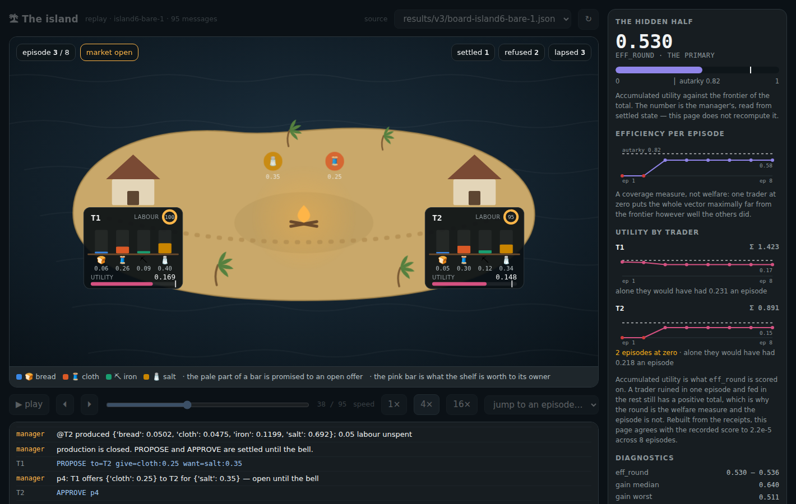
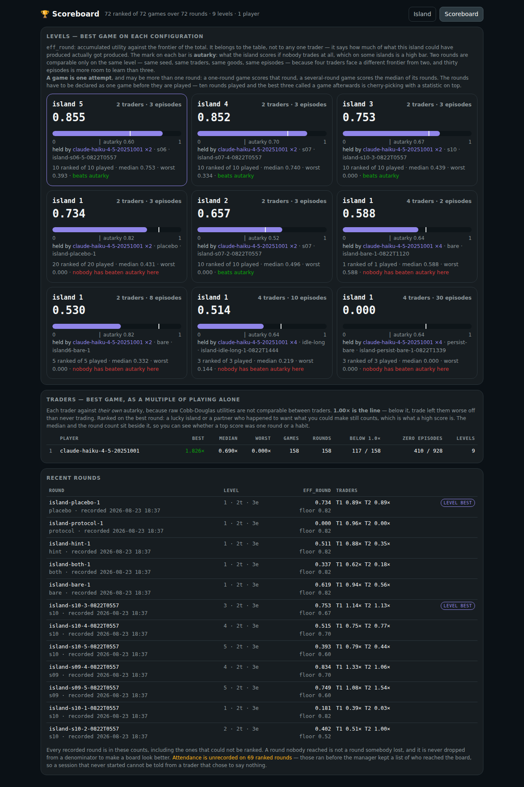

# The island — a spectator's view

A game surface over a 005 round. It changes nothing about the experiment: it
reads, it never writes, and it never reaches a hub.

```bash
switchboard-viewer                 # in the checkout that coordinates (for live)
python viewer/serve.py             # → http://127.0.0.1:8790
```

Replays need nothing running but `serve.py`. Live needs the Switchboard viewer
too, and reads it rather than the hub.



## What it draws, and what it refuses to

**Only what the manager said.** A trader writing `PRODUCE bread=0.5` has
attempted something; the shelf changes when `@T1 produced {'bread': 0.44}` comes
back. Self-reports are not authoritative in the experiment and they are not
authoritative here — attempts show in the ticker, receipts move the island.

**Not tastes, not capacities — not live.** They are private to each trader and
never appear on the board. A spectator page that drew all four hut interiors
during a round would know more than any player does, and what it showed would no
longer be the game the traders are playing. So the live page shows stocks,
offers, trades, refusals and the bell, and says out loud that the rest is
hidden. The hidden half is regenerated from the round's seed **afterwards**, by
[`reveal.py`](reveal.py), and appears only in a replay.

**Nothing it does not recognise.** A manager line that does not parse is counted
and shown as text, never repaired into a plausible receipt. If the manager's
wording changes, the page goes quiet about that line and says so — the same rule
the manager itself follows about malformed messages.

**No metric it computed itself.** `eff_round`, the per-episode efficiencies and
every trader's utility trajectory are the manager's, read from the recorded
round. A page that recomputed the metric would be a second implementation of it,
and the two would drift.

The one number the page does derive is the **card's utility while an episode is
running**, because no such number exists in the record — the manager scores at
the bell, not continuously. It is Cobb-Douglas over the revealed tastes and the
rebuilt shelf, and `audit()` puts it against the recorded trajectory at every
bell in the exact code path that draws the island. Agreement is reported in the
rail; disagreement says the *drawing* is wrong, not the score.

| on screen | what it is |
|---|---|
| a hut and its card | one trader; the card is the only part carrying information |
| four bars, fixed order | stock, from production and settled trades |
| the pale part of a bar | promised to an open offer, so not offerable again |
| the labour wheel | share of this episode's labour spent, from the receipt |
| a pill sliding down a rope | an offer being carried from the trader who made it to the trader it is addressed to |
| a pill waiting over a hut | an open proposal, with what it offers for what, standing on the trader who has to answer it |
| a stack of pills on one hut | every open offer that trader has to answer, oldest at the bottom |
| a pill blinking green, then gone | the offer settled |
| a pill blinking red | the manager would not settle it; the offer is still open |
| a rope blurring and coming apart | the bell took the offer with it, unanswered |
| goods in flight | a settled exchange, both directions at once |
| a card washed dark red | holding some goods and none of another — a zero episode |
| nightfall | the bell: proposals lapse, stocks and labour are eaten |
| the pink bar | replay only — what the shelf is worth to the trader who owns it |
| the tick on it | what autarky would have given them: the line worth beating |

## The three feeds

**Live via a local viewer** reads the Switchboard viewer's `api/state`, never
the hub. The viewer holds the token, the key and the read cursors, so this page
inherits its safety properties — it cannot post, cannot register, and cannot
advance any agent's cursor. `serve.py` forwards `api/state` so the two share an
origin, which they must: `api/state` sends no CORS headers, so a page served
from anywhere else cannot read it at all.

**A finished game is a recording, and the list finds it.** The host's live
directory *is* the archive — nothing there is pruned — so the manager lists
each finished game in `index.json` beside the files it already wrote, and this
page reads that index from `?games=<url>` or, failing that, from the directory
of whatever `?live=` names. The URL a game was watched on is the URL its replay
lives at; nothing is copied for that to be true. (`games/replays/` is still its
own thing: games kept in git deliberately, a commit each.)

**One control for search and list.** They used to be two: a ⌕ that filtered a
list you could not see, and a dropdown that listed rounds you could not filter.
The list now lives inside the drawer, under the search that narrows it, as a
listbox rather than a dropdown — a dropdown that has to be opened to be read
hides its own result.

**A live game ends into its own replay.** The live file a manager writes
(`games/island/live.py`) grows a `finished` block at the last bell naming the
board and reveal it has just copied in beside itself. The page takes it: the
hidden half unlocks, the ending is redrawn with each trader's multiple of
playing alone instead of "this board has no sidecar", and a button replays the
round just watched. It is the disclosure that already happens at the bell,
reached from the surface the watching happened on — see `games/island.md`,
"Watching". A room read straight from a hub has no manager writing files
beside it, so this is the local-viewer feed only.

**The ending is the official one.** The handover carries `scores.py:standing`
— the game's `capture`, its place among the games that played its own format,
and each seat's place among every seat that played it — read out of the ledger
the manager had just written the game into. The page prints it and computes no
ranking of its own: two scoring surfaces would mean two official scores for one
game. A game that may not be ranked (a practice table, a round somebody wrote
into, an unfinished game) shows its numbers with the reason it has no place,
which is the standing rule — kept, counted, never ranked.

**Live from the hub** reads a room the same way the *published* Switchboard
viewer does — sealed content opened in the browser, nothing trusted with a
key but the tab it was typed into. `feeds.js` imports `snapshot()` straight
from `https://gald33.github.io/switchboard/switchboard-room.js` rather than
reimplementing it, which is also why it works cross-origin: that file is
published with `Access-Control-Allow-Origin: *`. Point it at a room with
`?workspace=…&key=…` (defaulting `hub` to the managed hub) or one string —
`?invite=swb1_…` — the way an invite is meant to arrive. Neither is ever put
in a link this page hands out itself: a workspace and key are read-write
credentials, and advertising them in a spectator link would be handing out
write access along with the view (see `games/island.md`, "An invite is a
read-write credential" — open, not yet closed).

**Replay** reads a saved board — `board-*.json`, `{seq, at, author, body}` —
and its sidecar if one exists. Boards come from every tree named in
`serve.py:ROOTS`, each served under its own URL prefix: `results/` is this
experiment's, `replays/` is `games/replays`, where a finished game's board is
kept on purpose so it has a link after its Switchboard room is gone. The page
never learns which tree a board came from. Transport, scrubbing, episode
chapters, and a **pace** — see "Three rules, not three numbers" below. Silence
is compressed under two of the three paces, and where it is, the pause is
labelled rather than hidden.

## The island is a model

The scene used to draw the island: a wobbled ellipse, palms placed to miss the
cards, a hut per trader as a roof and a wall. It is a **three.js model** now,
rendered to a canvas behind the page — terrain, a market at the centre, a
settlement per seat, a site per good, a dock and boats. Ported from a design
delivered as `island.html`; `island3d.js` holds the geometry and `stage.js`
puts it under the scene.

Three things about it are worth knowing before changing any of them.

**The camera is orthographic, and that is not a style choice.** The cards,
ropes and sun are SVG drawn in viewBox coordinates. Under perspective, the map
from the island's ground to those coordinates depends on the viewport's aspect,
so a hut and the card belonging to it drift apart when the window changes
shape. Orthographic makes that map affine and viewport-independent, which is
what lets a settlement stand exactly beneath its own card.

**The settlements are placed on the screen and dropped onto the ground.**
`seatSpots()` decides where traders go in the frame, `Stage.groundAt()` turns
each into a point on the island, and the card goes back at `toViewBox()` of the
hut. Placing them on a ring in island coordinates was tried first and put both
huts on nearly the same pixel — the ring's axis and the camera's happened to
line up. A spectator does not care which compass point a hut is on.

**Anything standing on the coast is placed against the outline, never against
a radius.** The slabs are cut to `silhouette()`, whose two wobble terms can add
to nearly a quarter of the nominal radius — so on some bearings the meadow's
`3.25` reaches `3.70`, and on a few of them the grass reaches past the sand.
The dock was placed at a hand-picked point whose radius, 3.43, cleared 3.25 and
so looked offshore; it was inside the coastline, under the meadow's surface,
along with its bollard and two of its three boats, and `island-life.js` bobbed
them through soil for as long as the page was open. Only the third boat was
ever in water, so the scene read as a lone dinghy off an island with no dock.
Reported by eye, which is the argument for the check.

`meadowEdge`, `beachEdge`, `shelfEdge` and `shallowsEdge` are the four outlines
to ask, and `dockAxis()` is the worked example: it takes a bearing, seats the
root against whichever of the grass and the sand reaches furthest, and returns
both the rotation that aims the thing out to sea and how far it may reach
before it leaves the water. **A length is as much a placement as a position
is** — seating the root correctly while leaving the old hand-picked length of
1.54 in place moved the failure rather than fixing it: the jetty then reached
past the shallows, and since a dock is not weather, `render.py:island` counts
it as the island's own silhouette and found the island's foot below the first
card on a phone. The drawn water outside the sand is about `0.7` wide on every
bearing, so that is how long a jetty can be, and boats moor broadside because a
hull is 1.26 long and does not fit bow-out in 0.7 of water at any scale.

`tests/render.py:island` measures every part of the dock against those
outlines: nothing inside the grass, and no boat short of the waterline. They
are separate assertions because they fail separately — a boat can clear the
grass and still be a hull sitting on wet sand, which is exactly what the one
un-buried boat was.

**Without WebGL the page draws the island as it always did.** `.has-3d` is set
only once a model is actually up, so the drawn world is hidden exactly when it
has been replaced. `tests/render.py:fallback` takes WebGL away and checks the
drawn island comes back — that path is not otherwise exercised, and its failure
looks like a replay that will not load.

three.js is **vendored**, not fetched: see [`web/vendor/three/`](web/vendor/three/).

## A day, not an episode

**In the game an episode is called a day** — the round state, the chapter menu,
the closing card, the scoreboard's levels. It is a presentation name: the
manager still writes "episode" on the board, so the transcript quotes it that
way, and `eff_episode` keeps its name in the metric panel because that is what
the ledger records. Renaming either would change what agents read or what the
numbers are called. `tests/render.py:vocabulary` holds the line in both
directions — the game's own voice says day, and the transcript still says
episode.

## Three rules, not three numbers

*Decided 2026-08-29, replacing `1×/4×/16×`.*

The transport carried three speed buttons. **Two of them were the same
control, and the one worth having was not on the bar at all.**

`stepDelay` divides only the gap term and never the animation — deliberately,
and for a good reason kept below. But that means at `16×` the gap came to
`MAX_STEP / 16` = 162ms, which is under almost every `dwellFor`. So on any
stretch where something was actually happening, **`4×` and `16×` rendered
identically**; they diverged only across silence. `tests/scene.test.mjs` states
that as an assertion now — "the old speeds collapsed into each other on a busy
board" — so the shape cannot come back under new names.

And the gap was clamped to `MAX_STEP` *before* the speed divided it, so a
forty-second silence and a three-second silence played the same at every
speed. **No setting anywhere showed a round at the pace it was actually
played.** On these boards — 150s days in which two traders say three things
each — that is most of what happened. Measured on game 002's own board: gaps of
6.6s, 18s, 24s and 38s all rendered as the same 2.6s pause.

So the control is now a **pace**, and the three are rules rather than rates:

| pace | the waiting | what it answers |
|---|---|---|
| `live` — *real time* | the real gap, uncompressed | was the board busy, or was everyone thinking? |
| `tight` — *tightened* | clamped, then divided by 4 | what happened, without the sitting about |
| `step` — *one at a time* | none at all | the round as a sequence, for reading rather than watching |

`tight` is the default and is exactly the old `4×`, so a page somebody opens
plays as it did before. The choice is remembered in `localStorage`, because it
is a way of watching rather than a place in a round.

**The animation floor is the same under all three**, which is the old reasoning
and still right: a frame that draws a parcel crossing the square needs the time
that crossing takes, whatever the clock is doing. Speed never had any business
compressing the events, and neither does pace.

**`live` could not have existed before the sun did.** Real time is minutes of
near-stillness, and a still page reads as a stalled one — unless something on
it is visibly keeping time. The island has that now: the sun crosses on
`dayProgress` (see "The shadows tell the time"), so a silence reads as an
afternoon passing. That is what makes the pace watchable, and why it arrives
with the model rather than with the transport.

**`QUIET` is finally used.** It was declared in `feeds.js` in the same line as
`MIN_STEP` and `MAX_STEP`, with a comment saying the clamp is reported "so the
page can say a pause happened rather than pretend the board was busy" — and
then nothing imported it and the page never said so. `quietBefore` is that
sentence made true: a gap over four seconds is named in the transport (`· after
38s quiet`), and **only under a pace that compressed it**. Under `live` the
viewer has just sat through the pause and does not need to be told there was
one. An empty slot is therefore a claim in its own right: the board really was
busy here.

## The shadows tell the time

**With a model up, the disc is hidden and the island's own shadows say what
hour it is.** A drawn sun over a lit island is the picture saying it twice, and
the drawing was the half that could disagree — it crossed the sky while the
model's key light cast nothing at all, so the island had a sun in it and no
shadow under anything. The key casts now (`shadowMap`, an orthographic shadow
camera six units either way, which is the island and none of the sea), and
`.has-3d .sun` takes the disc away.

**The light's angle is reckoned from the camera, not from the island**, because
the camera goes right round the island every 150 seconds. A key at a fixed world
bearing would hold its shadow due north-west all day and let the camera sweep it
across the frame — so the shadow a person reads would be telling them the
bearing rather than the hour. `Stage.ctx()` passes `turn` along with `day`, and
`island-life.js` adds it straight back into the light's azimuth, which cancels
the revolution. What is left is the day: over one shoulder and long at the open,
behind the viewer and high at midday where the shadows are shortest, over the
far shoulder and long again by the bell.

**A cloud's shadow goes with the light.** The clouds cross the meadow on their
own loop and drop a dark patch under themselves, and that patch used to be the
same darkness at the bell as at midday — while the key had swung almost to the
horizon and every other shadow on the island had gone long and soft, so the one
hard dark patch left on screen was the only thing still claiming it was noon.
It now fades out with the sun and comes back with it, on `sin(π·day)` rather
than on `day`, because "the sun is up" and "it is late" are not the same curve:
the sun is up at dawn too, and casts almost nothing.

The disc is hidden with `visibility`, not `display`. It is still the clock the
**fallback** island has — the one drawn in SVG when there is no WebGL — so it
stays where it stands and both paths remain one path with one arc in it.
`daylight` and `alive` read the day off its position, which is what a viewer of
the fallback reads it off too.

### The model's light travels too

**The glide belongs to both suns, not just the drawn one.** `sky()` is handed
where the day is now and where it will be when the next line lands, and it
animates the disc across the gap so a silence looks long. The stage got only
the first of those — `setDay` was called once per board event with the
instantaneous fraction — so the island's shadows stepped to wherever the last
event fell and froze there. On a 3D board that is the *only* clock a viewer
has, because `.has-3d .sun` hides the disc that would have shown the rest of
the day.

Reported by eye against `island-game-001d-g1`: shadows walking to the middle of
the day and stopping while the board went on producing and trading. The board is
not at fault — every line on it settles before its bell — and the middle is
simply where that day's last event falls (0.38, 0.84 and 0.69 of the three
days). `setDay(day, until, ms)` now takes the same two ends of the same journey
and `Stage.dayNow()` reads the light off it per frame. It never travels
backwards, for the same reason the disc does not: a new day is a jump, not a
rewind.

#### And it lands where the disc lands

**Half of that journey was still only the disc's.** `sky()` and `setDay()` are
handed the same two ends — where the day is now, and where it will be when the
next line lands — and where there is time to animate, both travel. Where there
is *not*, they parted: `sky()` puts the disc straight at the far end
(`placeSun(to)`), and `setDay` kept the light at the near one, because a glide
it would not run left `this.day` at the hour the frame arrived with. A frame
with no animation in it is not a corner case — it is **every scrub**
(`player.seek` emits with `animate: false`, so `hold` is `0`) and **every frame
for a viewer who asked for less motion**.

So the island had two clocks again, and the size of the disagreement is the
size of the silence the frame is sitting in front of. Measured on
`island-game-001d-g1` at 1200×800, scrubbing to six points of the replay and
reading the disc's own `.sun` box against the hour the model was lit by:

| scrub | the model's hour | the disc, `.sun` top | tint of the land |
|---|---|---|---|
| 0.15 | 0 (before the round) | 94px — lowest | 0.394 |
| 0.30 | 0.28 | 27px — high | 0.368 |
| 0.35 | 0.38 | 94px — lowest | 0.333 |
| 0.45 | 0.013 | 20px — highest | 0.397 |
| 0.80 | 0.29 | 35px — high | 0.385 |
| 1.00 | 1 (the bell) | 304px — set | 0.349 |

Read the last two columns together: at scrub 0.45 the light is at dawn and warm
while the disc stands at noon, and at 0.35 the light is at mid-afternoon and
cool while the disc is on the horizon. **The island was coolest exactly where
its sun was lowest** — the day inverted, which is what `alive` reports:

    island-game-001d-g1 alive: the island is no warmer with the sun down than
    with it up (tint 0.41 -> 0.35); the light is not on the day's clock

*The check was right and the drawing was wrong.* The sun-height proxy it uses
is not the weak link: the disc is on `dayAhead` deliberately, it is the whole
of the clock a fallback island has, and a model whose light disagrees with it
is the two-suns defect this section already exists to hold shut.

**Why it failed on one board and not the other.** Nothing about the boards'
layout: it is where their lines fall. `island-game-002b-g1` is dense enough
that `dayAhead` is close to `dayProgress` at most frames — its disc tracked its
light to within a step across the same six scrubs — while `001d`'s three days
each go quiet after their last event (0.38, 0.84 and 0.69 of the day), so a
scrub into one of those silences puts the disc a whole afternoon ahead of the
light. **A board that passes here is a board with no long silences in it**,
which is not the same as a page that is right.

`setDay` now resolves the far end first and, when there is no journey to run,
lands on it — the same `placeSun(to)` the disc gets. Both suns, one clock, in
the still frame as well as the moving one. `tests/daylight.test.mjs` is that
rule with no browser in it (`node --test viewer/tests/daylight.test.mjs`); the
pixels are `alive` in `render.py`.

#### A sun that has set is not a low sun

One thing in the check *did* have to change, and it is worth stating plainly
because it is a change to a check: which frames count. `alive` took the six it
samples, found the highest and lowest drawn sun among them, and asked for the
low one to be the warmer. With the two clocks agreed, the lowest sun on both
boards is the frame **past the bell** — `sky()` sends the disc on down to `SET`
there, 304px against a sky the sun crosses between 20 and 94 — and the island
after the bell is drawn *cool on purpose*: a night with one fire in it, which
is the whole of "Twilight is a cool sky with one warm light" above and what
`twilight` measures. The same applies at the other end, where `dayProgress` is
`0` before the round opens and the island is waiting rather than at dawn.

So the check was asserting that the night should be the warmest hour of the
day, which is the opposite of what this page is drawn to do, and it was
deciding the whole thing on that one frame: 0.356 against noon's 0.277 on
`001d` and 0.359 against 0.334 on `002b`, either side of a bar of 0.08.

`sunAt` already says which frames are a time of day: `dim`, the disc's own
opacity, is zero for the first minutes of a day and zero again once the disc
has gone down behind the island. Counting only the frames where the sun is
**in the sky** leaves the claim the check is named for, on the hours it is
about:

| board | sun low | sun high | margin | bar |
|---|---|---|---|---|
| `island-game-001d-g1` | 0.377 (day 0.29) | 0.277 (day 0.49) | **+0.100** | 0.08 |
| `island-game-002b-g1` | 0.437 (day 0.15) | 0.334 (day 0.66) | **+0.103** | 0.08 |

**The bar is untouched at 0.08.** What changed is the population, and the
argument for changing it is not that the numbers were inconvenient — it is that
two of the six frames were not hours of a day at all. And the restriction alone
does not paper over the bug: applied to the *unfixed* page it leaves `001d` at
**−0.012**, still inverted and still failing, while `002b` passes at +0.117 as
it always did. The drawing had to be fixed first, and it was; the frames it is
judged on had to be hours of a day, and now they are.

### A hold is a level of night, not an hour

A clip that wants the island dark says so with `life.hold(v)`, and that value
used to *be* the day for as long as the clip ran. The day owns the key's
bearing as well as its brightness, so the dawn clip — which holds a night
lifting from `1` to `0` over four and a half seconds — dragged the sun
backwards through a whole day and swept every shadow across the island at the
moment a new day **opened**. Reported by eye as shadows crossing the island at
the start of a day, in the dark.

The hold is spent on the light *level* now — how bright, how warm, how high the
fire — and the bearing stays on the page's clock. The bell loses nothing: the
day is already at dusk when it rings, so the shadow is where the hold would have
put it anyway. The dawn gains what the drawn disc always had — a jump, made
under cover of the night still being drawn over it.

### The arc it keeps

An episode is a day, so the day is readable from the sky. The sun crosses on an
arc from the open to the bell, and during a replay it keeps travelling while a
frame is held on screen — so a stretch where nobody acted *looks* long, in the
one part of the page that is about the island rather than about the player.

It replaces a pill that read `quiet 41s`: a number about the replay, next to a
sun parked in one spot for the whole episode.

**Nothing else moves the sun.** The bell brings the night and lights the fire;
it does not touch the disc. The sun was already almost down when the bell rang
and it goes on down past the horizon on the same clock, so an event animation
starts at its own moment and runs alongside rather than taking the day over and
restarting it. The one discontinuity is the night itself — the sun sets in the
west and the next day rises in the east — and it is invisible because the disc
is at zero opacity at both ends of it: a day begins with the sun still out of
sight and it comes up out of the sea.

The arc is bounded by the island rather than by a constant. It rises and sets
beyond the island's width, where there is only water, and clears the island's
topmost point at noon — the sun is drawn *behind* the land so it can set behind
it, so an arc dipping below that edge would take it through the island at
midday. `scene.test.mjs` holds both properties at every trader count and in both
orientations.

**The bell had no date.** The manager writes *"the bell is at 12:42:27Z"*, which
`Date.parse` cannot read, so everything comparing it to a clock got `NaN` and
quietly did nothing — the live countdown read "bell due" from the first second
of every episode. The date now comes from the timestamp of the line that
announced it, and a bell earlier in the day than its own announcement is
tomorrow's.

## A card is shut until it is asked for

*Decided 2026-08-29, on Gal's suggestion that the cards could usually be hidden
and open on a click or on the trader acting.*

**Both ways up, since 2026-08-30.** This first shipped landscape-only, on the
reasoning that portrait already answered the question with the measured
tap-to-focus mechanism in "On a phone", and that two mechanisms for one
question on one screen is how a tap stops meaning anything. That reasoning is
kept because it was right about the hazard — and the resolution is the one it
implies: portrait got shut cards *and* gave up a focus, rather than running
both.

**What a portrait tap means now:** a tap on a card opens that trader's shelf; a
tap on the island gives the island the screen, and again shares it. One gesture,
disambiguated by what it lands on, the same as landscape.

**`FOCUS.cards` is gone.** It gave the cards the screen and was reached by
tapping a card — which was the only thing a card tap could mean while cards
were always open. It is not any more, so the state became unreachable, and a
focus nobody can ask for is not a focus. The measurements that justified it are
below and are left standing; `render.py:focusing` used to assert that a card
tap shrank the island and now asserts the pair that replaced it — the shelf
opens, and the frame does not move.

**Shutting a card gains portrait no island.** Measured: the viewBox stays
520x1020 and the cards stay at y465, because `cardPlan` reserves its slot from
the full card height whatever the card then draws. The cards do halve, 142px to
86px, so the screen is calmer — but the room does not go to the island. Giving
it to the island means reserving the shut height and letting an opened card
overlay what is below it, which at two traders fits in the gap above the
transport and at more does not. Not done here.

*Done on 2026-08-30, overlay and all — see "The split screen goes, and the
island keeps the frame". What changed is not the arithmetic above but what is
acceptable: an opened card covering another card's nameplate for a few seconds
is a smaller cost than the island being drawn small for the whole round.*

A round is mostly silence, and for most of it nobody is reading the shelves.
So a card is drawn shut: whose it is, the labour dial with its caption, and the
utility against the ALONE mark. What goes is the shelf -- the bars, the glyphs
naming them, the quantities, the plank. `CARD_H_SHUT` is 88 units against 186
open, so the two dark panels lose more than half their height.

**On a replay it keeps the utility, and that is the difference from the glance
card.** `CARD_H_GLANCE` -- what portrait's island focus draws -- does the
opposite: it keeps the shelf and drops the utility, because a viewer who tapped
the island wanted the picture. A card shut *by default* cannot drop the
utility, because then a settlement lands and the only things on screen are a
rope and a pill, and nothing says what the trade did to anybody.

### Live has no utility, so a shut card there is a nameplate

**Reported by Gal**, and it is the premise the paragraph above was built on, so
it needed saying: on a live board there is no score row at all. Tastes are
private and never reach the board, so `hut()` builds the row only when there is
a reveal to build it from. A shut card live is a name and a labour dial and
nothing else -- and sized at the scored height it was two dark rectangles
holding one word each with fifty-five units of empty box underneath.

The open card already draws this distinction, `CARD_H` against
`CARD_H_SCORED`, and the shut one now draws it in the same place:
`CARD_H_SHUT_BARE` is 42 against 88. It is derived the same way -- the name
row's depth plus the padding -- and `NAME_ROW_DEEP` is measured off the *dial*,
which reaches lower than the name beside it and is not the one you would guess.

That fixed a second thing with it. A symbol flying at a shut card aimed at the
score row (`SHUT_SCORE_Y`, 72), which on a bare shut card is **below the card's
own foot at 64** -- so on a live island every symbol a settlement threw would
have landed just underneath the card it was going to. It aims at the middle of
whatever height the card actually is now.

So live, shutting a card hides everything it had. That is the honest cost, and
what makes it acceptable is the auto-open below: live is exactly when goods
move, and goods moving is what opens the shelf.

**The height is derived, not chosen.** It was written as a literal 88 first and
was right by luck: the score row's foot and the card's foot are in card
coordinates and a height is not, so the two are a `CARD_TOP` apart and getting
that backwards puts the ALONE mark through the card's bottom edge -- which a
browser renders perfectly happily. It is now `SHUT_SCORE_Y + SCORE_ROW_DEEP +
CARD_PAD - CARD_TOP`, and `tests/scene.test.mjs` holds the relation from the
other side.

### Opening and shutting are animated

*Added 2026-08-29, on Gal's ask.* An instant toggle read as two different cards
swapped over rather than one card changing size — and on an island where a
settlement can open a card by itself, a jump reads as a glitch instead of as a
consequence. `CARD_SWING` is 220ms, on the same easing as a parcel's glide, so
the two motions on the page belong to each other.

Three things move and each is animated on the property that actually changes:
the card's ground grows or shrinks (`height` on the two rects), the score row
slides between the two rows it can occupy, and the shelf fades — on its own
opacity rather than the card's, so the name and the utility stay legible the
whole way through. The shelf's fade is a little quicker than the box: a shelf
still fading inside a card that has finished resizing reads as lag.

**WAAPI rather than CSS**, for the same reason `produce()` animates the labour
dial that way: the node is new on every toggle, so there is no previous
computed value for a transition to start from and a rule would simply land it
at the end state. `redrawCard` takes the old card's shape before replacing it
and hands it to `swingCard`. The shelf hides by `opacity`, not `display`, since
`display` cannot fade.

**A bug worth keeping, because of its shape.** The score row is *positioned*
with an SVG `transform` attribute — `translate(0 156)` — and handing that
string to `Element.animate` gives keyframes the engine drops on the floor: CSS
wants units. The animation still existed, still reported its 220ms duration,
and moved nothing. Every visible sign said it worked. It was found by reading
the keyframes back off the running animation, not by watching the card, and it
would never have been found by watching in this environment at all — a headless
page runs the island at under 2.5 frames a second, so a 220ms animation
completes between two frames and *nothing* appears to move whether it is
working or not. `scoreAt` now builds the string from the numbers in one place,
and `tests/scene.test.mjs` asserts its shape.

### The shelf and the number wait for the goods

*Reported by Gal, 2026-08-29: the bars fill before the symbols arrive, and so
does the utility.* Two separate faults with the same face.

**One was a regression from shutting cards.** Every bar keeps `now` — what it
should be showing — and `was`, the value before it; `hand()` rewinds a gaining
bar to `was` and holds it there until its symbol lands. `draw()` shifts that
history once per frame (`b.was = b.now`). A card opened by a settlement is
rebuilt from inside `play()`, and `redrawCard` called `draw()` to put the
numbers back — **a second shift inside one frame**, which moves `was` onto the
already-new `now`. The rewind then rewinds to the new value, which is no rewind
at all, and the shelf filled the instant the receipt was read.

`draw()` takes `advance` now. A repaint is not a new frame and passes
`advance: false`. In the same place, a bar being restored after a rebuild goes
back to `was` when it is holding rather than to `now`, which was the same
mistake one line further down.

**The other was never right.** The utility was read straight off
`state.stocks`, so it jumped on the frame the receipt landed while the bars
underneath it sat still — the card saying the trade had happened above a shelf
saying it had not. `score()` now computes it from what the card is *showing*: a
bar that is holding contributes what it is drawing. The number arrives with the
goods. `fly_`'s landing calls `score()` alongside `setBar`, because the hold is
released there and not on a frame boundary.

**What checks this.** `render.py:production` already asserts the shelf does not
fill early, in three places — 120ms after the receipt, across a repaint
mid-flight, and while the symbol is still rising — and it still passes, and
still fails when the animation is disabled, so it can still catch this. It does
**not** cover the shut-card path, because `ring` builds an unmodelled scene
where cards never shut. That gap is worth closing.

### And the number follows the shelf, rather than moving with it

*Gal, 2026-08-29, after the fix above: the utility should adjust **after** the
item bars do.* Making the two arrive together was right and still read as one
simultaneous jump; the value is a consequence of the goods and should be seen
as one.

**It took three attempts, and the first two failed because I guessed at the
cause instead of tracing it.** Worth writing down, because the guesses were
plausible and the measurement was cheap:

1. *Too short.* 420ms against a 550ms travel — the two still moved together
   for the last 130ms. Real, and not the whole story.
2. *Keyed on the wrong thing.* The gate asked whether the board's quantities
   changed. But `hand()` rewinds a gaining bar to its pre-trade value and
   holds it, which moves the bar on screen without moving the state at all. It
   now compares what the shelf is **drawing**, which `score()` already reads.
3. *A repaint overtook the wait.* This was the one that kept it broken.
   `flashCard` rebuilds a card and calls `draw` to refill it; that call saw a
   shelf unchanged *since the previous draw*, so it wrote the new number at
   once — two milliseconds after the bars moved — throwing away the stage the
   previous draw had correctly started. A pending wait now suppresses any
   immediate write for that trader.

Each attempt measured a 1ms gap afterwards and I read it as noise twice. What
found it was tracing every writer — patching `Scene.prototype.score` and
`setBar` to record a stack — rather than sampling the DOM and inferring.

**The first attempt was too short and Gal could see it.** It was 420ms against
a 550ms travel, on the reasoning that a hard ease-out puts a bar within a few
percent of its target well before it stops. That is true and it is not the
point: the two were still moving together for the last 130ms, so the pair went
on reading as one simultaneous jump — the whole thing the wait exists to avoid.
The arithmetic only explains the report; it did not predict it.

The wait is the bars' own travel plus a 90ms beat. **The travel is read off the
stylesheet, not copied** — `--bar-travel` is declared beside the transition that
spends it, the same arrangement as `--chrome-top`, because a copy in the script
is a second place to change and it had already been wrong once. Measured after
the fix: the number starts 534ms after the bars stop on the tightest case, and
never overlaps them.

**Debounced per trader**, because an exchange lands its goods one at a time,
`CARRY.step` apart. Scoring on each arrival walks the number up in steps that
look like several trades rather than one; each landing pushes the settle back,
so the value moves once, after the last bar.

It is staged wherever the shelf *moves* — a symbol landing, and any frame that
moves the bars on its own, such as the bell emptying them. It stays **immediate**
where nothing moved: the first paint, and a card being opened, where the number
should simply be there rather than fading in a beat late. `score()` remembers
whether a zero is blameable, because the call that writes the number is often a
timer firing long after the frame that could see whether labour had been spent.

Verified by patching `Scene.prototype.score` in a live page and recording every
write that changed the number: the settlement writes arrive through the staged
timer, and the immediate ones are all card-open fills.

### A side drawer narrows the frame instead of covering it

*Fixed 2026-08-29.* The chrome stepped aside for a drawer from the start; the
picture underneath it did not. At 1440x900 the reveal rail and the recording
picker are 340px wide and the right-hand trader's card runs x1126–1413 — so a
drawer covered **313px of a 287px card**, which is all of it. Measured, not
noticed by eye.

The frame is narrowed now: `--frame-right` takes the drawer's width off the SVG
and the canvas together, `frameBox` measures *that* box rather than the window,
and the layout re-divides what is left. Both cards come back inside it. The
foot drawer needs none of this — since cards shut to 88 units they end at y499
and the transcript starts below them, so that collision fixed itself.

**Both axes are sized explicitly, and that is load-bearing.** An `<svg>` with a
viewBox has an intrinsic ratio, so under `inset: 0` alone it takes its *height*
from that ratio rather than from its box — while the viewBox is computed from
the measured height. The two chase each other to a fixed point: the frame
settled at 1440x720 inside a 1440x900 window and the island was laid out for a
shape it was not drawn at. A width and a height break the loop.

The box is **not** transitioned. The scene is re-laid out once on the toggle;
animating the width would make every frame of the slide a different layout to
solve and rebuild the island sixty times on the way.

**A pre-existing thing this makes visible.** `widen()` only ever widens, so a
frame *taller* than the viewBox's ratio letterboxes, and the bands read as
seams above and below the sea. Unmodified `main` at 1100x900 shows exactly the
same bands — this change did not cause them, it just puts the frame into an
aspect where they show. Worth its own fix.

### What a click does, and what it must never do

A click on a hut or on the card hanging under it opens that trader's shelf;
another shuts it. **A click only ever opens, filters or highlights. It never
changes what the page reads, what it computes, or what it settles** -- the page
is a painting of `reducer.js`'s state and a viewer poking at it is not an
input to the island.

**The frame is never re-divided by a click.** Portrait's tap re-divides a band
because there is no room and something has to give; landscape has margins where
the cards already stand, so opening one moves nothing else. Verified rather
than assumed: the viewBox, the canvas and every hut transform are byte-identical
across a click.

### Which events open a card, and which do not

`produced` and `settled`, and nothing else. Those are the two that animate the
shelf -- crates into a yard, symbols on and off a bar -- so a shut card would
play them against a row of bars nobody can see.

**It opens before the symbols arrive and stays open after they land.** The card
is opened at the top of `play()`, before `flight()` or `produce()` build
anything, so `barAt` reads the open card's real bars rather than aiming at a
shut one. And the hold is `cardHold` -- `dwellFor` *plus* `CARD_LINGER` -- not
`dwellFor` alone, which is how it was written first and was wrong: `dwellFor`
ends when the animation ends, and the animation ending is the frame the new
quantity appears on the bar. The card shut on the one frame the thing it was
opened for became readable. Measured after the fix: a settlement on game 002
holds its cards 6.4-7.0s, against a `dwellFor` of 5.0-5.6s for those bundles.

`CARD_LINGER` is deliberately not divided by the playback pace, for the same
reason `dwellFor` is not: it is time the *picture* needs, not time the clock is
spending. It also carries the whole hold when motion is reduced, where
`dwellFor` is zero -- without it a viewer who asked for less movement would get
a card that opened and shut inside a frame.

**Not "any activity", which was the first idea and is the wrong rule.** A
`said`, an `ack`, a proposal and a refusal move no goods, and on an open market
those are most of the board -- opening a card for each one is today's layout
plus flicker. The two sets are kept apart for the same reason: a card the
viewer opened stays open, and one an event opened reverts to *what the viewer
chose*, not to shut.

### Two bugs this found, kept because both are the same shape

Both are about a card being rebuilt while something still points into the old
one. `hut()` builds fresh slots, and a rebuilt card is a new set of nodes.

1. **`slot.was` off `undefined`.** `draw()` writes each bar's `now` and keeps
   the frame before it in `was`; `hand()` reads `was` to hold a bar at what it
   *was* until the symbol flying at it lands. A card opened by a settlement is
   opened from inside `play()`, which runs after `draw()` -- so `hand()` got a
   slot with no `was` and threw. Found by playing a board through, not by
   reading. `redrawCard` carries `was`, `now` and `holding` across, which makes
   it safe from any caller: a click can land mid-animation just as easily.
2. **A shelf with no numbers on it.** Same cause, other half: the quantities,
   the dial and the utility are all written by `draw()`, so a card opened after
   `draw()` had been and gone stood there blank until the next line landed --
   which under `real time` can be forty seconds. `redrawCard` re-runs `draw`.

**A symbol cannot land on a shelf that is not drawn.** `barAt` sends it to the
middle of a shut card instead, where the utility row is -- the number it is
about to change. Flying to the bar's own `x` would put it in open sea beside a
card not showing that bar.

### What this does not do yet

**It gives the island no width.** Measured at 1440x900 with two traders: the
island's box is `w - col*4` where `col` is set by `CARD_W`, and that comes out
520 against a height of 560 -- so the island is width-limited by the cards, and
a shut card that is *the same width* as an open one does not move that by a
pixel. The whole gain here is vertical calm.

Getting the width needs a shut card that is narrower, which means the card's
interior re-lays on every toggle and an open card has to grow inward over the
sea. Worth about 8% at two traders and roughly a third more island at five,
where the frame is `268 * n + 300` and most of that is card. It is a second
change and should be measured on its own.

## On a phone

The page is a link you hand somebody, and most people open a link on a phone.

The island's viewBox is wide, so upright it used to fit to width and sit as a
thin band — **16% of the screen** — with dead sky above and dead sea below,
and the trader cards at about a third of a readable size. In portrait the huts
**stack in a column** and the viewBox goes tall with them; nothing else about
the scene changes, because everything is positioned from `seats`, `ly`, `rx`,
`ry` and `fire`, and `fits()` holds the geometry honest either way. Rotating
rebuilds it through the same `build()` — one construction path, run again.

The floating chrome re-stacks rather than being dropped: the title gives way to
the picker and the tab, the counters and the legend take rows of their own, and
the transport gives the scrub a full-width row so it is long enough to drag.
Controls get a 40px minimum under `pointer: coarse` — a tablet is neither
narrow nor short and is still touched.

### The chrome has a band, and the island stays out of it

Re-stacked, the pills are **four rows deep**, and they floated over the picture:
the round's state, the counts and the goods key all lay across the island's top
edge, over the shore and the hill. Reported by eye, twice.

The stylesheet declares what they come to — `--chrome-top: 162px`,
`--chrome-foot: 146px`, beside the rules that put them there, because that is
the one place that knows how tall four rows of pills are. `chromeBands()` turns
them into fractions of the window's height and `cardPlan` reserves them. What is
left is the island's, and **the island is the term that gives**: the cards carry
every number on the page and shrinking them is how this view was unreadable to
begin with.

*`--chrome-top` is 98px now, and the pills are two rows rather than four — see
"Four rows of chrome became two". The mechanism below is unchanged; only what
it is given to reserve has moved.*

That reservation rests on the portrait frame being **the window's own shape**.
A viewBox of any other shape is fitted inside the window with `meet` and
*centred* in whichever direction is slack, so a band at the top of the viewBox
would land somewhere in the middle of the window and reserve the wrong strip.
So `layout` sizes its own height from the aspect, and `frameAspect` rounds
portrait to hundredths and **downwards** — erring tall leaves the slack across
the width, where it is a few pixels of sea, instead of down the height, where it
would be split above and below and move every band.

The arithmetic is honest about what it costs. On a 393×660 window — a shared
link opened with the browser's own bars showing — the chrome and one row of
cards are near half the height between them, and the island is drawn small. That
is the deliberate side of the trade: it was bigger before because it was drawn
underneath the pills. So the size check no longer asks for a share of the
*screen*; it asks whether the island filled **the band it was given**, which is
the defect the check was written for — dead sky above it and dead sea below.
`island()` re-measures the silhouette off the model's own vertices at twelve
bearings and fails if it climbs into the chrome's band; `uncovered()` counts the
model's pixels behind every pill.

### The band the island was given

The size check above was **measuring the phone, not the layout** — the mistake
its own comment says it was written to avoid — and it took running the whole
file in CI to show it, as a failure on one board at one viewport by a fraction
of a percent:

    island-game-001d-g1 @safari 393x660: the island fills 85% of the 202px band
    between the chrome and the cards; the rest is dead sky and dead sea

It asked for 85% of the strip from the chrome's foot to the top of the first
card. But that strip is not all the island's: `cardPlan` keeps a fixed
clearance below the island's foot so a card hangs clear of the hut above it —
16 units of gap plus `CARD_TOP`'s 22, **38 units, measured at exactly 38 on
every board and viewport below**. Thirty-eight units is a constant number of
*viewBox* units, so as a share of a strip it grows as the frame gets shorter,
and the same page with no dead sky anywhere in it scores:

| board | 390×844 | 360×640 | 393×660 |
|---|---|---|---|
| `island-game-001d-g1` | 0.912 | 0.852 | **0.846** |
| `island-game-002b-g1` | 0.912 | 0.852 | **0.846** |
| synthesised, 3 traders | 0.855 | **0.830** | **0.824** |
| synthesised, 5 traders | **0.827** | **0.821** | **0.828** |

Two things fall out of that table. The floor was not a hair too tight: at three
traders it misses by three points and at five by nearly three on *every*
portrait viewport, so any number that passed the boards on disk would have been
a number chosen to pass them. And **the other board was never passing** — it
was never measured: `run()` calls `mobile(browser, base, boards[0], out)`, one
board only, and `002b` scores 0.846 exactly like `001d` when you ask it. The
known-failure entry said it passed on the other board. It does not; nothing
asked it.

So the ratio is split into the two claims it was standing in for, and neither
depends on the window's height:

- **the drawn land fills the band the island was given** — the chrome's foot
  down to the island's own, read off `geo.islandFoot` through the viewBox's own
  fit. Measured at **0.984 to 0.993** across both replays, synthesised boards
  of three, four and five traders, and all three portrait viewports; the floor
  is `BAND_FILL = 0.95`. That is a stronger claim than the old one at every
  size, not a weaker one.
- **the strip below the island is the card's clearance and nothing more** —
  `CARD_CLEAR = 38` units, with six units of slack for a rounded pixel. This is
  the half that stops a layout dumping dead sea between the island and the
  cards and passing anyway.

Dead sky is caught by the first: the island's box begins *at* the chrome's
band on every frame measured, and a box pushed down would grow the band without
growing the land in it.

To re-measure: `python viewer/tests/render.py` (the numbers above came from the
same `landMask` the check uses, over the two replays in `games/replays` plus
synthetic boards built with `render.synthetic`).

`tests/render.py` drives seven viewports and checks what a screenshot cannot:
that nothing scrolls sideways, that **no two pieces of chrome overlap**, that
the island fills the band between the chrome and the cards, that every control
is a fingertip tall, that rotating actually turns the island, and — in
`focusing` — that a tap on a card opens that trader's shelf and leaves the frame
where it is. The overlap check exists
because that bug happened twice while these breakpoints were written — once
because a media block was authored above the rules it meant to override and
lost on source order, which no amount of reading the CSS made obvious.

#### The overlap check compared the boxes, and the pills escaped them

*Found 2026-08-30, by Gal, on a live phone: "some overlapping buttons".* The
screenshot showed `settled 2` sitting on top of `bell in 60s`, and `mobile`'s
"no two pieces of chrome overlap" had been green the whole time.

Both halves of that row are absolutely positioned against opposite edges, so
nothing in CSS makes them negotiate — their widths were simply chosen to add
up, and they did not: `.at-top-left` was capped at **62vw** and `.counts` at
**44vw**, which is 106vw. On a 393pt phone that is 44px belonging to both.

`mobile` missed it because it compares the two **containers**, and the
containers never overlapped. `.counts` was `flex-wrap: nowrap` with
`overflow: hidden`, so with three counters running its pills overflowed its box
to the left — its own rectangle stayed exactly where the stylesheet put it
while its children stood in the other half of the row. **An assertion about a
parent cannot see a child that has left it.**

The clipping was the worse half of it, and the half nobody reported: `settled
1` rendered as a pill reading **`1`**. A wrapped row says it did not fit; a
clipped one says nothing at all, and a pill that has lost its noun still looks
like a pill.

What replaced it:

- The stylesheet's two caps now sum to exactly the row — `calc(60vw - 20px)`
  and `40vw`, with 10px of margin each side — so the overlap is impossible by
  arithmetic even before any script runs.
- `shareTopRow()` then re-divides the row **by measuring it**, because the
  split is uneven and changes with the board: on frame 0 the state pills need
  the whole row and no counter has happened yet; at the last bell it is the
  other way round. The counters are asked what they come to and given it, up
  to three fifths of the row; the state pills take the rest and wrap when that
  is not enough.
- `.counts` **wraps and no longer clips.** It was kept to one line on the
  reasoning that "a row that grew a second line would grow the band under it,
  and the band is a fixed number of pixels the island has already been given".
  That premise died when `chromeBands()` began measuring the band; the clipping
  outlived it. A second line is now absorbed — at 360pt the top band goes from
  144px to 216px on the frames that need it, and the island is given the rest.
- `crowding()` in `render.py` asserts it on the pills themselves, every frame,
  at all three portrait viewports: no pill from one half may stand on a pill
  from the other, and no pill may be clipped by an ancestor.

##### What letting it wrap cost, before `data-n` was put in the markup

Allowing `.counts` to wrap broke `focusing`: the island came out at **267px in
a 393px window, 68%**, against the 72% that check requires. The band had grown
from 108px to 144px — exactly one pill row plus its gap.

Nothing on any frame was two rows. The two rows were on **no frame at all**:
the markup ships four counter pills, and the rule that hides a counter at zero
asks `data-n`, which only `hud()` wrote. So between the page loading and the
first frame being read, all four stood there saying zero. Clipping had been
hiding that for as long as it existed; the moment the row could wrap, four
pills became two lines, and `chromeBands()` — which runs once at mount and
then only on reflow — measured that transient and baked it into the band the
island is given for the rest of the session.

`data-n="0"` is on the markup now. A counter at zero has not happened yet
before the board is read either, so the first frame and every frame after it
say the same thing.

*The check that caught this was one I had not run.* `focusing` measures right
after mount, which is the only moment the transient existed; I ran `crowding`,
`mobile`, `uncovered`, `island`, `shutters` and `straddle` and pushed. For a
change to the chrome's geometry the suite is the unit, not a subset of it —
which is the second argument this week for splitting the fast structural
checks out of the 32-minute drawing job, so that running all of them locally
is cheap enough to be habitual.

Both halves of the crowding check were run against the old stylesheet before
being trusted: **9 overlaps** (up to 58px, at 360pt) and **6 clipped pills**. The
first draft of the clipping half asked each pill whether its own `scrollWidth`
had outgrown its `clientWidth` — a question about text inside a box, when the
pill that rendered as `1` was a whole box that had left its parent with its
text intact. It found nothing, on any frame, including the nine the other half
was catching beside it. It walks up to the clipping ancestor now.

### The split screen goes, and the island keeps the frame

*Decided 2026-08-30, by Gal: "we don't need to stay with the split screen …
scratch all the different views, just decide on what views we need and have
them."*

**Everything in the two sections below is superseded, and they are left
standing** because the measurements in them are what made the case for
deleting the thing they describe. The mechanism they document — a tap that
re-divides the frame between the island and the cards — is gone from
`scene.js`, `index.html` and `render.py`.

What was wrong with it is not that it did not work. It worked, and 98% of the
window is a real number. It is that **it asked the viewer a question the page
should have answered.** A spectator who opens a link to an island wants to see
the island; nobody arrives wanting to negotiate how the frame is divided. And
the question had grown a third answer nobody could reach — `FOCUS.cards` was
reached by tapping a card, and a card tap had already come to mean *open this
trader's shelf* once cards were shut by default. Three states, two gestures,
and one of the states unreachable.

So there is **one view**, both ways up:

- The island gets the frame. It is what is being watched.
- The cards are nameplates. One opens when its trader acts, or when it is
  tapped, and it is **drawn over the frame** rather than the frame
  re-dividing around it.
- The chrome floats, and stands in bands the island stays out of.

`FOCUS`, `FOCUSES`, `cardMini`, `CARD_H_GLANCE` and `tapped()` are deleted, as
are `refocus()`, the `#focus-note` caption and the `.focus-island` and
`.card.mini` rules. `cardPlan` no longer takes a focus and `cardScale` is
always `1` — the only thing that ever scaled a card was the focus.

**The island keeps the room the focus used to buy it**, because the row now
reserves the *shut* nameplate rather than the open card: `layout` takes a
`shutH` and `cardPlan` divides the band around that. `CARD_H_SHUT` is 88 units
against 186 open (42 live, where there is no utility row), so the reservation
more than halves and every unit of it goes to the island by construction. That
is the paragraph in "A card is shut until it is asked for" that ended *"Not
done here"* — it is done here.

**What it costs, stated plainly.** An opened card is drawn over what is under
it: at three traders or more that is another card's nameplate, and at any count
it can be the transport. That is the trade, and it is the right way round — a
card is open for a few seconds because somebody asked for it or because a trade
just landed in it, and the thing it covers is on screen for the rest of the
round. The one thing an opened card may **not** do is leave the canvas, where
nothing is drawn at all, so `cardPlan` sizes the frame to hold the bottom row
opened. `scene.test.mjs` holds both halves: the shut rows clear the transport's
band, and an opened card stays on the canvas.

`render.py:focusing` keeps its name and asserts the pair that replaced it: a
tap on a card opens that trader's shelf, and the frame does not move.

### Four traders, shut

*Decided 2026-08-30. `render.py:shutters` is the browser check on the shut
card at the trader count where the row wraps; before it, nothing in a browser
had ever drawn one.*

**The gap.** `render.py:ring` is the only check that draws more than two
traders, and it built its probe as

```js
window.__probe = new Scene(document.getElementById('island'), t, null);
```

Three positional arguments. The third is `reveal`; the fourth and fifth are
`portrait` and `placed`, and `placed` **defaults to `null`** — so
`this.modelled = placed !== null` came out false, `shutCards()` returned false
with it, and `cardOpen()` answered true for every seat on the board. **Every
card on that scene was open for its whole life.** So `shutCards`, `cardOpen`,
`shutH`, `cardBoxHFor`, `toggleCard`, `flashCard`, `redrawCard`, `swingCard`,
`sayCards` and both of `CARD_H_SHUT` (88) and `CARD_H_SHUT_BARE` (42) had been
exercised in a browser **only** by `focusing()` and `uncovered()`, on the two
saved replays — two traders each, one row of cards between them.

Two is the count where none of the interesting geometry exists. Four is where
a portrait row wraps into a second one, which is where an opened card overlays
the nameplate below it and where the bottom row is the thing the frame has to
be tall enough for.

**What was done, and why it is a second probe rather than a model under
`ring`'s.** `ring` hands its scene to `check()`, `palms()` and `motion()`, and
each of those three is about the **drawn** island — the fallback a browser
with no WebGL gets — which is exactly what a model turns off: `check()` starts
failing the page for two islands on one page, and `palms()` has nothing left
to measure. Giving `ring` a model would have cost three checks to buy one. So
`shutters()` is its own probe, built the way `raise()` in `index.html` builds
the real thing: `layout(n, portrait, aspect, chrome, shutH)`, then
`stage.build({traders, goods})` on the page's own canvas, then the resulting
`anchors` handed to `Scene` as `placed`. The aspect and the chrome's bands are
read off the page the way `frameAspect()` and `chromeBands()` read them, so a
stylesheet change cannot leave the check drawing a frame the page never
builds.

It asserts four things at four traders over five goods, in the frame's own
units rather than in pixels — the viewBox is fitted into the window with
`meet`, so pixels measure the letterboxing as much as the drawing:

- every card comes up shut, at the height that board shuts to — `CARD_H_SHUT`
  with a reveal, `CARD_H_SHUT_BARE` live. Both are drawn, one scene each,
  because the row is pitched at whichever the board has;
- opening one grows its box to `CARD_H_SCORED` and leaves the viewBox string
  untouched;
- the opened card in the upper row reaches **past** the top of the nameplate
  below it, and that nameplate has not moved by so much as half a unit;
- and the bottom row, opened, is still on the canvas.

**Two frames, because the last claim is only checkable in one of them.**
`cardPlan` sizes the portrait frame at the largest of three terms, and the one
that reserves room for the opened bottom row is the smallest of the three
wherever the stylesheet has declared a transport band. On a 390×844 phone at
four traders the frame is 1130 units and the opened bottom card reaches 978 —
152 units of slack. Measured by deleting the term: `render.py` stayed green.
The band is declared under `@media (max-width: 700px)` and is `0px` above it,
so a window taller than it is wide and wider than 700px is a portrait frame
with **no** chrome band, and there the opened bottom row is exactly what the
frame is sized to with nothing spare. Hence `SHUT_FRAMES`: the phone, and
760×900.

Re-check the slack with:

```
node --input-type=module -e "
import { layout } from './experiments/005-deliberation-protocol/viewer/web/scene.js';
for (const [w, h] of [[390, 844], [760, 900]]) {
  const a = Math.floor(w / h * 100) / 100;
  const band = w <= 700 ? { top: 98 / h, foot: 146 / h } : { top: 0, foot: 0 };
  const g = layout(4, true, a, band, 88);
  const foot = Math.min(...g.cards.map((c) => c.y));
  console.log(w + 'x' + h, 'frame', g.h, 'slack', g.h - (foot + 124 + 22 + 186));
}"
```

`390x844 frame 1130 slack 152` and `760x900 frame 804 slack 0`.

**How the new assertions were shown to be able to fail.** Each defect was put
back, `render.py`'s `shutters` run watched go red, and the defect restored:

| defect put back | what went red |
|---|---|
| `new Scene(island, t, reveal, true)` — `placed` dropped, which is `ring`'s own shape | *the probe has no island under it, so every card is open for its whole life* |
| `cardPlan`'s portrait pitch taken back to `CARD_TOP + CARD_H_SCORED + gap` | *T1's opened card reaches 698 and T3's nameplate starts at 735; nothing is being overlaid* |
| `cardPlan`'s `h` with the last-row term deleted | *T3's opened card reaches 803 on a 720-unit canvas* — on the wide frame only, which is why there are two |
| `shutCards()` back to `this.modelled && !this.portrait`, the landscape-only rule it had before the split screen went | 56 problems: cards up open, `toggleCard` refusing, the flashed card never given back |

The first of those four is the defect this check exists for; the third is the
one that says why one frame was not enough.

`ring`'s docstring now says out loud that its probe has no island under it on
purpose, and points here.

### Four rows of chrome became two

The chrome stood on **162px of a 760px phone** before the island got anything,
in four stacked rows: the controls, the round's state, the counts, the goods
key. Two of the four were on screen the whole time saying nothing.

- **A counter at zero has not happened.** A board opens with nothing settled,
  nothing declined, nothing refused and nothing lapsed, and that is most of
  what those four pills say for most of a round. On a phone a counter is drawn
  once it has something to say, and it moves onto the round's state's own row,
  which has the width for it. Nothing is dropped — a count that reaches one
  appears — and on a desk all four still stand, because there the row is free.
  `hud()` writes the number onto the element as well as into it (`data-n`), for
  the plain reason that a stylesheet cannot ask what an element says.
- **The goods key is a caption for the shelves**, and the shelves are shut
  now. So it comes on with a shelf and goes off with it, drawn over the island
  above the transport rather than in a band of its own — the same bargain the
  open card takes. `Scene` reports whether any shelf is open and the page puts
  `.app.shelf-open` on the frame; the scene does not reach into the chrome
  itself.

`--chrome-top` is **98px**, and that is the whole of the gain: 64px of a phone,
handed to the island by two rows that were not earning their place.

*Half-reversed on 2026-08-30. The counts row was not earning its place and is
still gone. The goods key **was**, and the gain from dropping it was real only
while no card was open — the moment one was, the key stood across the bottom
row of cards, because it had been given no room of its own. It is back, in the
foot band, reserved. See "The goods key is reserved, and says what a column's
width means". The lesson is not that the row was needed; it is that hiding a
thing is not the same as making room for it, and this counted the second as
though it were the first.*

#### The band a stylesheet declares and the band the rows come to

Found by looking at the phone rather than at the tests, which had all passed.
The two pills that share the second row are **text**, and `--chrome-top` is a
number, so the two part company the moment a string grows enough to wrap.
"before the first day" and "acknowledging" came to 147 and 120 pixels, and 273
does not go into the 203 the row had — so the phase wrapped to a line of its
own and the two-row band was **three rows deep**, reaching 126px into a band
declaring 98. On frame 0, which is the frame a shared link opens on.

Two things were wrong and both are fixed:

- **The row was too narrow and its type too large.** 52vw was guessed. The
  pills are 12px on a phone now — the same size the counts beside them were
  already cut to, for the plain reason that they share a row — and the row is
  62vw.
- **And that still did not fit**, at 133 and 108 against 242. No width setting
  does: at 360pt the row is 223px and the two strings do not go however it is
  sized. So the string gives. `hud()` says **"before day 1"**, which loses
  nothing — the game calls an episode a day, and this is the same sentence with
  the ordinal spelled as the numeral every other day pill already uses.

Measured after, on all four phone viewports: one row, 30px tall at y=58, ending
at 88 inside the band. The counts clear the round's state by 20px at the
narrowest, which was **2px** before this — not a margin, luck.

**`uncovered` could not have caught it, and that is the interesting part.** It
counts island pixels behind each pill, and the wrapped row landed over *sky* —
there is no island that high up. Which makes it exactly the right check for "a
pill is on the island" and the wrong one for "the chrome outgrew its own
reservation": the island is handed everything below the declared band, so a row
standing in that band is a defect whether or not any land has been drawn under
it yet.

So `mobile` asks that directly now, of the laid-out rows rather than of the
declared number: the bottom of `.at-top-left`, `.at-top-right` and `.counts`
against `--chrome-top`, with two pixels of slack for a rounded edge. Shown to
work rather than assumed — putting the long string back fails all three narrow
phones with `the chrome reaches 126px down a band it declares as 98px`, and
restoring the short one passes.

To re-check: `python viewer/tests/render.py --require`.

`uncovered()` in `render.py` had to learn the difference between *laid out* and
*drawn*: it measured every pill's rectangle against the island's own pixels,
and a key at zero opacity would have failed the page for hiding something. It
skips anything at `display: none`, `visibility: hidden` or zero opacity now,
which is the honest reading — an element nobody can see covers nothing.

### The viewer says which of the two gets the screen

The section above ends by conceding that on a 393×660 phone the island is drawn
small and calling it the deliberate side of a trade. It is, and it is still not
comfortable. **Neither of them is.** At `even` on that frame the island draws
198px wide in a 393px window and a card 147px, with its quantities at 8.3 device
pixels. There is no arrangement that fixes that: the room is not there.

So it stops being the layout's call. **A tap on the island gives it the screen;
a tap on a card gives it to the cards; a second tap on the same thing gives it
back.** The whole mechanism is one number — `FOCUS` in `scene.js` scales the
cards, and `cardPlan` already sizes the island as the *residual* of the band the
chrome left, so the island moves by construction and there is nothing else to
move.

Measured on 393×660, two traders:

| focus | card scale | card, drawn | island, drawn | of the window |
|---|---|---|---|---|
| `island` | 0.55 | 81 × 46px | **385px** | 98% |
| `even` | 1.00 | 147 × 139px | 198px | 50% |
| `cards` | 1.19 | **174px** | 165px | 42% |

**The asymmetry is the frame's, not a choice.** The cards run out of *width*
long before the island runs out of *height*: two to a row on a 520-unit frame
allows `1.19×`, while the height freed by taking the island all the way down to
`ISLAND_TINY` would allow `1.63×`. A card focus that shrank the island further
would buy nothing at all.

Two things fall out of that arithmetic and are worth stating, because both look
like bugs from the outside:

- **The island is capped at the frame's own width.** The land spans exactly its
  box, so a box wider than the frame is an island with its shore cropped. On a
  *tall* phone — 390×844, a browser with no bars showing — the island is already
  at that cap at `even`, and tapping it only clears the cards away. That is the
  honest answer, not a dead tap.
- **The frame's height is settled before the focus is**, off the card the layout
  would have drawn had nobody chosen. A focus that moved `H` would change the
  frame's *shape*, and the shape is the whole reason the chrome's bands land
  where the chrome is — so a tap on a card would have walked the pills back over
  the island. A tap re-divides the band; it never resizes it.

#### Screen wide, and where the room came from

The first version of this reached **70%** of the window and called it a gain,
which it was. It was not what was asked for. And no card is small enough to
close the gap: on a 393×660 window the island needs 452 units of an 881-unit
frame to be 520 across, the gap to the cards takes 16, and the two chrome bands
leave 469 — so the cards would have to be **one unit tall**. Shrinking them
further was never going to do it.

The room has to come off the chrome or not at all, which is what the size check
had been saying all along: *"the answer then is to take room back off the chrome
rather than to move this number."* So at the island's focus two of the four
stacked rows stand down — the counters, and the goods key — and `--chrome-top`
drops from 162px to 96px. What stays is the controls and the round's own state,
which is a caption on the island rather than a tally beside it.

**The goods key is the real cost**, because it is what names the colours of the
boxes standing in the yards. It is paid because the glance card carries the same
glyphs on its own shelf, and because one tap brings both rows back.

The card gave up its **score row** at the same time, and the earlier reasoning
for keeping it is left in `CARD_H_GLANCE` because it was not wrong: the utility
is the one number a round is scored on, and a bare figure under a shelf is worse
than a named one. What changed is what the tap is *for*. 186 units of card is 74
more than the shelf needs, and those 74 units are band the island cannot have
while a number nobody tapped for is standing in it.

Together: **98% of the window on all three portrait phones**, from 50%.

The glance card's surviving type is now `calc(15px / var(--card-scale))` rather
than a literal `26px` paired with a literal `0.58`. Two constants that had to
agree, one edit apart from a name that shrinks with its card.

`focusing` gained the two checks that guard this: that the island **actually
reaches the frame** — a check watching only the cards would have called 70% a
pass — and that the chrome left standing is still clear of the island, counted
in model pixels behind each pill the way `uncovered` counts them. The second is
the risk the first one creates: a band declared shorter than the pills left in
it puts them back on the island, which is the defect reported by eye twice.

The block of island-then-cards is now **centred** in the band rather than pinned
to its top. Slack dumped below the last card is invisible, and on a tall phone —
where the island cannot grow — that is all a tap would have produced.

*Pinned back to the top on 2026-08-30, with the focus. Centring bought motion
for a gesture that no longer exists, and it bought it with dead sky: half the
slack landed **above** the island, inside the band the island is supposed to
have taken. `mobile` caught it the moment the nameplate reservation freed up
enough room for the cap to bite — the drawn land filled 84% of a 435px band on
a 390×844 phone against a floor of 95%. That check is the layout's own claim,
and centring made the claim false to make a tap feel better.*

#### 0.58 of a card is not a card

The viewBox is 520 across, so on a 390pt window a unit is 0.75 device pixels and
0.58 of one is 0.44. That puts a shelf's quantities at **4.8 pixels** and its
`labour` and `utility` captions at 4.2. A number too small to read is worse than
no number, because the page still looks like it is telling you something.

So the small card stops being a shrunk card and becomes a **glance card**. What
goes is everything that was a number at that size — the per-good quantities, the
labour caption, the dial's own reading. What stays is drawn at the size it
always was, by being declared `1/0.58` larger inside a group about to be scaled
by 0.58: the trader's name at 13px, the goods' glyphs at 12px, the utility at
10px, and the bars, which are shapes and survive being small. That is the same
rule as everywhere else here — the weaker thing is allowed, and is never allowed
to look like the stronger one.

`focusing()` in `tests/render.py` drives the taps on a real phone viewport and
re-measures all of it: that a tap moves the layout at all, that it moves it the
right way, that a second tap returns the frame **exactly** — a toggle that
drifts is one nobody presses twice — that the glance card prints no quantity at
all, that every mark it *does* print is still **the size it is at even focus**,
and that the same tap on a landscape phone does nothing, because there the cards
stand in margins and are not competing with anything.

Ten neuters, and **two of them found the check rather than the code**:

- The legibility rule was an absolute *7 device pixels*. Deleting the stylesheet
  rule that holds the trader's name up could not be made to fail it — 15 units
  at 0.58 on a 390pt window still paints a 7.5px box. It measures each mark
  against the same mark on the same card at even focus instead, which is what
  the stylesheet actually claims and which cannot go stale when a font size
  moves.
- The landscape rule compared viewBoxes. But `layout` ignores the focus in
  landscape, so a tap that got past the gate would rebuild the scene — throwing
  away every animation in flight — and land on exactly the same viewBox. Deleting
  the gate failed nothing. It reads the caption too now, which is the one thing
  that says a tap was taken.

#### A check that could not fail

Found while writing the above. `mobile()` measured the island by counting canvas
pixels with any alpha — which was the island back when the canvas was
transparent around it. [The sea reaches the edge of the frame](#the-sea-reaches-the-edge-of-the-frame)
ended that, and the classifier was never revisited: it had been returning the
whole canvas ever since.

| phone | what it measured | the island |
|---|---|---|
| 390×844 | 390×811, 2.22 of its band | 382×363, 0.99 |
| 393×660 | 393×464, 2.30 of its band | 198×187, 0.93 |

Every island-size assertion in that check — fills its band, wide enough to be
the picture — had been passing on arithmetic that could not fail. It uses
`LAND_JS` now, the classifier `uncovered()` and the card checks already share,
and it passes on the real numbers.

Shown, not assumed: pinning the island to `ISLAND_TINY` and running `mobile`
both ways, the fixed classifier fails **all three** portrait viewports with true
figures (29%, 47%, 49% of their bands); the old one fails **one**, and by
accident — the cards had moved up, so the band shrank until the whole canvas
stopped covering it.

## The fire at the centre

**The market had no purpose.** A roofed stall with six posts and a plaza stood
in the middle of the island because a barter game sounds like it should have
one — but nothing on the board ever happens there. A trade is struck between
two traders and settled by the manager; nobody walks to a stall. So the biggest
building on the island was a label for a thing that does not exist.

A fire is what the middle of this island is actually for. It is the point every
settlement faces and every trail runs to, it is the one thing with something to
say at the bell — it comes up as the light goes — and the drawn island the
model replaced had a campfire there all along. The bell keeps its post beside
it: the bell is the island's clock, and it was only hanging in the stall
because the stall was there.

**It is a fire, not a plaza.** It inherited the market's footprint when it
replaced it — a two-unit sand disc with a wide ring of ash in it, on an island
whose huts are eight-tenths of a unit across — so the thing meant to be a
campfire read as the largest structure on the island, which is the complaint
the market got. Reported by eye. The clearing is about a hut and a half wide
now and the hearth inside it is something four people could sit round.

### The fire is the bell

**So it does not light at lunchtime.** The flames rose from `day` 0.52 and stood
at full by 0.82 — from just past midday, and full while the island was still
producing and still settling trades. Reported by eye against
`island-game-001d-g1`, where day 2's activity runs 0.49 → 0.84 and day 3's
0.64 → 0.69: a spectator watched the campfire burn through a working afternoon.

This page's own glossary says the bell **is** nightfall and the campfire taking
over. A fire lit halfway through the day says the day is ending when it is not,
which is the one thing the fire is on screen to say. It rises from 0.86 and is
full at the bell itself, where the bell clip's hold and flare carry it the rest
of the way; the fireflies keep their place a little behind it, from 0.92.
Decided by Gal, 2026-08-27.

It is still banked all day — the embers are a floor under the flames, not a
curve — and still comes up a little before the light has quite gone, which is
what the last stretch of the day buys. What changed is how much of the day
counts as "before the light has quite gone": an eighth of it, not half.

### The island turned wheat-gold because a clip painted a material it did not own

**This is the yellow that was actually reported**, and it took three looks to
find because two plausible wrong answers were in the way: the campfire's reach
(real, fixed) and the warm dusk ambient (real, fixed). Both changed the
picture. Neither was this.

The screenshot that settled it: the meadow the colour of sand, most of the tree
canopies the same, and the raised middle of the island still green. That is not
a light — a light does not pick out two of a tree's three canopy spheres. It is
a **material**. `M.grass` draws the meadow and a tree's `canopy_a` and
`canopy_c`; `M.grassDark` draws the upland, the ridge and `canopy_b`. Exactly
the split in the picture, and the colour everything on the wrong side of it
went was `0xc9a86a` — the gold a field of bread ripens to.

**How a clip reaches the island's own material.** A production clip borrows the
field plots and paints them green to gold. Borrowing gives the clip a *clone*
to scribble on and hands the island's own material back when the clip retires,
which is what stops the fields staying gold (see "fields stuck gold", above).
Two productions over one field overlap all the time — one settlement making
bread twice inside five seconds is enough — and then:

1. clip A borrows the plot and puts its clone on it,
2. clip B borrows the same plot and puts *its* clone on it,
3. **A retires and hands the island's own `M.grass` back to the node**,
4. B's next frame reads `node.material` — which is now `M.grass` — and paints
   it gold.

`M.grass` is shared by every mesh that uses it, so one frame of that turns the
meadow and two thirds of every canopy the colour of ripe wheat, for the rest of
the round. The restore in step 3 is the yank; step 4 is the write that lands.

**Both halves are closed.** A clip now reads the material it is going to write
**once**, when it borrows (`paint()` in `island-events.js`), so a clip can only
ever paint the clone it owns — looking the material up per frame is what let
one clip write through another's borrow. And a clip's restore now only puts the
island's material back **if the node still holds that clip's own clone**;
otherwise a later clip owns the node and will hand it back itself.

Two tests in `viewer/tests/clips.test.mjs`, both of which fail on the old code:

```bash
node --test viewer/tests/clips.test.mjs
```

**And a whole game, because that is how it was seen.** `palette` in
`viewer/tests/render.py` plays a board from its first frame to its last at 16×
and reads the island's palette back all the way through. It reaches for one of
007's rounds, because the two boards under `games/replays` settle nothing and a
clip only borrows a field when somebody produces; on a checkout without them it
still plays a whole game and says that it could not see this.

On the code that had the bug, played through
`004-ladder-a-l-protocol-seed11` (162 frames, four days):

| | before | after |
|---|---|---|
| `M.grass` | gold from **frame 11** of 162 — the game's first production | unchanged |
| `M.wheat` | driven to the clip's green, then gold | unchanged |
| `M.salt` | driven brine-blue by the salt clip | unchanged |
| the meadow at the end | `#c9a86a` | `#4c8049` |

The sea is excluded on purpose: `island-life` writes `M.sea` and `M.seaDeep`
every frame, because the water is on the day's clock. Everything else in the
palette belongs to the island and no clip may write to it.

**What the two earlier fixes were worth.** Not nothing, and they stay: the
campfire really was a floodlight and the dusk ambient really did put the sunset
in the light that falls on every face. But the lesson is the one at the top of
this file — the report said *the trees and the hill*, and both times that was
read as a claim about light. It was a claim about **which meshes**, and the
meshes were saying which material.

### The warmth belongs to the light, not to the sky over the island

*Corrected 2026-08-28. The section below said the day's own light never takes
the greens off a leaf, and gave 100°–128° of hue across the whole arc as the
measurement. That number was a **sum done by hand for a flat, up-facing patch
of grass**, not a reading off the picture. It was wrong about the picture, the
campfire fix shipped on the back of it, and the island was still yellow at the
end of a day. The superseded reasoning stays here because it is the reason the
second look went to the right place.*

**What the pixels say.** Draw the island with everything but the grass hidden —
meadow, upland, ridge, canopies, fronds — and count the hue of what is left:

| `day` | median grass hue | on the yellow side of 90° |
|---|---|---|
| 0.25 – 0.80 | 102° – 116° | 0% |
| 0.90 | 91° | 30% |
| 0.95 | 87° | **64%** |
| 1.00 | 92° | 40% |

Two thirds of the island olive in the last stretch of the day, and turning the
campfire off changed it by a few points — so the fire was never the half of it
that a spectator was reporting.

**It was the ambient.** The rig is a key, a fill and an ambient, and the
ambient reaches every face, including all the ones a low sun has stopped
touching. Its dusk colour was `0xa08a90` — a warm mauve — chosen so that a cool
ambient held fixed would not make the last light of the day read *bluer* than
midday. That reasoning is right and the fix for it was in the wrong place: it
put the sunset in the light that falls on everything, and orange on green is
yellow.

Twilight is a cool sky with one warm light in it. The key keeps its sunset
colour (`0xd9603a`) and does the warming; the ambient goes to `0x8497b0` at
dusk and `0xb3bccb` at dawn, which is what the sky over an island is at those
hours. The grass comes back — median 103°–128° at every hour of the day, with
nothing below 100° — the sand still reads warm (hue ~22 at `day` 0.95, because
the key is still on it), and dusk is still darker than noon by two thirds.

**The check.** `twilight` in `viewer/tests/render.py` is the reproduction and
the guard. It measures the rendered pixels, because that is the thing that was
wrong while the arithmetic said otherwise:

```bash
python viewer/tests/render.py
```

It fails on the old ambient at seven hours of the day, and on the old campfire
at two.

### The firelight is a pool, not a floodlight

**The trees and the hill went yellow at nightfall, and it was the campfire.**
Reported by eye twice, and looked for twice in the wrong place: the island's
greens were moved off olive long ago (`island3d.js`, "Green, not olive"), and a
sum done by hand said the day's own light never takes them back — under the
whole arc from dawn to dusk the grass stays between about 100° and 128° of hue,
which is a leaf. **That sum was of a flat patch of grass and was wrong about
the picture** — see the section above, which is the other half of this bug. The
fire below is real and was the near half of it.

The fire's `PointLight` did. It was `(0xff9a3c, distance 4.2, decay 2)` driven
to intensity 5.5 at the bell, and the fire stands *on* the hill: at half a unit
that is three and a half times as much light as the island gets at midday, and
firelight is orange while the island is green. A strong warm light on a green
material beats its green channel down until red and green come out level, and
level red and green with no blue is yellow. The hill, the ridge and every tree
within about two units of the hearth measured 79°–88° — olive — while the
meadow, being mostly further off, stayed green. Hence "the trees and the hill",
which is what made it look like a materials bug.

The colour was never wrong: a fire is orange and the ground beside a fire is
warm. The **reach** was. At distance 2.4 and intensity 1.2 the pool covers the
hearth and its clearing — the ground there is still six times as bright as the
grass outside it — never out-shines the day, and is back to leaf-green by the
foot of the hill.

Grass at the bell, on the ground beside the hearth, against the same grass at
midday — measured on the built island, not on the arithmetic:

| from the fire | before | now |
|---|---|---|
| 0.35 | 3.39× midday, hue 60° | 0.87× midday, hue 64° |
| 1.2 | 0.40× midday, hue 72° | 0.19× midday, hue 90° |
| 2.0 | 0.20× midday, hue 89° | 0.15× midday, hue 103° |

Both halves are pinned by `viewer/tests/firelight.test.mjs`, which builds the
real island, runs the life layer to the bell and sums the rig the way the
renderer does for an up-facing surface — the same approximation already used
for the sea band, and checkable without a GPU:

```bash
node --test viewer/tests/firelight.test.mjs
```

**Fireflies** come out over the meadow once the light has gone, a little behind
the fire, which is banked before dusk and built up as it arrives. They are
nothing at midday on purpose: a bright drifting dot in daylight already means a
good in flight on this island. They are also **kept clear of the fire** — they
were seeded on a ring about the island's centre, which the fire is very nearly
at, so the densest part of the swarm hung in the smoke, and beside small warm
flames a firefly is not a firefly, it is a spark coming off the fire.

## The sea reaches the edge of the frame

The renderer letterboxes: it draws into the rectangle the `<svg>` fits its
viewBox into, because that mapping is what puts a hut under its card. Two
separate reports came out of the bands beside and above that rectangle.

**The island stood in a void.** The sea was a disc a little wider than the
shore, and everything past it was the page's own dark backing. The disc was
widened to sixteen units, and the bands are painted by a **first pass** that
draws the sea alone, through the same camera, at a viewport the full width of
the canvas — so what lands in them is open water. Two passes rather than a
clear colour chosen to look like water: it is the same mesh under the same
lights, so it goes down with the day and through every colour the sea passes
through without a second copy of that arithmetic being kept in step. The first
attempt did keep one and it was half a stop out at noon.

**A frozen bar across the top, with clouds cut in half in it.** A scissored
clear only clears inside the scissor, so the moment the rectangle changed shape
— a resize, a phone rotating, a second round with a different number of traders
— a strip of the previous frame was stranded outside the new one and nothing
ever drew there again. The clear runs with the scissor off now. The animation
loop was also calling the renderer directly and so skipping the clear
altogether; it goes through `render()` like everything else.

### And then a third time, through the shape nothing measured

**The corners came back black on a phone.** Reported as "the sea could fill the
whole background", which is the same sentence as the first report and was the
same defect underneath — with a different cause.

The first pass draws the sea *disc*, and a disc has an edge. Sixteen units of
radius covered every frame this had ever been pointed at, and all three were
desktop-shaped, where the island's box is most of the frame. A phone in portrait
is not: the box is a fraction of a tall frame, so the frustum runs
`8.7 × geo.h / D` island units deep — **29 on a 393×660 window**, 36 at a card
focus. Past 16 there was nothing to draw.

`stage.js:flood()` sizes the disc to the frustum instead of assuming. A
horizontal disc of radius `R` under an orthographic camera at elevation `TILT`
projects to an ellipse with semi-axes `R` across and `R·sin(TILT)` down, so a
frustum corner at `(x, y)` is covered when `hypot(x, y / sin TILT) ≤ R`. It
takes the furthest corner and scales the mesh to reach it, which carries the sea
along with any change to the tilt, the frame, or the island's box.

`afloat` measures **five** shapes now, two of them phones, and asks three
questions instead of two:

- **no unpainted pixel anywhere on the canvas** — which could not have caught
  this: a corner cleared to black is painted;
- **every corner is sea** — by the same classifier the rest of the suite reads
  land with, which calls black *land*, and so fails on it;
- **and where there is a letterbox band, it is the same water as the frame.**
  That is the seam a band painted from a second copy of the day's arithmetic
  showed. It is asked **at the band** now, which is the only place the seam can
  be. It used to compare the corners against a point 2% in at half height and
  call that open water — which stopped being true the moment a phone could draw
  the island the full width of the frame, and the check failed on a correct
  page, sampling the shore shelf.

The seam's tolerance came down from 12 per channel to **4**, and that too was
measured rather than inherited: the shipped gap is *exactly zero* on both shapes
that have a band, while a backdrop pass mis-tinted 30% brighter gives a gap of
11 — a visible line down the side of the screen, which twelve was calling clean.
Two of five shapes have a band, and `afloat` now fails if *none* of them does,
because a seam rule with nothing to look at is a rule that has stopped asking.

## Flags say which good is made where, and nothing else

Every settlement used to fly one too, so a four-trader seven-good island carried
eleven flags and a flag stopped meaning anything — it was just what the skyline
was made of. Reported by eye. A hut still has to say whose it is, so the
trader's colour moved **onto the hut**: the door it faces the fire with, and a
painted band under the eaves that is visible from any bearing the camera swings
to. That is more of the colour than the banner ever showed, on a shape a viewer
is already looking at.

**The band was drawn where nothing could see it** (2026-08-27). Reported by
eye — *"I don't see the door and band"* — of an accent that had been in the
model for weeks under a comment claiming it was "visible from any bearing the
camera swings to". The bearings were never the problem; the elevation was. The
roof is a cone of radius 0.52 whose rim sits at y = 0.42, and the band was a
ring of radius 0.40 at y = 0.41 — wholly inside the overhang, so the only
camera that could ever have seen it is one standing below the eaves, and this
island is watched from above. Measured: **0 of 148 sample points unoccluded**,
on every hut, at every bearing.

The band is on the **roof** now, where the camera is already looking: a ring
hugging the cone's own slope between y = 0.47 and y = 0.55, its radii the
cone's radius at those heights (`r = 0.52 (0.84 − y) / 0.42`) plus 0.006 to
keep it off the surface it lies on, open-ended so it is a stripe and not a lid.
It measures **38–40 of 50 points and about 69px across** on a 1200×800 frame.
The finial takes the colour as well — it is the highest thing on the hut and
the last to be occluded by anything — and the door went from 0.14 × 0.24 to
0.19 × 0.28, having been about five pixels across.

`render.py:whose` is the check, and it asks about *visibility*, not existence:
each accent's own surface is sampled and every sample raycast from the camera,
counting a point only when the accent is the first thing the ray meets, at four
bearings. Every check the old band passed was a check that it existed. Neutered
against the old geometry, it reports 0 of 148 at all four bearings.

**The drawn hut and the card wore none of it** (2026-08-27). That colour lived
only in the model: `SEAT_COLOURS` in `island3d.js`, painted on the door and the
band. The SVG hut — which is what a page with no model behind it draws, and
what a viewer sees before three.js is up — had a brown door and a thatch rim
like every other hut, and the card hanging under it was a dark rectangle with a
name on it, identical for all six. So the one place a trader is named for the
whole episode said whose it was in text alone.

Now the settlement group carries `--seat` (set once, in `scene.js`, from the
trader's index) and the hut and its card both inherit it: the drawn hut's door
and roof rim, the card's border, and a rule down the card's inside edge — kept
on the glance card, where it is the cheapest mark that says whose card this is.
The stripe is inset rather than laid on the card's own border, which is rounded
at 13 and would show a straight stripe overhanging both corners. Starvation
still outranks identity: a starved card's border goes back to `--critical`.

`--seat-1..6` are in `tokens.css`, and were the same list as `SEAT_COLOURS` in
`island3d.js` — not a coincidence to be trusted, since the goods drifted in
exactly this way, so `test_palette.py` compared the two.

**Superseded the same day, and by the defect both lists shared:** each picked
its colour with `% 6`, so a seventh trader's hut, card and offers all wore the
first trader's colour. There is one list now — `web/seats.js`, which answers for
any seat count and which both layers import — and the accent set on the
settlement group comes from it rather than from `var(--seat-N)`. The stylesheet
still names the six, because that is where the palette's gates are run. See "A
seat's colour is a function of the seat *and how many seats there are*" below.

The bell and the new day used to run those banners down and back up their poles.
Both keep the larger half they always had — nightfall over the whole frame, the
fire taking over, the night lifting, every trader's crates draining and coming
back — and neither needs a scrap of cloth on a stick to say it.

The offer and the refusal used to raise a **post with a notice on it** beside
the maker's hut. **Both posts are gone (2026-08-27, Gal)**, and with them the
last post or flag on this island that is not a production site's marker. A flag
here says which good is made where; nothing else says anything with a post or a
scrap of cloth.

Neither event loses its picture, because neither was carried by the post. An
offer is **the rope** across the frame — labelled with what is on the table, its
dashes crawling toward the trader it is addressed to — and, on the island
itself, the crates the maker is offering lifting off its own pile and settling
back, since an offer is a proposal and nothing has moved yet. A refusal is the
**bubble over the hut** with a cross in it — and, where the manager named a
cause, the slot it came up short in and the offer holding what it needed, lit
together (`blame()`). It has nothing of its own on the island at all: `render.py:overhead` is
what holds it to that job, and `mechanics` names it as the one event the island
is not asked to show. Measured on the way here — a refusal was 3.20% of the
island's frame with its ground disc and 0.27% with only the post, so what was
dropped is the smaller half of something already carried elsewhere.

**The offer's lift is bigger than it was, because it is now the whole of the
offer on the island.** It was 0.42 of a unit with a twelfth of a scale on it —
tuned when it was the third thing an offer did, behind a post and a notice — and
with those gone `mechanics` measured the whole event at **0.17%** of the
island's frame, under its own 0.2% floor. That is the check saying a viewer
could not see it, and it was caught by the browser suite after the change was
merged rather than before it: the run that would have said so was written off as
an environment failure on a flaky first load. It is a crate held up over the
yard now — twice the height, a third again the size, every box up together
rather than stepped a tenth of a second apart — and the suite passes with no
floor moved.

### The water casts no shadow

Reported by eye: a dark, soft-edged **rectangle** sitting on the meadow,
flickering rather than sitting still.

It was the sea. `island3d.js:add()` gives every mesh `castShadow`, and the
water is a flat disc sixteen units across against a shadow camera six units
either way. Two things go wrong at once. The frustum clips the shadow map, so
its own edge is a straight line laid across whatever it falls on; and from a
light forty-five degrees up the disc's **far side is nearer the light than the
island is**, so the water wins the texels the land needs, the land is compared
against the water's depth, and it comes out shadowed. The patch crawled as the
light swung through the day, which is what read as flicker.

Widening the disc from five units to sixteen — so the frame ends in open water
rather than a void — made it obvious. It did not cause it.

Water casting a shadow is meaningless in any case, and nothing on this island
stands far enough out to sea to throw one onto deep water, so the disc neither
casts nor receives now. The shallows, the shelf and the beach still do both,
which is where the coast's own shadows are.

`render.py:island` asks the model rather than the picture: **every mesh that
casts must fit inside the box the shadow camera covers.** "Is this caster
inside the box that can hold its shadow" has an exact answer, where "is there a
rectangle on the grass" is a question about pixels that only fails once
somebody has already seen it. Neutered, it reports the sea at 16 against a
reach of 6, in every frame shape.

### An element is smaller when there are more of them

A fixed element size at a growing table is how an island reads as crowded and
how a hut ends up drawn against a production site — a layout accident, not a
fact the manager settled. The props were sized by eye at a small table and
stayed constant as it grew; at eight traders and five goods, settlements and
sites covered **62%** of the meadow and overlapped.

Three things, and they are one rule seen from three sides:

**Size.** `room = √(REF / crowd)`, clamped to 0.72–1.1, where `crowd` is
traders plus goods and `REF` is 8 — the table the current sizes were tuned at,
so nothing moves on an island already drawn. The rule is area-preserving: twice
as many things, each about seven-tenths the size, covering the same grass. It
holds: the footprint share is 36–39% from two traders and four goods up to
eight and five, where it used to run to 62%.

**Bearing.** Settlements and sites used to be laid on two independent rings,
and the comment said "a ring the settlements are not on", which was not true —
a dry site sits at 2.15 and a settlement may stand anywhere from 2.15 out to
the grass's edge. Which bearings collided came down to how the two counts
happened to divide the circle. There is one schedule now, `crowd` slots wide,
dealt alternately between the two kinds. **The angular pitch is the density
rule**: `2π/crowd`, the same arithmetic that shrinks the props, applied to the
ground they stand on.

**Then measure.** Any placement rule works on anchors, and what a spectator
reads as "these two are drawn against each other" is the ground the props
actually cover — which is not centred on the anchor, because a hut carries
crates beside its door and a site carries a flag on a pole. A hut cleared the
bread field by the rule and still overlapped it by a tenth of a unit. So the
props are built and *then* the footprints are measured, and any overlapping
pair is separated along whichever axis is cheaper. A settlement moves freely; a
site moves only along its own ring, because its radius is what it means — salt
is worked on the wet shelf, iron is cut out of the upland.

Two consequences worth naming. `spaced()` no longer moves seats only around the
island: a seat caught between the hill and a site on its own bearing had the
push taken straight back off it by the clamp, so it relaxes in two dimensions
and lets `homeSite` put it back on the grass. And `follow()` — which walks a
site's parts down onto the slope under each of them — now runs *after* the
settling rather than during the build, because it reads the ground once and
adding the slope twice is what running it before a move would do.

`render.py:island` measures footprints at six through eight traders as well as
the shapes it already had, and asks two things: no two of them overlap, and
together they cover no more than 48% of the meadow. The old "two settlements at
least 1.2 apart" is gone — the right question asked against a constant, from
when a hut was always the same size. Neutered to a constant size, the new one
reports 51%, 56% and 62% and two overlaps.

### An offer is delivered, and then it waits on the trader it is addressed to

**Decided by Gal, 2026-08-27.** The rope was the whole picture of an offer: a
line between two huts with a label hanging at its midpoint, its dashes crawling
toward the taker. Two things it did not say, and both are the offer's content.

**Whose it is.** The label named the maker in 10px monospace beside the pid,
and that is the only place on the frame an offer said who made it — a spectator
reading the square had to read text to answer the first question they have. The
pill now wears the **maker's seat colour**, as its border and as a dot inside
it: the same colour the island paints that trader's hut and boat, so a pill
leaving a roof is the colour of the roof it left.

The seats are held to **byte-distinctness** from every good and metric rather
than to the series' contrast floors. A seat is never the only thing saying
whose an offer is — the pill carries `maker→taker` in text under it — so it is
not asked to be tellable apart at a glance the way two bars on one shelf are.
What it must not be is the *same colour* as something that already means a good
or a score on the same frame.

### A seat's colour is a function of the seat *and how many seats there are*

`SEAT_COLOURS[i % 6]` is what the island did, and a table is not capped at six
anywhere — `dealer.draw` takes an agent count and the lobby seats whoever turns
up. **At seven, the seventh trader wore the first trader's colour**: on the
hut, on the boat, and on every offer either of them made. A repeated colour is
not a quiet degradation, it is a wrong answer to the one question a colour on
this island is asked.

`web/seats.js` owns it now, and both layers import it — the island for its huts
and boats, the SVG layer for its pills, so there is one list rather than a
CSS one and a three.js one drifting apart the way the goods did. Up to six
seats it is the hand-picked six, unchanged, which are also `--seat-1..6` in
`tokens.css` where the gates are run. Past six the **whole ring is generated**:
`n` hues evenly spaced in OKLCH around the band those six sit in.

**The ring belongs to the round, not to the trader.** With seven at the table
nobody wears one of the six; they wear one of seven. That is fine because the
question a seat colour answers — *whose is that?* — is only ever asked within a
table, and a round is where the table is fixed.

**Hue alone is one colour to a dichromat, which is why the ring steps its
lightness too.** Evenly spaced hues at fixed lightness looked right and
measured terribly: at ten seats the closest pair was CVD ΔE **0.3**, because
red-green vision keeps roughly one chromatic axis and a hue circle folds onto
it. Lightness survives every dichromacy, so seats cycle four levels spanning
0.20 of OKLab L as the hue goes round:

| seats | closest pair (worst CVD) | closest pair (normal) | dimmest on the panel |
|---|---|---|---|
| 6, hand-picked | 2.1 | 17.1 | 4.93:1 |
| 7 | 5.1 | 19.9 | 4.87:1 |
| 8 | 3.2 | 17.0 | 4.91:1 |
| 10 | 2.8 | 14.7 | 4.70:1 |
| 12 | 3.8 | 12.6 | 4.75:1 |
| 16 | 1.1 | 10.1 | 4.73:1 |

```
python3 viewer/palette.py seats 6 7 8 10 12 16
```

Two things that table says, and both are written into the gates rather than
left as a reading. **The hand-picked six do not clear the series' adjacent
floor and never did** — `--seat-2` and `--seat-5` are ΔE 2.1 apart under
deuteranopia — so `test_palette.py` holds seats to **2.0**, which is a
regression gate at what the palette measures today and not a standard anybody
would design to. And **past twelve, colour stops carrying a seat at all**: 1.1
at sixteen, 0.0 at twenty-four, two seats one colour to a dichromat and
distinct only in bytes. That is the eye and the gamut, not the generator, and
no palette fixes it. What is asserted at every size is what remains true: **no
two seats share a colour, and every seat is legible on the surface it is drawn
on.** Past that, the name in text beside the colour is what identifies a
trader — the same bargain the goods make with their glyphs.

**Where it is going.** The rope's direction was carried only by the crawl of
its dashes, which is a thing a viewer has to already know to read. The pill now
**slides the rope**, from the maker's hut to the taker's, and then the **rope
fades** and the pill **stays over the taker** until that trader answers it or
the bell takes it away. An offer is a thing waiting on somebody, and it now
looks like one: the line was the *delivery*, and once the delivery has happened
a line across the picture is saying something already said.

Three details that are the design, not the implementation:

* **The pill rides the rope's own curve**, sampled from the same quadratic the
  path is drawn as, and it is driven by a per-frame loop rather than by a CSS
  or WAAPI animation. The camera turns the island continuously, so keyframes
  sampled when the offer opened would walk a path that is no longer where the
  huts are. `scene.js:ride`.
* **The slide's clock is kept by pid, not by node.** `follow()` and `paint()`
  both throw the rope nodes away — on every camera frame when the set of open
  offers changes — and a slide restarted by a rebuild is a pill that never
  arrives. Kept in `scene.travel` and dropped when the offer stops being open,
  which is also what lets a viewer scrub backwards and watch it delivered
  again. This is the same defect the dashes' crawl had, and it is the reason
  `render.py:turning` reads the animation's own clock.
* **The faded rope is still in the DOM, at its own two settlements.** That is
  what `turning` reads to check the ropes are re-laid as the camera goes round,
  and the crawl still runs under the fade. A blamed offer — a refusal for goods
  the trader has already promised away — brings its rope back at full opacity,
  because that refusal is a statement about *which* line on the square is the
  problem and it cannot make it invisibly.

A viewer who asked for less motion gets the pill arrived and the rope gone at
once: the picture is where the offer is standing, not the travelling.

### There are no ground marks left, and now no lights either

**The last two are gone (2026-08-27).** The lamp on an offer's post and the red
disc under a refusal outlived the ring purge — one because it replaced a ring,
the other because it was called a flash rather than a ring. Cut on the same
reading: a light on the grass is not a thing that happened, it is a caption for
one.

The cost was measured before the cut, not discovered after it. An offer changed
**1.75%** of the island's frame with its lamp and **0.36%** without; a refusal
**3.20%** with its disc and **0.27%** without. Doubling the notice instead of
the lamp gets 0.61%, so nothing standing on the post buys it back — the light
on the ground *was* the change.

That is fine, because neither event was ever carried by the island:

* an **offer** is the **rope** — a line across the frame from the maker to the
  taker, labelled with what is on the table, its dashes crawling toward the
  trader it is addressed to;
* a **refusal** is the **offer blinking red** with a ✗ on its pill, and the red
  outline round the trader's card — no bubble;
* a **decline** is that same red, on a copy that leaves the square, because the
  offer is over.

Both are SVG over the canvas. So `mechanics` — which drives a bare stage with
no scene on it, and cannot see either — lets those two off its 1.2% floor and
holds them to a real but small one instead: something has to happen on the
island, a post rising and a notice unrolling, a post shaking and a notice
tearing in two.

**That is a handover, not an exemption, and the difference is asserted.**
`mechanics` reads this file's own source and fails if `turning` (the rope) or
`overhead` (the bubble) has stopped being run — otherwise the day somebody
deletes one, the event goes quiet everywhere at once and nothing says so.
Neutered — `turning` dropped from `run` — it reports exactly that.

### There are no ground marks left

There was a ring under every event. Reported as shockwaves, they became a patch
of light in the same places instead — and that was reported too, and by then the
reading was the right one. **A coloured disc on the grass is not a thing that
happened, it is a caption for one**, and the island already shows what happened:
goods are made and carried by boxes that stand there afterwards, and the bell is
the fire coming up and the light going. A ring said none of it and covered the
ground that did.

What each clip carries itself now:

| clip | what a viewer sees |
|---|---|
| a production | the site works, boxes are made there and hop home, and **they open where they land** |
| an offer | a post and a notice beside the maker's hut, the crates it offers lifting off the pile — and **the rope**, which is the picture |
| a settlement | the boxes cross the island and **open where they land**, and the fire flares once |
| a refusal | the post shakes and the notice tears, and **the offer blinks red with a ✗ on its pill** |
| a remark | **a bubble over the hut, with three dots in it** |
| the bell | **nightfall**, and the campfire taking over |
| a new day | **the night lifting**, and last night's fire going out |

### The offer's crawl is measured on its own clock

`stroke-dashoffset` is a **painted** value, and Chromium throttles the paint
when the machine is busy: run alongside the rest of the suite, the offer's
dashes crawled 0.31 in six hundred milliseconds against a floor of 0.5, and
`turning` failed for being run in company. Run alone it passed. That is a check
whose answer depends on the load.

It reads the animation's `currentTime` now, which tracks the document timeline
and advances whether or not a frame was drawn. It still catches the bug it
exists for — a rope rebuilt under its own animation gets a *fresh* animation
whose clock starts at zero — and neutered (ropes replaced every frame) it
reports the clock at 0 → 0 alongside six replacements.

### A crate on this island is a good, and nothing else is

Asked by name — *"what are the brown boxes?"* — which is the question a shape
gets when it looks like something it is not.

Two of them stood by every hut's door, and one at the generic works site. They
are scenery from before goods stood on the island at all: a hut with some things
outside it. They became a lie the moment a trader's holdings became **crates in
a yard beside that same hut**. A brown cube with no colour and no glyph, next to
a stack of coloured ones that each say what they are, is a good a viewer cannot
identify.

The door crates are gone. The works site's crate is a barrel — it is only drawn
for a sixth good and no table has been that wide, which is exactly why it would
still have been a crate when one was.

The same rule as the flags: **a shape on this island means one thing.** A flag
says which good is made where; a crate says a quantity of a good somebody holds.

The quarry's cart was the third of them — a 0.2 timber cube, reported as not
recognisable, and it was a crate in everything but name. It is a cart now: a
tipped body, two stone wheels and a shaft, and half again the size it was. A
cart is a quarter of a unit long on an island eight across — about twenty pixels
on a laptop — so what makes it readable at that size is its silhouette and the
contrast of the wheels against the body, not its parts.

### A bubble belongs over the hut

**A bubble is a remark, and now only a remark.** It used to be two things — a
cross for a refusal and, for a remark, **three dots and nothing else** — because
the island's job is to say *that* somebody spoke, not what they said. What they
said is in the ticker, and printing the manager's sentence across the sand was
the thing this replaced.

The cross is gone (2026-08-29, Gal): only what the manager *announces* has a
picture on the island, and a refusal is not an announcement — it is an answer to
one trader about one line it wrote, whispered wherever the roster allows. A
refusal shows as the offer in red and nothing else. Everything below is about
the remark bubble that is left, and it was written when the refusal shared its
shape.

They were hung at `seats`, which is the **card** once there is a model. So the
one picture that says "this one just spoke" appeared out in the frame's margin,
a third of a frame from the thing that spoke, and read as chrome rather than as
the island. They hang at `pins` now — where the model put the settlement.

Two groups, not one. The outer holds the *place* and is moved by `follow()` on
every frame the camera turns; the inner holds the *rise* and is what the
animation drives. One group doing both would have the animation's transform
overwrite the position sixty times a second, and the bubble would sit where the
hut was at the moment it opened — which matters, because a bubble lives about a
second and a half and the camera covers a few pixels of its revolution in that
time.

**The refusal lost its bubble entirely** (2026-08-28, then 2026-08-29): first
because the red blink on the offer already said it and drawing both said it
twice, and then because a refusal is not one of the manager's announcements at
all. `render.py:motion` fails on any `.pop.bad`. The remark's three dots are
unchanged, and `overhead` below drives them.

`render.py:overhead` drives a real refusal on the real page and asks that the
bubble opens on the settlement, is still on it a second later, and carries the
right mark. It **freezes the bubble half way up** before measuring: it lives
1300–1500ms and a click through the driver costs most of that, so measured live
the first reading came back with the thing already faded to two per cent — a
check that would pass or fail on how busy the machine is.

Neither replay this repo keeps has a plain remark on it, so the talk half is
driven from the first board the page serves that does have one, and which board
that was is printed. Both halves fail when the bubbles are put back over the
card.

### The huts have no lanterns

Each hut carried a small emissive sphere by its door, brightened as the day went
on the argument that it was the one thing on the island brighter at dusk than at
noon. **Cut as unnecessary (2026-08-26).** The campfire already carries
nightfall, and a warm dot per hut says nothing the fire has not — while a small
bright dot on this island already means a good in flight, which is the same
reason the fireflies are held a clearing's width off the fire.

That line used to end "the material stays, for an offer's lit notice, which is a
mark that fires once for a reason rather than a light that is simply on." **The
offer's lamp is gone too (2026-08-27)** — see *"no ground marks left, and now no
lights either"* — so there is no lantern anywhere on this island.

`M.glass` survived that cut, unused, on the argument that the next thing which
genuinely glows should be this colour and that deleting it is how a palette
drifts. **It is deleted now (2026-08-27, Gal)**, with the last of the posts and
the notice it was kept for: a palette entry nothing draws is not a palette, it
is a note, and the note is the one in `island3d.js` — it was `0xffd79a` at
roughness 0.4, emissive `0xffb45e`.

### One face per good, wherever the island draws one

A crate standing in a trader's yard and the flag over the site that *makes*
that good are the same claim, and they were made two different ways: the crate
carried a colour and a symbol, the flag carried a colour and nothing at all.
A flag with only its colour asks a viewer to tell pink from purple across an
island eight units wide, which is exactly what the palette does not promise —
it clears **adjacent** pairs, not all pairs, and that is the whole reason a good
carries a glyph anywhere.

[`good-face.js`](web/good-face.js) is the one texture both read. It lives in its
own file because the glyph table belongs to `scene.js` and the model must not
import the drawing layer; nothing in it imports the model either, since the
colour arrives as an argument, so there is no cycle in either direction.

It returns `null` where there is no `document`. The island is built headless by
checks that ask it geometry questions — where a hut stands, how high the ground
is — and never render a pixel, and a model that cannot be constructed without a
browser is a model those checks cannot ask. The caller falls back to the flat
colour, which is what a face is under its mark anyway.

`island()` reads each flag's own texture and fails below a tenth of the face
covered. Against the shipped flags it reports **50**.

### A clip asks the island; it does not reach into it

The bell is not a bell swinging. It is the light going and the fire coming up —
both the size of the island, where the bell itself is a plum on a post. Dawn is
the mirror. Neither of those is a prop a clip can own, so a clip **asks**
`island-life` for them: `flare` for the fire, `hold` for the light.

Both are **contributions for one frame**, spent by the layer that reads them.
A clip that ends, is cut off half way, or is thrown away with the island under
it stops contributing by saying nothing — there is no state left holding the
island at midnight because a restore did not run. That was the first shape of
this and it left the island dark after every bell.

Two orderings fall out of that and both were wrong before:

* the stage steps its **clips first**, then the ambient layer, then draws —
  a contribution has to be set before the layer that spends it, and the other
  way round applied everything a frame late;
* a clip that has run out is **not advanced one last time**. `step()` used to
  call `update()` past a clip's duration and retire it in the same pass, which
  was harmless while a clip only touched props it owned and not harmless once
  one could set nightfall: the bell's final call darkened a frame with no bell
  in it. What a clip leaves behind for good is `settle`'s job.

### The offer's line travels

The dashes crawl from the trader making the offer toward the one it is
addressed to — the path is written maker-to-taker and a negative dash offset
advances along it, so a line built the other way round would animate the goods
flowing backwards.

They were not moving at all. `follow()` runs on every frame the camera turns,
and it rebuilt every rope node each time; **a fresh node restarts its CSS
animation**, so the crawl was reset sixty times a second and the line sat
still. Ropes are moved in place now and rebuilt only when the set of offers
changes. `turning()` holds both halves: the node has to survive the camera
turning, and the path has to start at the maker's end.

### The border is whose, and nothing else

**A card's border is its seat's colour, at the weight an offer's pill wears
it** (2026-08-27, Gal's ask). It was a half-opacity hairline with the colour
that said whose card this was living on a rule *inside* it instead — so a card
in the margin and a pill over a hut, which are the two places the same trader
appears at once, wore the same colour at two different strengths. They match
now, and the inside rule is gone: with the border carrying it at full weight, a
second stripe of the same colour is the same fact twice.

That leaves the border with one job, which is why the other thing on it had to
move. **Starvation floods the card instead of outlining it.** A red border said
"this is the trader in trouble" by ceasing to say *which* trader it was —
identity and alarm competing for one line, and the alarm winning. Holding some
of something and none of another is a state the whole card is in, so the whole
card carries it: the fill goes dark red and the shadow under it picks up the
same colour. The shelf cell that is empty keeps its own red ring and red zero,
which is the part that says which good.

### What became of an offer, said on the offer

An offer left the square three ways and the square said nothing about which.
It vanished at the bell, it vanished when it settled, and a refusal put a cross
over a hut while the rope it was about carried on crawling. All three are now
said on the rope and the pill themselves (2026-08-27, Gal's ask):

* **The bell dissolves it.** A lapsed rope used to fade its opacity, which read
  as the page dropping the offer rather than the bell taking it. `fray()` blurs
  and lifts the group while `@keyframes scatter` pulls its dashes open into
  specks.
* **A refusal blinks it red.** `refuse()` finds the offer the manager was
  answering — the manager names the proposal in three of its four approval
  refusals, and in the fourth it names the good, where the offer is the open one
  addressed to that trader asking for it. Marked on the **live** rope, since a
  refusal does not close the offer, and a red copy laid over the orange original
  would blink to the wrong colour between flashes. **This is the whole
  indicator** since 2026-08-28: `refuse()` returns whether it marked anything,
  and the badge over the hut is drawn only when it did not. It hangs a ✗ on the
  pill as well as the colour, carrying the manager's reason as the cross's
  `<title>` — red on its own is a colour a viewer reads as "an answer", and the
  cross is *which* answer. `render.py:motion` drives both halves: an offer the
  manager named blinks, carries the cross, and raises no badge; the
  proposal-time refusal above it still raises one.
* **A decline takes it off the square, and a refusal does not.** For a day the
  refused offer was made to vanish after its blink, on the reading that a
  refusal ends the deal. *It does not* — and the correction is the point worth
  keeping. The manager refusing an `APPROVE` rejects **one line**: the proposal
  stays `open`, still escrowing the maker's goods, still takeable by the same
  trader a moment later, and a page that dissolved it was telling the spectator
  the deal was over when it was not. What ends an offer early is the new
  `DECLINE` command (2026-08-29 — see the standing decision in
  [`games/island.md`](../../../games/island.md), "What does not change"), and
  that is drawn like an approval: `paint()` spawns a copy from the frame where
  the offer stopped being open, blinking **red** where a settlement blinks
  green, and it fades off the square. `render.py:motion` drives both — the
  refused offer is still laid after its blink, the declined one is gone.
* **And a refusal has no bubble at all** (2026-08-29, Gal's ask). Only what the
  manager *announces* has a picture on the island. A refusal is an answer to
  one trader about one line it wrote, delivered by whisper wherever the roster
  allows — so it is in the ticker, and on the island it is only the offer in
  red. The ✗ badge is gone, and a bubble now means exactly one thing: somebody
  spoke.
* **A settlement blinks it green.** A settled offer is out of `this.ropes` by
  the time `play()` runs, because `paint()` draws only open offers — so the
  green copy is spawned from `paint()`, beside the lapsed one.

The colour is the answer and stays under `prefers-reduced-motion`; only the
blinking goes.

### A live poll must not build a new island

Reported from a live game: the animation froze every three seconds, and every
offer's pill started its slide again after each freeze.

Both were `mount()`, which runs on **every poll** and built a whole new `Scene`
— every SVG node torn down and rebuilt, on top of re-reducing the entire board
history. And with the old Scene went the two maps a pill's motion lives in:
`travel`, when it started down its rope, and `spot`, where it had got to. So
each pill jumped back to its maker's hut and slid again, once per poll, for as
long as its offer stayed open.

The cast is what a Scene is built around — a hut per trader, a shelf slot per
good — so while that is unchanged the same Scene is kept and told the new
timeline. A trader or a good appearing is a different island and still builds
one. Measured on a live board, four polls over twelve seconds:

| | before | after |
|---|---|---|
| biggest single-frame pill move | 955 units, once per poll | 14 (its own flight) |
| island nodes added / removed | 148 / 144 | 0 / 0 |

**And a poll that brought nothing does nothing.** Most of them bring nothing —
three seconds is short and a board is quiet for most of a round — and each of
those re-reduced the history and repainted every card, bar, rope and pile to
arrive at the picture already on screen. The sun does not need it either:
`sky` is aimed at the bell and travels there on its own clock.

**That skip was nearly worse than the bug it fixed.** The first version
compared row *counts*, and `hubFeed` snapshots with `limit: 200` — so on a
board that has said more than that, the count is pinned at 200 while the game
carries on underneath it, and the page would have stopped updating for the rest
of the round. It compares the last row's seq as well now, and the check that
holds it is a windowed feed whose count never changes: offers still arrive.

### A pill only ever flies

**Nothing moves a pill by putting it somewhere else** (2026-08-27, Gal's ask).
Every place that used to set a new position now sets a *target*, and `glide()`
eases the drawn point toward it on `ride()`'s frames. Four things teleported:

* **The arrival**, every single time, and it was the big one. The end of the
  rope and the resting spot over the hut are two different points — the pill
  reached the end of its slide and jumped up into its place in the pile.
* **A re-stack**: a pill below it settles or lapses, and the ones above drop a
  slot.
* **A pile compressing** as it grows, which moves every pill in it.
* **A pair's fan changing** when a second offer between the same two huts
  closes, which moves the arc out from under the pill.

Measured on the replay, sampling every frame and taking the largest
single-frame move per pill (`--disable-webgl`, because the model renders at
about 2fps headless and an ease measured in wall-clock time cannot be seen at
2fps):

| | biggest single-frame move |
|---|---|
| before, at the arrival (t≈1094ms) | 78, 116, 154 units — one frame each |
| after, same moment | 22–30 units, spread over frames |
| a re-stack, before | 38 units in one frame |
| a re-stack, after | 13.4 units, 38 total |

**The clamp is the part that matters.** The first version still teleported on a
re-stack and the measurement is what caught it: a settled pill is not being
stepped — `ride()` has stopped — so when its pile changes under it, the gap
since its last step is however long it sat there, and an unclamped exponential
covers the whole distance in that first frame. A jump wearing an ease. Idle
time is not animation time, so `glideTo` clamps the gap to one slow frame
(48ms), and `scene.test.mjs` holds that: a nine-second gap must move the pill
no further than 48ms would.

A viewer who asked for less motion gets the target, arrived — there is nothing
to smooth when nothing is animating.

### The pile on a hut is the queue that hut has to answer

**The pills stack by taker, and the ropes fan by pair. Those are two different
numbers**, and using one for both was the bug. Fanning the arcs keeps two
offers between the *same* two huts off one curve, which is what `fan` is for —
but three traders offering the same hut all sit at fan 0, so their pills landed
on that one roof on top of each other. Which is exactly where a spectator
counts what a trader has been asked, and the count was unreadable there.

`stacking()` numbers the open offers by taker in the order they were made, and
the arrived pill rises one pill-and-a-gap per place in the pile, oldest at the
bottom. Two details it needs:

* **The frame before is kept** (`wasStack`). A pill on its way out is drawn
  *after* its offer stopped being open, so `fray` and `verdict` build their copy
  from a proposal the current map no longer carries — without the old height it
  would drop to the roof before dissolving.
* **A changed pile is changed offers.** `follow()`'s reuse check compares pair
  fans and the count, and one offer lapsing as another opens leaves both
  identical. `aimRope()` re-reads the stack every frame, so the reused branch is
  correct either way.
* **The pile stops at a ceiling and compresses instead of growing through it.**
  A pile that grew freely put its top pills off the top of the picture, which is
  the one place a spectator counting what a trader has been asked cannot count
  them; overlapping pills can still be counted. So every pill knows how tall its
  own pile is, and the spacing is the smaller of a pill-and-a-gap and what the
  room allows.

**The ceiling is measured off the drawing, not derived from the layout**, and
the first version got this wrong by deriving it: a frame whose shape is not the
window's is fitted inside it with `meet` and *centred*, so in landscape there is
real picture above `y = 0` — a sixth of a 1500×1000 window at the frame this
draws — and a ceiling taken from `islandBox.y` squeezed piles of three that had
room to stand at full spacing. What actually cuts a pill off is the `svg`'s own
box, which clips, and the floating chrome, which is opaque and stands on top.
Both are on the page, so `ceiling()` asks them. Measured on a 1500×1000 window:
six offers on one hut stand 34.6 units apart against a 38 maximum, the top one
115 units above the frame's own top edge and inside the window with a pill's
height to spare.

### The pill says whose without writing it down

The pill carried a grey `p2 · T1→T4` under it. **Gone (2026-08-27, Gal)**: the
pid is the manager's word for the ledger, and the arrow repeated what the pill's
own colour and the rope it hangs from already say — whose offer this is, and
which hut it is addressed to. It survives as `data-pid`, `data-maker` and
`data-taker` on the rope's group, which is where a name nobody reads belongs;
`render.py:turning` reads the maker from there rather than off a label.

### The sea moves, and there are dolphins in it

The open water was a flat disc: one colour, perfectly still, with every moving
thing in the picture crowded into the two surf rings at the shore. The further
from the coast a pixel was, the more plainly it was a painted floor.

**The swell** is that disc's surface. `island-life.js` lays a ring of geometry
over it, from just under the shallows out past anything the camera frames, and
displaces it with three sine trains crossing at different bearings and speeds.
The normals are recomputed each frame, which is the part that matters: without
it the crests are lit as though the sheet were flat and the whole thing is a
blue disc with a bumpy outline. Lit rather than tinted, so it goes gold at dusk
because the light does, and nobody keeps a second copy of that arithmetic.

The deep disc stayed, and **moved down**. Its top used to sit at `-0.04`, and
the swell's troughs reach a tenth of a unit below the still water line, so
every trough cut into it and the sea got a ring of intersection lines. It is
the colour behind the swell now; it only has to be below the lowest trough.

**The dolphins are occasional, and that is the design.** A pod circling the
island all day is scenery and stops being seen by the second minute. A pass is
a chord across the open water lasting thirteen seconds out of every fifty-two,
on a bearing taken from the cycle number — so it is different each time round
and still reproducible — and between passes the pod is not in the scene. They
porpoise: the pitch follows the slope of the arc rather than being animated
apart from it, so a dolphin never enters the water nose up.

Two things had to be got right and neither is guessable from the code that
draws them.

**A dolphin is built along `+x`, so its yaw is `-bearing`.** The gulls' own
`-a + PI/2` is the tangent to a circle, and borrowing it here swam the whole
pod broadside, nose to the camera, for a full pass.

**They belong to the backdrop pass, not the framed one.** `Stage.render()`
draws the sea across the whole canvas on layer `WATER` and then the island
again, scissored to its own rectangle. Anything on layer 0 alone stops existing
outside that rectangle: the swell ended at the edge of the box with flat water
beyond it, and a pod passing wide was cut off mid-leap at a line down the
frame. `stage.js` enables `WATER` on the swell and on each dolphin — and on
their child meshes, because layers are per object and are not inherited, so
marking the group alone renders nothing at all.

Neither is caught by a structural check; both were found by looking, with
`python viewer/tests/render.py --out /tmp/after` and a browser on
`viewer/serve.py`.

## The goods stand on the island

**Nothing pops or vanishes except when it is created or consumed.**

Every good used to be a clip prop. A crate appeared when a production receipt
arrived, crossed the island, and shrank out of existence at the hut three
seconds later; a settled exchange conjured crates at one settlement and
dissolved them at the other. So the ground held nothing between events — a
trader's stock existed only as a bar on its card — and what the island showed
was goods being destroyed and re-created rather than changing hands.

[`island-stock.js`](web/island-stock.js) is the other half. Every trader has a
**yard** beside its hut and what it holds stands there as boxes, each wearing
the good's colour and the good's own symbol — the same two marks the legend and
the card's shelf use, because colour alone does not identify.

| what happens on the board | what the island does |
|---|---|
| a production receipt | boxes are **made** at the site that made them and hop home to the yard |
| a settled exchange | **the same boxes** leave one yard, fly the offer's line, and stack in the other |
| the bell | what was held is **eaten**, and the boxes go down into the ground |

Those three are the only times a count changes, and each is a thing the manager
settled. The one cut that is not an animation is a **scrub**: jump into the
middle of a replay and the island has to be what the board says at that frame
with no journey to show. `rest()` is that cut and it is the only path that puts
a box down without one.

### How many boxes is a holding

**A box is a fixed quantity, and it is the same one on every board.**

It was a sixth of the round's own largest settled holding of that good, so six
boxes was whatever the biggest pile turned out to be. That reads well in a
replay and is wrong twice over. A denominator taken from how a round *ended* is
not known while it is running, so a live board had no scale at all and every
non-zero holding was a single box; and even in a replay it made a box mean a
different quantity on every board, so two rounds side by side could not be
compared by looking at them.

The scale comes from the **distribution**, which the design fixes and which is
therefore known before a single message is posted. `barter.economy`'s
`draw_island` gives every trader a capacity per good of `exp(0.8 · N(0,1))` —
lognormal, `spread = 0.8`, the same for every island this game has ever drawn.
Six boxes is its **ninetieth percentile, 2.79**: a pile at the top of what one
trader can make of one thing. A box is a sixth of that, `UNIT ≈ 0.465`.

The ninetieth and not the median, which was the other candidate: the largest
pile ever settled on any board on disk is 5.91 and the median round's biggest
is 0.75, so a median-sized cap (0.167 a box) puts a full yard under both and
says nothing. At `0.465` the median round's biggest pile draws two boxes, the
upper quartile three, the ninetieth four, and only the genuine extremes
saturate at six. Any non-zero holding is still at least one box — a trader with
a little of something has some of it.

`tests/test_box_unit.py` re-derives the quantile from `draw_island` itself, so
a change to `spread` — or to the shape of the draw — fails there rather than
silently rescaling every yard on the island. The number is a literal in three
places (the page, the checks, and that test's own constant) because JavaScript
cannot import a Python module; the test is what stops the three drifting.

Two things moved with it. A crate is a little larger (0.15 island units, from
0.13), because a box is worth about three times what it was and there are one
to three of them in a yard now rather than five or six. And `render.py`'s
event fixture was scaled up: its quantities were chosen when 0.8 of a good was
five crates, and the events it fires say they are showing "the day's work
standing in the yard", which 0.8 no longer is.

### The three legs of an exchange

A good is in exactly one place at every moment, and no bar changes until
something arrives to change it:

1. the **losing** bar empties and its symbols fall to its own boxes (820ms);
2. the boxes cross the island (1500ms) — the only thing that moves between the
   two settlements;
3. the arriving boxes **open**, the symbols rise out of them and the
   **gaining** bar fills as they land (900ms).

With a model up the card layer draws no parcel across the square at all. The
boxes are already crossing; a parcel would be the page saying it twice, and the
two would disagree the first time one was a frame behind.

### Three things reported by watching it

* **A traded box vanished and reappeared.** The clip hid each box until its own
  leg of the exchange began, so for the first 850ms the goods were gone from
  the maker's yard and then appeared in mid-air on the way to the taker's —
  the one thing this whole layer exists to stop. No check would have caught it:
  the yards agree with the board at *both ends* of the animation and the counts
  never lie. It is only wrong while it is moving. `render.py:carrying` drives an
  exchange a tenth of a second at a time and watches every box that existed
  before it started — none may go invisible, none may move further in one step
  than a box can travel.
* **The island's palette and the card's had drifted.** From the fifth good on —
  and five goods is the table default since fish — the stylesheet said pink,
  green, purple and `GOOD_COLOURS` said purple, pink, cyan, so a crate standing
  in a yard was a different colour from the bar counting it and the chip naming
  it. Nothing compared them because one list is CSS and the other is hex
  integers for three.js. The stylesheet is the source: its colours are the ones
  `palette.py` runs the contrast and dichromacy gates against, so a colour that
  exists only in the model has passed nothing. `test_palette.py` compares the
  two lists; `render.py:stock` compares the **pixels** a box is painted against
  the computed `--good-N`.
* **A box could carry no mark.** A good absent from the glyph table got a plain
  coloured cube, while the card's shelf already fell back to `▪` for the same
  case. Colour alone does not identify — the palette clears adjacent pairs, not
  all pairs, which is exactly why goods carry a glyph. The check reads a box's
  own texture and fails below a tenth of the face covered.

### A second replay played in the first one's night

Reported by eye: *"first replay was fine, second replay showed many bugs —
daylight hasn't changed."*

The key, the ambient and the fill belong to the **stage** and outlive the
island, so a round watched to its bell leaves them at dusk. `day` is the page's,
set on every paint, and it is `null` on a board whose schedule line the page
cannot read — and the rule for `null` is to leave the light where it is, because
not knowing the hour is not the same as it being dawn. Between them: a second
round that played from its first frame to its last in the previous round's dark.

The rule is kept and narrowed. `Stage.build()` forgets the hour, so a new island
is **untold**; `island-life.js` gives an untold island the middle of the day, and
only an island that has been told the hour holds what it was told. Both halves
are needed and both are neutered in `render.py:nightfall`, which drives a stage
to a bell, builds the next round on top of it, and asks for daylight — and then
asks a *told* island to hold its hour when the clock goes quiet, so the fix
cannot be "always daylight".

A second thing fell out of chasing it: **the animation loop asked for its next
frame last**, so one exception anywhere in it meant no frame was ever requested
again and the island froze exactly as it stood — sun, clouds and camera — with
the canvas still showing the last thing drawn. It asks first now, and a frame
that throws says so once instead of sixty times a second.

### A game that started with a day, a night and a day

Reported by eye, and decided by Gal, 2026-08-28: *"at the start of a game the
animations show day becomes night and then day again. that's not needed. just
start rolling the day."*

Two halves of the fix above met and made it. An island that has not been told
the hour is lit at **noon** (see the section before this one), and the page
could not tell it the hour before the first day opened: `dayProgress()` returned
`null` while the board was still announcing its schedule and waiting for
acknowledgements. Then the first `open` arrived and `island-events.js:opened`
played the dawn — a clip whose whole job is to *lift a night*, holding the light
at full dark and letting it up over four seconds. On day 2 that is right and is
the mirror of the bell. On day 1 there is no bell behind it.

So the wait for the first line is **morning**, not an unknown hour:
`dayProgress()` answers `0` in the `before` and `ack` phases, which is not a
guess — the round has not started, so the island is at dawn and nowhere else.
And `opened` returns no clip for day 1. The first day now simply rolls: the sun
is at dawn from the first frame drawn and travels from there.

The `null` rule is untouched and still means what it meant — a board whose
schedule this page cannot read, or a live poll that brought nothing, leaves the
light where it is.

### What a check can catch that could not exist before

The island can now be *wrong* in ways it could not be as a prop layer: a box
left behind after a trade, a pile that did not grow when a receipt arrived, a
stack floating over the grass. `render.py:stock` drives a stage directly with
holdings it chooses — a trader holding nothing, holding a crumb, holding more
than six boxes can show — and compares the yards against the board. It found a
real placement bug on its first run: a settlement sits on an annulus reaching
most of the way to the meadow's rim, so for some seats the ground *behind* the
hut is sea, and the clamp that keeps a yard on the grass pulled the whole thing
back on top of the hut it was meant to stand beside. A yard picks the first
bearing with room now — behind, then either flank, then in front.

## The symbols wait for the boxes

The exchange is three legs, and they run in order:

1. the **losing** bar unfills and its symbols fall to its own pile;
2. the boxes cross the island;
3. the symbols rise off the **arriving** boxes and the gaining bar fills.

Leg 3 was starting **30ms before the boxes touched down**, and 590ms before
they had finished settling onto the new owner's pile — so a bar filled from
goods that were still in the air. Reported by eye.

The cause is the shape of the thing: the boxes are three.js and the symbols are
SVG, and the two engines were keeping **separate copies of the same
choreography in different units** — `island-events.js` in seconds off its clip
clock, `hands()` in milliseconds off a `CROSS` constant. They had drifted apart,
and nothing could have noticed, because neither one was wrong about itself.

`scene.js:CARRY` is the one table now, and `island-events.js` imports it and
divides by a thousand. It is the same arrangement `feeds.js` already has with
`DWELL`: the durations are named once, where the animation that spends them is
written.

| | ms |
|---|---|
| `off` | the boxes set off, the losing card having emptied into them |
| `step` | and the next good's boxes follow this much later |
| `spread` | one good's boxes leave across this window, however many |
| `cross` | over the island |
| `land` | and the hop onto the new owner's pile |
| `rest` | a beat standing there before the symbols rise off them |
| `back` | the return bundle sets off this much after the first |

**`spread` is what makes the cue computable.** The boxes of one good used to
leave a fixed 120ms apart, so a good that came to six boxes was 600ms slower off
the ground than one that came to one — and the card's symbols, which do not know
how many boxes a quantity came to, had no landing time to follow. Spread across
a fixed window at `k / (n - 1)` of it, the *last* box of a good always leaves at
`spread`; a lone box takes the whole window rather than none of it, so that is
true of every good and not only of the crowded ones. `carriedBy(i, back)` is
then exact, and both engines compute it.

`DWELL.settled` stopped being a literal. `dwellFor` measures the bundle it is
given — a two-good exchange runs 300ms longer than a one-good one — because
holding every trade for the worst case a board allows (seven goods, 7.6s) would
spend that on every two-good trade as well.

### A crate that has arrived opens, and the symbols come out of it

Asked for by eye: leg 3 had the symbols climbing **out of a sealed cube**. The
box was the right place for them to come from — that is what leg 3 is for, and
it is why the card's bar fills off the pile it counts rather than out of the top
of its own card — but nothing on the box said so, so what a spectator saw was a
symbol passing in front of a crate rather than coming out of one.

Every box carries a lid now: a thin slab hinged on the back edge of its top
face, a child of the box, so every carry, hop and tumble the box already does
carries the lid with it and nothing is kept in step by hand. `island-stock.js`
builds it and `openLid(box, p)` is how far open it stands; `island-events.js`
is what knows when a box has arrived, because that is a thing that happened and
the stock only owns what a box *is*.

**Open is exactly leg 3 and nothing else.** The lid swings up across the landing
hop (`CARRY.land`), stands open through `CARRY.rest` and the whole of `IN_LEG`
— which is precisely the window `carriedBy` sends the card's symbols in — and
falls shut afterwards. So a box is open only while something is coming out of
it. `IN_LEG` is exported from `scene.js` for the reason `CARRY` is: a second
copy of that number in the other engine is the drift this pair has had once
already, and it cost half a second and was invisible to every check.

Three things follow from open being a *moment*:

* **A box standing in a yard is shut.** `tidy()` shuts every lid it puts down,
  so a scrub — which has no journey in it and therefore no beat to be open for
  — lands on closed crates.
* **A clip cut short shuts the lid**, the same way it puts the box down:
  `land_` does both, so no box is left standing open with nothing coming to
  empty it.
* **A production's crates open too, and did not at first.** They landed shut
  for one release, because `scene.js:produce` filled the shelf off its own
  clock — its symbols left the yard inside the first second while the crates
  were still walking home at two and a half — so a lid swung up on landing
  would have opened on an empty beat. That was written down here as its own
  change, and it is done: see **A production is three legs too**.

**`render.py:emerging` is the check for all of it**, and it is a check of the
card layer's *keyframes*, not of a rendered frame: it drives a real exchange,
catches each symbol on the frame it is created, and asks three things of the
animation it was built with.

* **Its crate end is on a crate.** Which end that is depends on the direction:
  `in` rises out of a box and lands on a bar, `out` leaves a bar and drops into
  one. The first draft measured both at birth, which is the wrong end for half
  of them, and it reported a symbol leaving its own bar as 362px from a crate.
* **It is opaque there.** Held transparent for more than a tenth of the way
  from the crate, it appears out of clear air however exactly it was aimed.
  `computedOffset`, not `offset` — an unspelled first or last keyframe comes
  back as `offset: null`, and reading those as 0 and 1 the wrong way round put
  the crate end of an `out` symbol at 58% of its own flight.
* **It flies as soon as it is built.** This is the defect itself. A distance
  measured at birth would have passed on the broken page too — the keyframes
  matched the yard *at cue time*; what was wrong was the 3.4s between cue and
  flight, with the island turning throughout. Zero wait and a crate-end
  distance of zero are together the whole claim.

Neutered both ways, it says so: bake the keyframes at cue time again and it
reports symbols built 3170ms and 3370ms before they fly; put the old fade back
and it reports them still transparent 42% of the way from the crate.

`render.py`'s yard checks take the crates by name (`box_`) rather than every
mesh under `yards`: a flap sits a box-height above the grass by construction,
and the clearance check exists to catch a crate that floats.

### A production is three legs too

*Reported by eye:* **"for trades I see the boxes move and only then their
symbols; for production it should be the same."** It was not, and the reason is
the one this file has now recorded three times in different clothes: **two
engines drawing one event off two schedules**.

An exchange has had a single table since `CARRY` was written. A production had
none. `island-events.js` flew its crates off hard-coded seconds — the first at
0.9, the next 0.3 later, *per crate rather than per good*, 1.9 across, landing
at 2.4 — while `scene.js:produce` filled the shelf off `DWELL.produced - 300`
divided among however many goods there were. Nothing tied the two together, and
they disagreed by more than a second: the bar filled from goods that were still
walking home.

`MAKE` is that table, and `madeBy(i)` is the cue both sides compute from it:

| | ms |
|---|---|
| `work` | the site works before anything comes out of it |
| `step` | and the next good's crates are made this much later |
| `spread` | one good's crates leave across this window, however many |
| `fly` | across the island, from the site to the yard |
| `land` | the hop onto the pile |
| `rest` | a beat standing there before the lid comes up |

`spread` is there for the reason it is in `CARRY`: the crates of one good used
to be staggered *per crate*, so a good that came to six crates landed a second
and a half after one that came to one, and no card could compute a landing time
from a quantity. Spread across a fixed window at `k / (n - 1)` of it, the last
crate of a good always lands at `madeBy(i) - rest`.

**And the card's last leg is now literally the exchange's.** `produce()` calls
`hand(..., "in", madeBy(i), IN_LEG)` — the same method, the same motion, the
same rise off the crate. Which means the fix that made an exchange's symbols
leave *from* the crate rather than from where it was three seconds earlier is
this code too, and cannot drift from it. `DWELL.produced` stopped being a
literal for the same reason `DWELL.settled` did: `dwellFor` measures the
receipt it is given.

`tests/making.test.mjs` is the check, and it drives the clip rather than
reading the table: for each good, when its own crates stop moving against when
the card is told to send that good's symbol. Bounded on both sides — early is
the defect, later than the beat means the schedules have drifted apart again —
plus the lid, which must be shut while the crate crosses, open at the cue, open
half way through the rise, and shut by the end. Neutered (the crates given back
a flight of their own, off the table) it reports the crates still moving at
4240ms against a symbol cued at 3800ms.

### A check that mirrors a schedule goes stale the moment the schedule moves

`render.py:production` and `render.py:motion` both looked for a symbol in the
air **150–620ms** after a receipt and read the filled bar at 3.8s. Those were
the old production timings, written out a second time in the harness — so when
production was put on one table with its crates, both reported failures on a
page that had started drawing the thing correctly. Three of them, from one
change of schedule.

They wait on the symbol now rather than on a clock: wait for one to be in the
air, read the bar *then*, wait for it to land, read the bar again. Which also
fixed a subtler thing they had been getting away with — **this harness paints
about four times a second**, and a WAAPI animation does not start until the
page paints. A symbol built at cue time (as they are now, so they leave from
the crate) therefore begins up to 800ms after it was created, and any check
sampling on absolute times is racing it rather than measuring it.

The claims are unchanged and still bounded: neutered — the bar let fill on its
own instead of waiting for the symbol — `production` reports the shelf full at
1 of 1 while the symbol is still rising, three times over.

### The symbols were not coming out of the boxes

Reported by eye after the lids went on, and the lid was not the half that was
wrong. Three things were, and each of them on its own is enough to make leg 3
read as a symbol passing *in front of* a crate rather than out of one.

**1. The flight started 55px off the crate.** Measured on a 1400px page, by
driving a real exchange and comparing each symbol's first keyframe against
where the page itself says that trader's top crate is. The gaining bar is cued
**3.4 seconds** after the losing one — leg 1, the crossing, the landing,
`CARRY.rest` — and the island turns for all of it, so a start point baked at
cue time is a start point from a third of a revolution ago. The rope and the
overhead bubbles are re-pinned every frame for exactly this reason; a WAAPI
keyframe cannot be re-pinned, so the symbol is now **built at the moment it
flies** and reads the yard then. Same measurement after: **11px**, which is the
camera's drift across the flight itself — the same drift a bubble lives with.

`hand()` therefore only *schedules*; `fly_` is what draws. A scheduled symbol
carries the `gen` of the card layer it was scheduled on and is dropped if the
layer has been rebuilt under it, and each exchange cancels anything the last
one left pending — otherwise a symbol would arrive at a bar that had moved on.

**2. It was invisible where it mattered.** Both ends started at `opacity: 0`
and reached 1 at three tenths of the way across, so the symbol faded up in open
air a third of the way to the card — the one moment it is meant to be read as
coming out of the box was the one moment it could not be seen. The fade is a
beat at the crate end now: small in the mouth of the box, full size and clear
of it by a tenth of the flight. `out` runs the same motion backwards and
shrinks *into* the crate rather than snapping out at full size on top of it.

**3. The pin was the wrong slot.** `yards` was `stock.next()` — where the
*next* box would land, which after an arrival is the empty slot after the
crates that just came: a row across, a tier up, or bare grass. It is
`stock.top()` now, the position of the top box of the pile, which is both where
the arriving crates are standing and where a departing bundle is taken from.

**And the departing crates open too.** A symbol falling into a sealed box on
leg 1 is the same defect at the other end, so the maker's crates open as its
bar starts emptying and are shut again a lid-fall before they are carried off.
Each box's two open windows never overlap: open to be loaded, shut across the
island, open where it lands.

`carrying()` measures the claim rather than the table: for **each good**, the
moment its own boxes stop moving against the moment `hands()` is told to send
its symbols. Bounded on both sides — early is the defect, and later than a beat
means the two schedules have drifted apart again.

Its fixture had to change to say anything. It held 0.8 of everything and moved
0.4, which at `BOX` = 0.465 is a **single box** changing hands per good — and a
single box is the one case where `spread` does nothing at all, so the rule it
exists for could not be made to fail. Six boxes each now, five of them moving.

## The ring is the percentage, so the percentage comes out of the ring

*Decided by Gal, 2026-08-30: "we can lose the percentage inside the available
labour. Having it visually is enough."*

The labour dial drew an arc **and** printed the number the arc was drawn from.
A ring is already a share of full, so the number restated it: two marks for one
fact, in the smallest type on the card, inside a 24-unit circle.

### The em dash was doing a second job, and the arc cannot

Which is the whole of the care needed here. `used` is `1 - spent`, and a trader
nobody has reported is `spent === null`, which is also `used = 0` — so **an
unreported labour and a fully-spent one draw the same empty arc.** The number
was the only thing telling them apart: `—` against `0`.

Those are the two most different states on the card. A trader who has not
produced yet has said nothing; a trader who has spent everything has made their
whole decision for the day. Drawing them alike is the failure this repo keeps
having to catch — the weaker thing is allowed, and never allowed to look like
the stronger one.

So the **track** carries it: broken (`3 4`) while nothing is known, whole once a
receipt has landed. A state, not a value, on the one part of the dial that was
not already saying something.

### What checks it

`render.py:labour`, called from `replay` at every stop it already visits, so it
costs no page load. It asserts the invariant everywhere — a ring marked unknown
draws a broken track, one that is not draws a whole one — plus the one frame
whose answer is known in advance, the open, where nobody has produced.

Both sides are exercised on the real replays rather than in principle: on game
001d the two traders read `unknown=[True, True]` at the open, `[True, False]` at
the middle, `[False, True]` late, `[False, False]` at dusk, and `[True, True]`
at the end.

**That last one is a fact the check got wrong first.** It asserted every ring
was *known* at the closing frame, on the reasoning that by then everybody has
produced — and failed. Labour is an **episode** quantity and resets at the
bell, so a ring at the closing frame is correctly unknown, and the assertion
was a misreading of the game rather than a defect in the page. The check found
it on its first run, which is the right way round.

Shown to fail: pinning the class off gives *"T1's ring claims to know a labour
at the opening frame, before anybody has produced"* on both traders and both
motion settings.

To re-check: `python viewer/tests/render.py --require`.

## The utility jumped to full before it settled

*Reported by Gal, 2026-08-30: "the utility when producing jumps to full and
only then adjusts. It should only move after the item bars settled."*

The staging was already there and already working — `scoreSoon` holds the
write until the shelf has stopped moving, and that is the fix from
["The utility follows the shelf"](#the-utility-follows-the-shelf-rather-than-moving-with-it).
What was wrong is where the bar started.

`hut()` built `.score-fill` with `width: w` — **the track's width, one line
above it, which is what it was copied from.** So every card came up with its
utility at 100%, and it only came down when the staged `score()` fired. The
stage made it worse, not better: the later the honest write, the longer the
bar sat full.

Measured on game 001d's first production, stepping the transport onto the
frame and sampling every animation frame from inside the page:

| | before | after |
|---|---|---|
| at 14ms | **170px of 170**, empty shelf | 0px |
| at 1774ms | still 170px | 0px |
| at 2345ms | 0px | 0px |
| shelf fills | — | 7652ms |
| number moves | — | 8806ms |
| bar completes | — | 9386ms |

A fill starts empty. The transition on it is what makes the number arrive with
its goods; it cannot do that job from the wrong end.

**And a rebuilt card comes back at what it was showing.** `redrawCard` already
carries each bar's value across a rebuild for exactly this reason; the score
bar and the number beside it now go with them. The number matters more than it
looks: a fresh score row reads `—`, which is what this card says when there is
**no reveal to know a utility from**, and a rebuild flashed that over a number
the page knew perfectly well.

### The two fixes are alternatives, and the check says so

Either one alone prevents the flash, which the neuters show: authoring the fill
empty with the carry removed passes, and restoring the full width with the
carry in place also passes. Only the original code — both — fails. Both are
kept because both are right for their own reason, not because a check demands
them.

`shutters` asks it in the seam between building a scene and drawing into it,
which is the only place the authored width is on screen by itself. **Two other
ways were tried and neither could fail**, which is worth recording because both
looked reasonable:

- driving a real production and watching the order of events needs a
  nine-second animation to finish on a page drawing two frames a second. It
  went red at random on a loaded machine — rebuilding by hand the exact flake
  #189 took out of this suite — and was deleted rather than kept;
- comparing the bar's width either side of a `flashCard` rebuild reads 170
  both ways on that probe, because the check's own synthetic reveal saturates
  `utilityTop` and the bar is legitimately full there.

To re-measure: `python viewer/tests/render.py --require`.

## What a live board shows, and what it had stopped showing

*Reported by Gal: "not everything we decided on has carried to the live game."*

Checked rather than assumed, by driving the live path against a fake upstream
the way `living` does and reading every decision off the page. Most of it had
carried, and the ones that are absent live are absent **by design**, because
live has no reveal: no score row, no appetite widths (`data-appetite="no"`,
every column the same 26 units), no caption naming those widths. Cards come up
shut, the labour ring carries no number, the rows straddle the island, and the
bands are measured.

**One had not carried, and it was mine.** A phone shows one line of goods key,
and the line it was given is the caption naming the column widths — which only
exists when there is a reveal to name them from. Live has none. So a live
phone drew a key of four goods with a **height of zero**: measured. The chips
were dropped so the caption could have the row, and on live there is no
caption, so the trade took the key away and put nothing in its place — leaving
a viewer no way to learn what a parcel in flight is carrying, which is the one
thing the key is for.

So the rule is now conditional on there being a caption at all (`.legend.keyed`,
set by `legend()`): the caption where there is one, the chips where there is
not. Measured after — replay phone 17px showing the caption, live phone 22px
showing the chips, desk 98px showing everything.

`render.py:appetite` runs its **bare** leg on a phone now, which costs nothing:
that leg's own claim — a board with no reveal draws every column the same
width — does not depend on the viewport, and the phone is where the key was
lost. It asserts the key is never empty. Shown to fail: restoring the
unconditional rule gives *"the goods key draws 0 of its parts and comes to
0px"*.

## The rows straddle the island

*Reported by Gal, 2026-08-30, with a screenshot: opening T1 on a four-hander
covered T3 completely. "It's better even if it covers the island and not other
cards… maybe two above the island and two below."*

An opened card is drawn over what is under it — that is the bargain that gave
the island the frame — but **what** it covers was never chosen. Under one
column of rows the thing under a card is another card, so the card a viewer
just asked for hid a card they did not ask to lose.

Covering the island is fine: it is still there behind, and the card is what was
asked for. Covering another trader's numbers is not.

So half the rows go above the island and half below — `rowsAbove =
floor(rows/2)` — and the property that buys is simple: **a block one row deep
has nothing of its own to cover.** At four traders or fewer that is both
blocks, so no card can ever cover a card, which is the case asked for and the
case every board on disk is. Above five it degrades honestly: the block with
two rows in it can still overlap inside itself, and no arrangement of a phone's
width avoids that.

Measured, 393×852, four traders: two seats at y=130 above the island, two at
771 below, the island drawn from 261 to 755.

### An opened card grows toward the island

Found while checking the above, and it is the older half of the same bug.

The bottom block has the **transport** under it, and the transport is HTML
drawn over the whole scene — so a card growing down there does not overlay it,
it goes *behind* it. Measured on a 393×660 phone, before the fix:

| | card | transport |
|---|---|---|
| shut | 447 → **513** | 514 → 644 |
| open | 447 → **587** | 514 → 644 |

73 pixels of the card — including the utility, the number the round is scored
on — behind a solid panel, and `elementFromPoint` at the card's own centre
returned the transport, so it could be neither read nor tapped shut. This
shipped in #190 and the check only caught it now, because the shut card cleared
the transport by a single pixel and it took a 14-unit shift to move the centre
across the line.

So a card in the bottom block **grows upward**: `cardLift` in `scene.js`, and
`lift` on the seat. An opened card always grows toward the island, down out of
the top block and up out of the bottom one. It costs nothing — reserving the
open height down there would cost the island 98 units, which is the reservation
this layout exists to have got rid of.

The lift is animated with the swing, and `was.lift` is derived from the shelf
the old node was drawn with rather than from `cardLift(name)`: by then
`toggleCard` has already flipped the state, so asking the scene answers with
the *new* lift and both ends of the animation are the same number — the card
would jump 98 units in one frame, which is the bug the animation exists to
prevent wearing the animation's clothes.

### What checks it

**Two existing checks asserted the arrangement this replaces, and the full
suite is what found them.** Neither showed up while driving the checks the
change obviously touched; both came out of `render.py --require` end to end:

- **`shutters`** asserted that an opened card **is** drawn over the nameplate
  below it — *"nothing is being overlaid, so this frame is not the one the
  island's band was bought from"* — because that overlay was the bargain that
  bought the island its band. The bargain survives; what an opened card covers
  was never *chosen*, only whatever the single column happened to put beneath
  it. Its claim is now the reverse: an opened card moves no other nameplate and
  covers none of them. The move half is unchanged and still load-bearing — a
  row that shoved down would not overlap either, and clearing a neighbour by
  pushing it is not the same as clearing it by construction.
- **`island`** measured the gap between the island's drawn foot and
  `geo.cards[0]`, which is now the card *above* it: it read **-626** on a
  four-trader phone. That is the check measuring a gap that is not there, not a
  layout that had gone wrong. It reads the first card whose seat is at or below
  `islandFoot` now.

Both reversals are marked at the assertions themselves rather than edited to
look as though they always said this.

`render.py:straddle` drives a four-trader board — built in the check, served
from a directory of its own, because no saved replay has four traders and
dropping one into `games/replays` would change what every other check iterates
over. It opens each card in turn, on a tall phone and a short one, and asserts
the opened card overlaps **no other card** and **no chrome**.

Shown to fail: pinning `rowsAbove = 0` gives *"T3 opened over T1's card"* and
*"T4 opened over T2's card"*; returning 0 from `cardLift` gives *"T3 opened
with 28px of itself behind #transport"* and 17px behind the key, on both
phones. The centre-of-the-card test alone was **not** enough — it only fires
once most of the card is behind the transport, and a third of a shelf hidden is
already a shelf nobody can read.

## The bands are measured, not declared

`--chrome-top` and `--chrome-foot` were a number beside the rules that place
the chrome, on the reasoning that this is the one place that knows how tall the
rows come to. It is not, and twice in two days the chrome grew past them in
silence:

- "before the first day" beside "acknowledging" came to 247px on a row 242px
  wide, so the phase wrapped and a two-row band was three rows deep;
- and the goods key, once it earned a caption, came to 45px in a foot band that
  had reserved it none, and sat across the bottom row of cards.

Both were declared correctly and drawn differently. **A number beside a rule
cannot know what the rule renders to**, so `chromeBands()` measures the chrome
the page actually laid out — the bottom of `.at-top-left`, `.at-top-right` and
`.counts`, the top of `.at-bottom` and `.legend` — and publishes what it found
as `--band-top` and `--band-foot` so a check or a person can read it back.

There is no loop: the chrome is positioned against the frame and its geometry
does not depend on the island's, so the island is sized *from* this and never
feeds back into it. The declared numbers stay as the fallback for a chrome that
has not been laid out, and as what a person reads when changing the rules.

Two things had to move with it. `legend()` is now called **before** the scene is
built, because the frame is divided around what the chrome measures and an
empty key measures nothing. And `mobile` reads `--band-top` rather than
`--chrome-top`: reading the fallback counted the air between the chrome and the
island as dead sky and failed a correct layout at 95% of a floor of 95%.

The air is **20px**, which is wider than it looks like it needs to be:
`uncovered` grows every piece of chrome by ten pixels before asking whether a
card is behind it, and it is right to — nine pixels between a card and a
caption is a collision that happened to miss.

## The goods key is reserved, and says what a column's width means

*Reported by Gal in the same screenshot: "the item bars on the agent card are
not identical in width."*

**That is the taste feature working, and reading as a defect** — which is a
fair reading of what was on screen, because the one line explaining it was
suppressed on exactly that surface. `.legend span.sub { display: none }` in
portrait dropped the notes as "a caption for a picture there is barely room to
draw", and the appetite's caption went with them. Of the three notes it is the
only one naming an encoding a viewer cannot otherwise deduce: `pale` and the
utility bar are marks you can find, a *width* is a claim about what it means.

Three things changed, and the second one is a partial reversal of "Four rows of
chrome became two":

- The caption shows on a phone.
- **The key is reserved and always on.** It was raised only while a shelf was
  open, to save the row — and that saving is precisely why it had no room of
  its own, so the moment a card opened it stood across the bottom row of cards.
  Reserved *and* hidden is the worst of both: the island does not get the strip
  either way and the viewer loses the key.
- **The chips go on a phone**, so the caption can stay. The band reserves
  whatever the key comes to, so the key's height is island: chips and caption
  together are 45px of a 660px phone, the caption alone 17. A good's glyph
  rides on its own colour on every shelf and every parcel, so the chip adds the
  English word and nothing else. Both stay on a desk, where the row is free.

### `ISLAND_WIDE` moved from 0.90 to 0.72, deliberately

The old number came from a phone whose key floated. Measured on 393×660 with
the caption reserved the island draws **78%** of the window, against 86%
without it — and on a tall phone (390×844) it is capped at the frame's own
width and the key costs it nothing at all.

The claim is weaker than it was and is still worth making: the island is the
picture and gets most of the frame, against the 50% an even split gave it and
the 42% the old card focus did. The floor sits under the measurement with room
and above the arrangement it rules out. **This is a threshold moved with a
stated design change and a recorded measurement, not a check quietly weakened
to go green** — the old number and the new one are both here for that reason.

To re-check any of the above: `python viewer/tests/render.py --require`.

## A shelf says what its owner wants

*Reported by Gal, 2026-08-30: the viewer could not see the utility factors, and
the relative preference between goods is information the page was throwing
away.*

The shelf drew what each trader **held** and the score row drew what it **came
to**, and nothing on the island said why those two were related. So a
settlement was a rope, a pill and a number that moved — with the reason the
trade was worth making nowhere on screen.

The numbers were not missing from the page, only from the picture: the rail's
"Tastes (α)" panel has had them all along. But that is a reference table you
open, and the moment the information matters is the moment a parcel is landing
on a shelf, which is exactly when nobody is reading a drawer.

Game 001d, which is the replay this was found on:

| | bread | cloth | iron | salt |
|---|---|---|---|---|
| **T1** | **0.698** | 0.118 | 0.091 | 0.092 |
| **T2** | 0.146 | 0.117 | 0.173 | **0.565** |

Bread-for-salt is good for both of them, obviously and at a glance — and the
two cards could not say so.

### Quantity is a height, so appetite is a width

That is the whole design, and it is the reason it is safe. The shelf already
spends its **vertical** axis on how much a trader is holding; a second length
on that axis would be a second quantity however it was styled. The horizontal
axis was carrying nothing at all — every column was `BAR_W` wide — so it was
free, and nothing drawn on it can be misread as a stock.

So **the column a good stands in is as wide as its owner wants it**, and every
mark in that column is cut to the same width: the trough, the bar, the pale
held portion, and the outline that says empty. `render.py:appetite` measures
all four, because a width applied to the trough alone would draw a bar standing
proud of its own slot.

Measured on 001d at 1400×880, in device pixels:

| trader | bread | cloth | iron | salt |
|---|---|---|---|---|
| T1 | **52.5** | 21.7 | 20.3 | 20.3 |
| T2 | 25.0 | 23.1 | 26.7 | **52.5** |

### Two things it deliberately does not claim

**It is normalised against the trader's own largest taste**, not against 1 and
not across cards. Σα = 1, so on a five-good island an even taste is 0.2 and the
whole range ever drawn would be a fifth of the axis. And the question being
asked is *"what does this trader care about most"*, which lives inside one
card; across cards the same drawing would answer "who has the peakier tastes",
which is a real quantity and not the one a shelf is for.

**Width is the taste**, and above the floor it is proportional to it: a column
twice as wide is a taste twice as large.

*It was affine until 2026-08-30 — every column started at the floor and only
the remainder was spent on the taste — and Gal held it to what it claimed. The
floor ate **29% of the axis**, so the drawing did not keep the claim:*

| board | trader | taste range | drawn, affine | drawn, now |
|---|---|---|---|---|
| 001d | T1 | 7.6× | 2.6× | 5.4× |
| 001d | T2 | 4.8× | 2.3× | **4.8×** |
| 002b | T1 | 10.2× | 2.8× | 5.4× |
| 002b | T2 | 1.8× | 1.5× | **1.8×** |

*That is the same compression the rooted share was rejected for, arriving by a
different route. The floor is a clamp now rather than a base, and `BAR_MIN`
drops 11 → 7 (5.3px on a 393pt phone, 9.8 on a desk).*

**What the floor still costs, said out loud.** It binds below `BAR_MIN / wide`
— about a fifth of the trader's largest taste — and below that two columns are
equally wide whatever their tastes. On 001d's T1 that is cloth, iron and salt
together at 7 units against bread's 37.5, which is why the two rows above still
read 5.4× rather than 7.6× and 10.2×. `scene.test.mjs` asserts the
proportionality above the floor and the clamping below it separately, so
neither can quietly become the other.

*The floor was justified as a touch target until 2026-08-30, and that was
wrong: a click resolves through `closest("[data-trader]")` to the whole
settlement, nothing binds a handler to a column, and the stylesheet takes
pointer events off a shut card's cells. The number said so too — `BAR_MIN` is
11 units, which renders **8.3px** on a 393pt phone, against the 40px this page
requires under `pointer: coarse` of anything it actually expects a finger on.
The floor is unchanged; only the reason for it is. Found on a parity check,
which is the sort of thing a wrong reason survives until somebody measures it.* What the shelf claims is
the **order and the spread**: which good this trader wants most, and whether
the others are close behind or nowhere near. The numbers stay in the rail. This
is meant to be read while a parcel is landing, and a glance does not read four
decimals.

**A rooted share was tried first and was wrong**, and is written down because
the reasoning was plausible: it was justified as putting the drawn *area* on
the taste. But the column's height is the quantity held, so its area is a taste
times a stock, which is not a quantity anything wants to show — and it
compressed the very differences the drawing exists for. T1 wanting bread 7.6×
as much as iron came out as a column **1.4× wider**, which is worse than not
drawing it at all, because the shelf then looks like it has answered the
question. Linear: 2.6×.

### No taste is drawn as no taste, never as an even one

The half that matters most, and the one this repo keeps having to re-learn in
the other direction. **Live has no reveal.** Tastes are private, they never
reach the board, and `utility.js` already refuses to invent them — a live card
has no score row at all for exactly this reason.

So on a board with no reveal there is **no appetite drawn**: not flat, not
even — absent, and the shelf is the fixed-width row of columns it always was.
An even row would say *"this trader wants everything equally"*, which is a
claim about a trader. The true statement is that nobody outside that trader's
head knows, and a thing that is not known must not be drawn as a thing that is
known and happens to be uniform. The cell carries `data-appetite="yes"/"no"` so
a check can ask which of the two it is, and the caption naming the width is
raised only with a reveal — a caption for a thing that is not drawn is how a
live page ends up claiming to show tastes it does not have.

### What checks it

- `scene.test.mjs` — `appetiteWidth` is arithmetic and is checked as such: the
  most-wanted good gets the widest column, the widest column still leaves a
  gutter at every good count from one to seven, a near-zero taste is floored
  rather than vanishing, and **no taste returns `null`** rather than a width.
- `render.py:appetite` — that the drawing uses it, in a browser, on a real
  board: every mark in a column matches the column, a trader whose tastes
  differ several-fold does not draw columns within 1.5× of each other, and a
  board opened with no reveal draws every column identical.

Shown to fail, not assumed. Drawing an even appetite when there is no reveal
fails the `bare` half on both traders (`reports ['yes'] … on a board that has
no reveal`); ignoring the taste and drawing every column `BAR_W` fails the
`scored` half on both (`1.00x its narrowest`).

To re-check: `python viewer/tests/render.py --require`.

## Utilities and efficiency

Both need tastes, so both are replay-only, and the live page says so rather than
showing an empty score.

On the island, each card carries the trader's utility — rising as they produce
and trade, held at the episode's closing value through the bell rather than
dropping to zero with the emptied shelf, because what the episode was worth is
what it closed holding.

When the round is over, a **closing card** says what it came to, over the
island rather than behind a drawer: whether anybody beat playing alone, and
each trader's total as a multiple of what they would have had never trading —
the number the ledger scores a trader on. Its figures are derived from the
sidecar's trajectory and autarky utilities, and reproduce the ledger's own
exactly; a board with no sidecar gets the card saying so instead of numbers.

**`capture` and `eff_round` are deliberately not on it.** Both are measured
against the island's frontier, the page has no frontier and cannot derive one
from a trajectory, and a results screen guessing at the headline number is
worse than one that leaves it out. They are in the rail and on the scoreboard.

In the rail (the ▤ drawer, shut until asked for):

- **`eff_round`** as the headline, with the autarky floor marked on its meter.
  Accumulated utility against the frontier of the total — the primary.
- **Efficiency per episode**, with the floor as a reference line, and the
  standing warning that it is a coverage measure and not welfare: one trader at
  zero puts the whole vector maximally far from the frontier however well the
  others did.
- **Utility by trader** — each trader's per-episode series with their autarky
  level as the reference, and the accumulated total beside their name. That
  total is the object `eff_round` is scored on, which is why a trader ruined in
  one episode and fed in the rest still shows a positive round.
- **Diagnostics** the medians hide: the `eff_round` bracket, gains at the median
  and worst trader, how many ended below autarky, how many trader-episodes were
  zero, and the first episode that beat the floor.

## The island can be heard, if you ask

A speaker button (🔇/🔊) in the top-right chrome, **off by default and
remembered**. What it turns on is the island: surf and wind on their own slow
swells, gulls at the hours gulls call, the fire at the centre, dolphins going
past now and then, and **each site audibly at work** when a production receipt
for that good lands — the ovens and kneading for bread, strikes and a cart at
the quarry, nets going in for fish, brine and a rake at the salt pans.

**The first version of this was one chime per board event over silence, and
that was the wrong thing.** Kept as the superseded reasoning, because the
mistake is an easy one to make again: it treated sound as a fourth channel for
content the page already carries three times, so it had to be sparse, and
sparse-over-silence is a notification noise on a picture. A spectator who
leaves a replay running between offers heard *nothing*, on an island with a sea
round it. The event voices survive at **42% of their old level** (`ACCENT` in
`island-sound.js`) as accents under the bed, which is the level they should
always have had.

### What responds to what

| heard | driven by |
|---|---|
| sea, wind | always, swelling on their own slow clocks |
| gulls | the hour — most at dawn, none once the light has gone |
| the fire at the centre | always, and it *is* the night |
| the sun coming up | the day's open: six seconds of swell, with the shine on top |
| dolphins | nothing at all |
| a site at work | a production receipt for that good, for 6.5s |
| an event accent | the event, at 42% |

The hour comes from `scene.dayProgress()` — the same clock as the drawn sun and
the model's shadows, because three suns keeping separate time would be worse
than two. The dolphins answer to nobody, and that is deliberate: everything
else here is the board or the clock, and a spectator who hears them twice in a
round and cannot work out what caused them has understood it correctly.

**A site's work is not a caption.** What a receipt buys is the sound of that
trade being done while the clip carries the crate home, gone a few seconds
later. Three traders making bread is one busier bakery, not three bakeries —
re-triggering a sounding site puts its clock back rather than stacking a copy.

### Still synthesised, and what that costs

Decided again by Gal, 2026-08-27, choosing synthesis over recordings with the
trade-off stated. The standing reason is unchanged — a folder of audio files
would be the first binaries in the repository, each one a thing to license,
ship and keep in step with a deploy — and the cost is real and worth writing
down rather than discovering later: **this is an impression of surf and a gull
and a dolphin, not a recording of one.** Filtered noise with a swell reads as
sea; a swept sine with a fast vibrato reads as a dolphin whistle, which is the
one animal synthesis is genuinely good at; a chisel is a bandpassed click and
anyone who knows quarries will not be fooled.

Nothing here is a loop of a file, so **nothing here repeats**: every gull cry,
crackle and chisel strike is scheduled individually a beat ahead on the audio
clock (`AHEAD`, `TICK_MS`), which is why the bed can run for an hour without
the seam a four-second loop would have. It is also why a stalled frame cannot
make the sea stutter — none of it is on the frame clock.

### The levels are measured, and measurement is not enough

`tests/audio.py` renders the real `island-ambience.js` through an
`OfflineAudioContext` in a real browser and measures what came out:

    python viewer/tests/audio.py --verbose

**It caught one mistake and let the opposite one straight through, and both
are worth keeping written down.**

*The quiet mistake.* At the level the sites were first written to, a whole
site at work moved the mix by 7%, and salt by nothing at all — inaudible, and
it would have shipped, because by ear under a bed everything sounds like it is
probably there. That is what the audibility floor exists for.

*The loud mistake, found by ear on 2026-08-27 and reported as "the production
sound is so annoying".* Chasing that floor with RMS produced a `strike()` that
was **a square wave at 2.4–3kHz with no attack envelope, fired twelve times at
one pitch and one level** — odd harmonics the whole way up, a discontinuity
instead of an onset, and a machine stamping rather than somebody working.
Every check passed. **RMS is blind to this by construction: harsh transient
content is exactly what it rewards**, so a level set by measurement alone
walks straight into it.

So the check grew a second measurement. `bright` is the share of a window's
energy above roughly 4kHz, and a site at work must not be more than 4× the
brightness of the bed it sits in. The rewrite (a filtered-noise contact, a
damped triangle body under a lowpass, a few ms of attack on both, and every
hit varied in pitch and weight) reads as this:

| site | over the bed | brightness, work / bed |
|---|---|---|
| bread | ×1.82 | 0.073 / 0.160 |
| salt | ×1.74 | 0.175 / 0.159 |
| fish | ×1.51 | 0.098 / 0.160 |
| timber | ×1.47 | 0.092 / 0.161 |
| grain | ×1.47 | 0.161 / 0.161 |
| cloth | ×1.44 | 0.106 / 0.160 |
| iron | ×1.44 | 0.092 / 0.162 |
| a good with no site | ×1.39 | 0.090 / 0.159 |

Every struck site now sits **at or below the brightness of the sea around
it** while staying clearly audible. `WORK_GAIN` went 8 → 4.2 → 9 across this:
the first number was RMS chasing audibility, the second was over-correcting
for the complaint by turning it down (which made every site inaudible again —
the wrong knob), and 9 is where the *rewritten* strike sits, louder in level
and gentler in character. **Turning the harsh thing down would have lost the
work; changing what it was made of kept both.**

The spread in the first column is not a defect — an oven is louder than brine
drying — so the check asserts a floor (×1.35), not a level. Cloth and timber
were raised to clear it rather than the floor being lowered to admit them.

The other thing that changed with it: the `produced` accent in
`island-sound.js` is quieter and lower (`peak` 0.28 → 0.13, and its knock
dropped from 780Hz to 430Hz), because it fires in the same instant the site
starts working and two onsets stacked were most of what made a production
unpleasant. A production window is 5s now, not 6.5.

### The morning is a sunrise, and the night is a fireplace

Both asked for by Gal, 2026-08-28, in those words, and both were things the
bed had a token of rather than the thing itself.

**The open was a chime saying "morning".** Three notes over 0.9s — an
announcement of a sunrise, which is the opposite of one: what makes a sunrise
read is that it *takes its time and brightens as it grows*. `Ambience.sunrise()`
is one gesture over six seconds where everything moves the same way at once — a
warm low chord swelling from nothing, a lowpass opening from 180Hz to 2.4kHz
across it so the sound gets brighter as it gets louder, the octave arriving
late and quiet as the top of it, the surf brightening with it, and seven gulls
scattered through: the dawn chorus is the loudest hour for birds and this is
that hour arriving. The fire goes the other way, because a fire at sunrise is a
fire being left. The accent voice in `island-sound.js` is now one low note the
swell comes up through, not the event's whole sound.

**The night was a beach with a fire on it.** Sea at full, fire a little up
behind it — but once the light has gone every trader is round the one fire at
the centre, and that is where a spectator should be sitting. At night the fire
is `4.2` against the sea's `0.62` and the wind's `0.22`, and because the
crackle interval is *divided* by the fire's level, a louder fire is also a
busier one. The fire's own filter opened from 190Hz to 340Hz (a hearth you are
sitting at has air moving in it; a lowpassed rumble alone reads as traffic) and
one spit in twelve is now a `pop` — a log settling, lower and four times as
long. The bell hands straight over to it rather than flaring and settling back,
so the flare and the night are one continuous fire.

Both are measured, and the checks are written to be about the *shape* rather
than the level, since level is the thing that was already there:

| asserted | measured |
|---|---|
| the sunrise swells | late half ÷ early half > 1.3 (it is ×1.8) |
| …and brightens as it swells | late brightness ÷ early > 1.15 (×1.35) |
| …and is heard over the bed it rises into | ×1.4 (it is ×1.7) |
| night is louder than day | the bed at night ÷ the bed by day > 1.1 (×1.4) |
| …and warmer than day | night brightness < day's (0.077 against 0.155) |

### The light on top of it: a shine, from a reference

Gal, 2026-08-28, pointed at a four-second game accent (Envato `shining` by
TibaSFX — tagged *bless, enlightenment, grace, illumination, magic, shine*)
and asked for something like it. **Like it, and not it.** What is taken is the
idiom, which belongs to nobody: a cluster of bell partials with long tails,
detuned in pairs so they beat against each other, sparkles scattered above,
and a riser climbing underneath into the moment they land. No part of that
recording is in this repository and nothing is fetched at runtime — the
reference was read, not sampled.

`Ambience.shine()` is that, and it is the top of the sunrise rather than a
separate event: the swell is the sun's warmth and mass, the shine is the
moment it clears the water. A struck partial is a detuned pair plus a quiet
inharmonic at 2.76× (roughly where a struck bar puts its first overtone, and
far enough off the octave to ring rather than to double the note); the sparkle
climbs on average as it goes, because a sparkle that does not go anywhere is
a wind chime.

**It starts at 1.5s, and the check is why.** At 0.6s its riser and first
sparkles fell inside the sunrise's own opening seconds and the gesture then
*grew without brightening* — there was nothing left for the second half to be
brighter than. Moving it later fixed the measurement and is also the truer
thing: the sun is felt before it is seen.

**Every partial in it is a sine, and that is asserted.** The brightest thing
on this island is the last place the square wave should come back — bright is
not the same as sharp, and the quarry proved how easily one becomes the other.
`tests/ambience.test.mjs` counts the cluster (>50 oscillators, where a chime
is three) and fails on any non-sine partial; `tests/audio.py` adds a *ceiling*
to go with the brightening floor: the sunrise may not exceed 2.5× the bed's
brightness.

| the sunrise, measured | |
|---|---|
| swell | 0.0200 → 0.0425 (×2.1, floor ×1.3) |
| brightening | 0.095 → 0.134 (×1.4, floor ×1.15) |
| over the bed it rises into | ×2.0 (floor ×1.4) |
| brightness against the bed | ×0.9 (ceiling ×2.5) |

### The world was a third of one chime

Reported by ear, 2026-08-28: the sunrise, the day and the night are all barely
heard. Measured, and the balance was plain —

| | peak, after the master gain |
|---|---|
| the bell | 0.125 |
| a settlement | 0.107 |
| **the whole world** | **0.051** |

The island was **half the height of a single accent**, and every check here
had passed it, because every check compared the island to itself: a site was
×1.6 over *the bed*, the sunrise ×2.0 over *the bed it rises into*. Nothing
asked how loud the bed was against the things laid over it, so a world at any
volume at all would have scored the same.

`BED` went 0.5 → 1.15, and it is one number because of how the file is wired:
the sites at work and the sunrise both hang off `this.gain`, so raising the
bed lifts the whole world together and changes only its balance against the
accents — which is exactly what was wrong. Every ratio the checks hold is
untouched by it. The world now peaks at 0.130 against the bell's 0.125.

Two checks were added, and both fail on the old value:

- the bed's own RMS must sit in a band — **not below 0.04** (barely there) and
  not above 0.09 (a spectator noticing the sea rather than the island);
- the bed must peak at **at least 0.6× the loudest voice** laid over it.

```
FAIL: the bed is barely there (0.026): the world is the thing being listened
      to, not the accents over it
FAIL: the bed is dwarfed by the accents over it (the world peaks at 0.056,
      one voice at 0.125)
```

### The checks were measuring a page nobody hears

Reported 2026-08-28: all the sounds are too weak, I can't hear any of it. Then,
minutes later, unprompted: *now I do hear everything. weird.*

**Nothing in this repository had changed in between.** What changed was GitHub
Pages: run 74 published the merge that took `BED` from 0.5 to 1.15 at
09:07:44Z, and the report was made against the deploy before it. So the level
that sounded broken is the level that sounds right, heard on a stale page, and
the honest response was to change nothing — the sweep of `MASTER` values that
was underway when the second message arrived was thrown away.

*Worth writing down for the next time a sound report arrives:* **ask what is
deployed before touching a number.** The viewer publishes on a push to `main`
and a listener is usually a minute or two behind it.

But the round found a real defect anyway, in the checks rather than the sound.
`tests/audio.py` rendered the island straight at the destination and then
multiplied by its own copy of `MASTER` — so it modelled the master gain and
**ignored the limiter under it entirely**, and every number it had ever printed
was a level no listener hears. Renders now go through `outputChain()`, exported
from `island-sound.js` and used by the page itself, so there is one definition
of what sits between the island and the speakers.

That is also what let the band below be set honestly. The bed's floor is not a
round number anybody liked:

| heard | bed RMS out |
|---|---|
| `BED` 0.5, "I can't hear any of it" | 0.009 |
| `BED` 1.15, "now I do hear everything" | 0.021 |

The floor sits between them, at 0.015 — it fails the configuration a listener
rejected and passes the one they accepted, and that is the whole of its
justification. Every threshold in that file chosen by taste has been wrong at
least once; these are the only two numbers in it that a pair of ears has ruled
on directly. The ceiling (0.09) is still the old rule, still untested by
anybody's ear, and worth remembering when it first fails.

### Listening to it is part of the harness now

`python viewer/tests/audio.py --wav DIR` writes the day bed, the night, the
sunrise and every site at work as WAVs, through the page's own master gain and
boosted for headphones.

The files are what the page plays, at its own gain — **they used to be boosted
3.2×**, which meant they sounded right while the page was 20dB down, and the
boost was hiding the very thing it existed to reveal.

It is in the repository for the reason the table above shows twice over:
**every complaint that mattered was heard by a person and measured only
afterwards** — the sites inaudible, the quarry harsh, the box in the air
pitched over the bell, and now the whole world too quiet. Four for four. The
checks are regression guards; they have never once been the thing that found
the problem. So the harness that lets a person hear it belongs beside the one
that measures it, rather than being rebuilt from memory every time somebody
says it sounds wrong.

### The bell is the top of the register

Reported by ear, 2026-08-28: the box flying is too high against everything
else. Measured at once, and it was not a close thing —

| voice | rang at |
|---|---|
| **settled** | **~1019 Hz** |
| offer | ~763 Hz |
| bell | ~539 Hz |
| refused | ~232 Hz |
| produced | ~162 Hz |
| open | ~97 Hz |

`settled` was not merely the highest accent; it was **higher than the bell**,
and the bell is the one voice this island lets sit over everything — the day
ending is the loudest fact on the board. A settlement plays while goods cross
the ground between two huts, and the offer's pill rides its rope to the same
kind of sound, so what a spectator heard was **a box in the air pitched above
the end of the day**.

Both dropped an octave. The chords are unchanged in shape — a fifth with a
third over it for a settlement, two notes up and unresolved for an offer —
only their register moved: settled now rings at ~509 Hz and offer at ~378 Hz,
both under the bell.

The rule is now a check rather than a memory. `tests/audio.py` renders every
voice alone, takes its pitch by zero-crossing rate (a fair proxy for signals
this simple, and it needs no FFT) and fails any voice that rings above the
bell. It fails on the old frequencies and passes on the new — verified by
putting them back, which is the only way to know a check works.

That is three ear-reports in a row that measurement had passed: the sites
being inaudible, the quarry being harsh, and this. Each one became a check
afterwards, and none of the three was found by one. **The ear goes first
here; the checks are what stop a fixed thing from coming back.**

### The check is seeded, and judged on its worst seed

Everything intermittent here is scheduled at random, and while tuning the
sites the check began failing **one run in six, on a different site each
time** — a margin thin enough that the result was the scheduler's dice rather
than the design. `Ambience` already took its `rng` for exactly this, so
`tests/audio.py` now passes a seeded one and takes every measurement on three
seeds, judging each site on the **worst** of them.

The seeds were not a way to make the failures go away: with them the check
said plainly that grain (×1.35) and the generic works (×1.37) were genuinely
marginal, and both were raised until their worst seed cleared. The spread is
printed under `--verbose` so a site whose seeds disagree is visible rather
than merely lucky.

| site | worst seed | all three |
|---|---|---|
| bread | ×1.74 | 1.74 1.74 1.76 |
| iron | ×1.61 | 1.69 1.61 1.64 |
| grain | ×1.64 | 1.64 1.66 1.64 |
| salt | ×1.59 | 1.59 1.78 1.72 |
| a good with no site | ×1.59 | 1.63 1.61 1.59 |
| fish | ×1.49 | 1.49 1.50 1.49 |
| timber | ×1.44 | 1.60 1.44 1.47 |
| cloth | ×1.42 | 1.56 1.42 1.45 |

### The rest of the shape

**Off by default, and the button is the gesture.** A page that starts making
noise is a page somebody closes, and browsers agree: an `AudioContext` will not
start before a user gesture, so the context is built on the first press. A
browser with no WebAudio leaves the button off rather than pretending — `set()`
returns what it actually managed and the button follows that. A hidden tab
stops the bed: surf coming out of a page nobody is looking at is worse than
silence.

**Not tied to `prefers-reduced-motion`.** A reader who wants the island to hold
still has said nothing about hearing it. `stage.fire()` is silent under that
setting, so sound is fired from `paint()` beside the clip rather than inside
it.

**Two throttles on the accents.** A scrub, or `one at a time`, pushes events
through in a few frames; without a floor between two soundings of the same
voice (90 ms) and a ceiling on all voices at once (6 in 700 ms), the bell
rings forty times in a second. `tests/sound.test.mjs` and
`tests/ambience.test.mjs` hold those, the off-by-default, the hidden-tab stop,
one voice per animated event kind and one site sound per good the island can
draw — all against a fake `AudioContext`, so neither needs a browser.

## Deploying

`.github/workflows/pages.yml`, at the repo root, publishes `web/`, `results/`
and `games/replays/` to `https://gald33.github.io/ai-lab/island/` on every push
to `main` that touches this directory or a published replay. **Under
`island/`, because the island is one game and the root is a games index** — a
game that owns the whole site is a site to be rearranged the moment a second
one wants a page. The tree moves whole and nothing in `web/` changes, since it
all fetches by relative path. The root redirects there, carrying `?` and `#`
across, so the links written down before this move — `games/runs/001` and
`002` each cite the root as where their replay outlives its room — still
resolve. The staged site's
directory names are `serve.py:ROOTS`' prefixes, which is what `api/boards`
names — so the copy and the listing cannot disagree about where a board is. Same origin switchboard's own published viewer uses
— a different path under `gald33.github.io`, not a different origin — so the
managed hub's existing `SWITCHBOARD_CORS_ORIGINS` already covers this page
for the hub-direct live feed with no change on that side.

`web/` fetches `api/boards` and `api/scores` as relative paths, which
`serve.py` answers from a running process; a static host has none, so the
workflow runs `freeze_static.py` to compute the same two answers once and
write them to disk under those paths before publishing. Nothing in `web/`
changes because of it — replay and the scoreboard read exactly what they
always did.

One manual step, once per repo, unavoidably: *Settings → Pages → Build and
deployment → Source: GitHub Actions*. The workflow's own token cannot flip it
— that needs admin — so the first run fails at `configure-pages` with a bare
`Not Found` until it is set by hand. Re-run afterwards.

## The scoreboard

A round that is over should still be worth something, so every finished round is
recorded and the boards are read back out of that record.

```bash
python viewer/scores.py --ingest results/*/v3.json    # add finished rounds
python viewer/scores.py --table                       # the boards
python viewer/scores.py --verify                      # recompute every row
```



**A game is one attempt, and may be more than one round.** A *round* is what the
manager runs — `k` episodes on one island — and that vocabulary does not move. A
*game* is the unit somebody enters: one round, or several played as a single
attempt. A one-round game is a legitimate format and its score is that round; a
several-round game scores the **median** of its rounds, so within a declared
format the luck evens out, while a lucky game still tops the board.

The rounds in a game have to be declared as one **before they are played**, or
the median is worthless: ten rounds played and the best three called "a game"
afterwards is cherry-picking with a statistic on top. A game short of the rounds
it declared is kept, counted, and not ranked — abandoning the rounds that went
badly is the cheapest way to launder a median. The runner is what stamps the
game, at launch, next to where it binds identities; nothing an agent says about
which game it is in can be believed.

Until joining exists nothing declares a game, so every recorded round is a
one-round game and the boards read exactly as they did before this existed.

**Two scores, because two things are being played.**

*The table's.* **`capture`** — how much of the gains actually on this island got
taken, with autarky at 0.0 and the frontier at 1.0. It belongs to the whole set
of traders rather than to any one of them.

Not raw `eff_round`: two islands are not equally hard, so ranking on raw
efficiency ranks the draw. Among the rounds recorded here, a 0.734 against a
floor of 0.823 sits fourth on a raw board while those traders ended up
substantially worse off than never trading. `barter.economy.capture` already
makes this argument and this uses it. Negative is not clamped.

*A trader's.* `u_i / autarky_i` — what they ended with as a multiple of what they
would have had **alone**. Raw Cobb-Douglas utilities are not comparable between
traders, so "T1 got more than T2" means nothing; "T1 ended at 1.4× what it would
have had alone" means something, and those ratios are comparable, being pure
numbers against a per-trader baseline. That argument is
`barter.economy.gains`'s, and this reuses it rather than restating it. **1.00× is
the line**: below it, trading left them worse off than never trading.

**The format is the level** — traders, goods, episodes. Not the seed: the island
is drawn per round, so a seed is a roll rather than a level, and `capture` is
what puts two rolls on one scale. Four traders still face a different frontier
from two, and thirty episodes is still more room to learn than three.

**A player is ranked on their best game.** A lucky island, or a partner who
happened to want what you could make, still counts — that is what a high score
is, and a board that averages it away is a statistics table wearing a trophy.
Inside a game of several rounds the median has already taken the luck out to
whatever degree that format asked for. The median across games, the worst, and
the game and round counts sit beside the best, so a top score that was one game
is visible as one.

### The page ranks games and players, all time and this week

*Decided 2026-08-28.* The scoreboard showed one card per format and one table of
players, and a spectator could not answer either of the two questions people
actually ask a high-score screen: **what is the best anybody has ever done**, and
**who is doing well lately**. So the page now carries four things, and they are
all the same arithmetic read differently:

- **Two overall records**, at the top, and they are **not the same kind of
  claim**. The *best game ever* is the single most successful game there has
  been, on any format: `capture` is the share of what a game's own island had on
  the table, so the biggest one is a fact about the whole book — no table has
  ever taken more of what was in front of it. It is still a record and not a
  rank, because there is no league of every format and a game cannot beat one it
  never had the chance to play against, so **both denominators travel with it**:
  `of_all`, every ranked game, which is the field it is the best *of*, and
  `first_of`, the games on its own format, which is the field it actually
  *beat*. Without the second, a record set where only one game was ever played
  reads like one that beat everybody. The *best player ever* can be honest about "overall" where that one
  cannot: a player's score is `u_i / autarky_i`, a pure number against their own
  baseline that does not carry the island with it, so it really is every format
  at once. What it still cannot claim is that every format is equally easy to
  post a big ratio on, so it too names the format it was set on, and the games
  and formats behind it — 2× from one game and 2× from forty are different
  claims.
  Both follow the window toggle, so a week headline is never an all-time number
  wearing this week's label.
- **Best games**, ranked on `capture`. The list is sorted so it can be read down;
  the number that means something is the **place**, which is computed inside the
  format and nowhere else. Both are shown, because a list has to have an order to
  be a list at all and the order is not the claim.
- **Best players**, unchanged in rule: a player's place goes to their best game,
  with the typical, the worst and the counts beside it. It now also names *which*
  game the best came from, so the number leads somewhere a spectator can look.
- **Both boards twice**: all time, and the last `RECENT_DAYS` (7). One
  `board_set` computes them over two populations of rows, so a week board can
  never rank by a different rule from the all-time one.

**The week is counted back from the newest round in the record, not from the
clock.** The site is static and is rebuilt when somebody publishes it; a window
measured from build time would empty itself on a quiet week without a game having
been played, and would move every time the site was rebuilt. A round with no time
on it stays in the all-time boards and out of the week, rather than being given a
date it does not have.

**The page speaks to a player, the ledger speaks to an auditor.** `capture` is
shown as a percentage and described as *how much of the trade that was there for
the taking got taken*, with 0% "everyone staying home" and 100% "a perfect day";
the format is `2 traders · 4 goods · 3 days`, because the game calls an episode a
day. Autarky, Cobb-Douglas and `eff_round` are gone from the page's prose — the
exact fraction stays in the tooltip and the whole argument stays here and in
`scores.py`. Nothing softer than the arithmetic is claimed: a minus score still
says the traders ended up worse off than not trading, and the games that are kept
and not ranked are still named on the page, with their reasons, in the same
plain words.

### The ledger holds every experiment's rounds, not this one's

*Decided 2026-08-28, after `island-e-plan-1-0823T1105` — a game where one trader
ended at 2.01× — turned out not to be on the board at all.* It had been played,
scored and kept; it had simply never been ingested, because it belongs to 007
and the ledger held whatever somebody had run `--ingest` on, which was 005's
runs. **A leaderboard of who remembered to type a command is worse than a wrong
one**, because its denominators look right: the page said "72 games played" and
meant "72 games somebody ingested".

    python viewer/scores.py --sweep      # every run record in the tree
    python viewer/scores.py --upgrade    # re-derive rows from an older version

`--sweep` is now the normal way to feed the ledger and naming one record is the
exception. Re-ingesting is free — a round's id is a hash of its own content — so
a sweep adds what is new and skips what is there. Four things had to hold first:

- **Paths that resolve in somebody else's checkout.** A row from outside this
  experiment would have stored an absolute path, and `--verify` degrades to "the
  file moved" for every one of them. Rows store a path relative to the
  experiment while they are inside it — which is what every row written before
  this says — then to the experiments tree, then to the checkout; `resolve`
  tries all three.
- **Boards in either shape.** This experiment writes `{"messages": [...]}`
  beside its run record; 006 and 007 write the room's rows as a bare list under
  `boards/`, named by arm and seed rather than by workspace, so they are found
  by reading the workspace off the rows themselves. A dict board is returned
  untouched, or every digest already written down would report as changed.
- **A round that never started is still a round.** 007 records those as
  `{"failed": true, "error": ...}` with no workspace and no trajectory, and they
  crashed the ingest outright. They are kept, never ranked, and carry their
  error — and when there is no workspace the run and cell name the row, so two
  failures in one run cannot hash to one id and quietly shrink the very
  denominator they are there to show.
- **A date that is a date.** `recorded_at` is when somebody typed the command,
  so falling back to it dated an August game as played today and put it in
  "this week". The round is asked instead: the board's last line where the board
  was kept, else the manager's own `run_stamp` for the round, and `played_from`
  says which. The page writes *about* for a stamp and *recorded* when the round
  says nothing at all, rather than showing the weaker answer as the stronger.

**`--upgrade` re-derives rows written by an older schema**, in place, keeping
`recorded_at` — when a round was first written down is a fact about this file
that re-deriving must not overwrite — and refusing to replace a row whose id
moves, which would be a different round wearing an old row's name. It exists
because `--verify` skips old rows, and a file that quietly accumulates unchecked
rows stops being a record anybody can defend. Three rows resist it and are
reported every time: they name `games/results/g1.json`, a run record that is not
in this repository, so they cannot be re-derived from anything.

What the sweep did to the boards, first time out: **75 rounds became 327**, 238
of them ranked across 7 formats, and both overall records changed hands — the
best game went from +64% to +99.5%, and the best player from 1.83× to 3.16×.

### What the ledger will not do

- **Believe anybody.** Every figure is recomputed from the run record and the
  round's seed: the island is redrawn, autarky is resolved, and a row whose
  recorded `eff_round` disagrees with what its seed produces is refused rather
  than written down. No agent's account of how it did is read anywhere.
- **Lose a round.** `scores/ledger.jsonl` is append-only and a round's id is a
  hash of its own content, so re-ingesting cannot duplicate it and re-running
  cannot quietly replace it.
- **Drop a failure from a denominator.** A round nobody reached is not a round
  somebody lost: it is recorded, kept out of the ranking, and still counted in
  every "of N". Rounds that ran before the manager kept a list of who reached
  the board are marked as having unrecorded attendance rather than assumed fine.
- **Need this file to be believed.** Each row carries its seed, its trajectory
  and the digest of the board it came from, so anybody can re-derive it without
  trusting the ledger.
- **Confuse a schema change with tampering.** Rows carry the version they were
  built under. When `digest` moved from hashing a board's bytes to hashing its
  contents, every stored digest became unreproducible at once, and an
  unversioned ledger reported that as ten boards having changed. A row built by
  an older version is re-ingestable, and `--verify` says so instead.
- **Serve a ranking nobody asked for any more.** The derived boards are keyed on
  the ledger *and* on the version of the rule that read it, because a ranking
  that changes while the record does not is exactly when a cache keyed only on
  the record keeps answering with the old order.

### The page opens on a round, and picks one at random when nothing named one

Decided 2026-08-28. A visit with no `?board=`, no `?live=` and no invite used
to open whichever round happened to sort first, which meant every unadorned
visit for months showed the same round -- and the listing has over a hundred
and fifty. There is no canonical round to show, so the page draws one:
`picker.js:openingChoice` returns the pinned entry when there is one (a live
game, or a round somebody was linked to -- that is what the reader came for),
and otherwise a uniformly random record. Only the *opening* choice is random;
filtering, sorting and the remembered selection are untouched, and a link that
names a round still opens exactly that round.

*Amended 2026-08-28, same day.* The first version of this preferred any
pinned entry, and the listing's live pointer is pinned: `serve.py` publishes
`live` whether or not a game is running, so an unadorned visit still opened the
live room -- and when that room had said nothing, the page showed an empty
island and `Cannot read properties of undefined (reading 'x')`. Two things were
wrong and both are fixed. The pointer is now marked `offered` and
`picker.js:openingCandidates` drops it from the opening choice unless one read
of it finds a game in it; it stays in the listing, where picking it is the
reader asking for it, and a `?live=`, an invite or a `?board=` still wins
outright. And `scene.js:scenery` drew the worn track between huts from the
first seat's `x` without checking there was a seat -- an island with nobody on
it now simply has no track instead of throwing.

To re-check by hand: run `python viewer/serve.py` with no game running (the
live pointer 502s), or with the room answering `{"messages": []}`, and open the
page with no query string -- it opens a record, and a different one each time.
The choosing half is tested in `viewer/tests/picker.test.mjs`
(`node --test experiments/005-deliberation-protocol/viewer/tests/*.test.mjs`).

### Keeping many rounds

Three different things scale differently, and only one of them was a problem.

**Watching a replay does not care how many there are.** A replay is two files —
the board and its sidecar, about 17 KiB — and you fetch the one you are
watching. That is the same work at ten rounds and at ten thousand.

**Reading the boards did care.** Parsing the whole ledger and recomputing the
leaderboards on every request is a page that gets slower every time somebody
plays: measured on one machine at 72,000 rounds, 4.6 s to parse plus 0.9 s to
compute, for a 16 KiB answer that does not grow. So the ledger stays the record
and the page reads `scores/boards.json`, derived and rewritten when rounds are
added — **0.2 ms**, whatever the ledger holds. The cache carries the stamp of
the parts it was built from; a stale or damaged one is rebuilt rather than
trusted, so deleting it only ever costs one recomputation. `--refresh` forces it.

Ingest checks `scores/index.json` — round ids and nothing else — instead of
re-reading every round to ask whether it has seen this one.

**Storage grows with what you keep.** A board is mostly the manager saying
similar things, so it packs about sevenfold:

```bash
python viewer/scores.py --pack     # 109 KiB → 19 KiB across ten boards
```

Each is read back and compared before the original is removed. Afterwards the
board is a `.json.gz`, and nothing else changes: `serve.py` answers a request
for the unpacked name with `Content-Encoding: gzip`, so saved links keep
working and the page never learns; every reader here — `scores.py`,
`tests/board.mjs`, the tests — accepts either name; and the digest a ledger row
carries is of the board's *contents*, so packing does not make `--verify` claim
the board has changed.

The ledger itself is line-oriented and append-only, so old parts can be rolled
off and gzipped — `ledger-2026-08.jsonl.gz` beside `ledger.jsonl` — and are read
back with it.

What is **not** solved: where thousands of boards live. Forty megabytes of
replays does not belong in a git repository, and that decision belongs with the
joining mechanics rather than ahead of them.

### Known, and open until joining exists

A player is currently whatever the run record called the model. Real entrants
need identities bound by the runner at launch — the same place `Manager.bind`
binds a Switchboard peer to a trader name — never claimed on the board, because
a name an agent types is a self-report.

And the trader board is farmable by anyone running both seats: a partner who
gives everything away goes to zero and inflates the other's ratio. Ranking on
the best game makes that cheaper — one arranged game is enough, and a one-round
game is one round — so the rule about who may sit at a *ranked* table matters
more, not less. It belongs with
the joining mechanics; until then the ledger records every player in every round
so such a rule can be applied to what is already there.

## The sidecar

```bash
python viewer/reveal.py --seed 1 --agents 2 --goods 4 \
    --result results/v3/v3.json --workspace island6-bare-1 \
    --check results/v3/board-island6-bare-1.json \
    -o results/v3/reveal-island6-bare-1.json
```

`--check` is the honest test of the whole wrapper: it replays the board through
the same reducer the page uses, rebuilds each trader's holdings from the
receipts, and compares the resulting utilities against the trajectory the
manager scored. All ten saved boards agree to **6.8e-05 or better**.

They do not agree exactly, and cannot: `Manager._produce` writes `round(qty, 4)`
into its receipt while keeping full precision internally. A spectator rebuilding
stocks from receipts is accurate to ~1e-4 in quantity and ~2e-5 in utility and no
better. That is a property of the record, not a fault in the reader — and it is
the reason the replay shows the *recorded* score rather than its own.

## Tests

```bash
node --test "viewer/tests/*.test.mjs"            # the page: 180
python -m pytest viewer/tests/ -q                # the ledger and the roots: 200
python viewer/tests/render.py                    # the drawing, in a real browser
python viewer/tests/render.py --require          # ... and as CI runs it
```

### All three run in CI now, and the third took two goes

*Decided 2026-08-29.*

`.github/workflows/tests.yml` ran `games/island/tests` and
`experiments/005-deliberation-protocol/tests`. It did **not** run
`viewer/tests/`, and nothing anywhere ran `render.py` — so a green tick said
nothing about 200 Python tests, and nothing at all about what the island draws.
That is the same gap the workflow's own header describes closing for the node
tests, left open for these two.

**The first half is closed.** `viewer/tests/` is in the `island` job. It had
already hidden a real failure long enough to be found by accident:
`test_adding_a_five_good_level_leaves_the_recorded_ones_alone` asserted that
every round on the ledger was played over four goods, and four five-good rounds
have since been recorded. The test said in its own message that when that
stopped being true the test was the wrong shape rather than the ledger, so it
was reshaped to the property it was guarding — a round's level is a function of
its own island, so a level added for some other round cannot reach in and
relabel it. That form does not expire as the ledger grows, which is what the old
one did.

**The second half was held back once, and the reason was measured.**
`render.py` was put in a CI job and run twice on the same commit. It failed both times, with a
*different* failure each time:

| run | unexpected failure |
|---|---|
| 1 | `ring/4: the labour went in one step` |
| 2 | `ring/4: the bell did not bring night` |

Not a bug in the island, and not one bug at all — the suite is **flaky on a
runner with no GPU**. The cause is one number: a headless page with the three.js
stage running renders at **2.5 frames a second**, measured on a developer
machine, and a CI runner is slower still. Every animation assertion in `ring`
samples a scene whose frames are 400ms apart, while the motions it measures last
220ms to 3.6s. Some land and some do not, and which is which changes run to run.

`ring` removes the `has-3d` *class* to isolate the drawn SVG scene — "the
fallback a browser with no WebGL gets" — but the stage's own render loop keeps
running behind it, eating the frame budget the check needs. `Stage.pause()`
exists and nothing calls it from a test.

So the job was **removed rather than landed flaky**. A check that goes red at
random teaches everyone to ignore CI, and `continue-on-error` is worse: GitHub
draws that as a green tick, which is the weaker thing wearing the stronger one's
face — the one move this lab does not make. It would go back in when the races
were fixed, which meant stopping the stage for the isolated-SVG checks and
converting the remaining absolute-time samples to watchers.

**Both are done, and the job is back.** What that took is the section below;
what it cost is about 25 minutes of runner time, and what it buys is the only
check on what the island actually draws being behind a green tick.

### How the flake was fixed

*Decided 2026-08-29.* Two runs of one commit disagreeing is the tell, and the
cause named above is measurable in one paste. On a headless page with the
three.js stage running:

```js
// on http://127.0.0.1:8790/ after the island has mounted
let n = 0; const t0 = performance.now();
const tick = () => { n++; performance.now() - t0 < 2000 ? requestAnimationFrame(tick)
                     : console.log(n / 2, 'fps'); };
requestAnimationFrame(tick);
```

**2 frames a second**, measured on a headless GPU-less machine -- which is the
same SwiftShader path a GitHub runner takes, and the reason it reproduces there
at all. Every
animation assertion in `ring` was sampling a scene whose frames are about
400ms apart, and the motions it measures last from 220ms (a card swing) to
3.6s (the labour wheel). Some samples landed inside their animation and some
did not, and which was which changed between runs.

Nothing was weakened to get green. Two things were fixed.

**1. The stage is stopped, not just hidden.** `ring`'s isolated checks --
`production` and `motion` -- take `.has-3d` off the app to unhide the drawn SVG
scene, which is "the fallback a browser with no WebGL gets". Hiding the model
does not stop it: the WebGL loop went on drawing an island nobody could see,
and on a machine with no GPU that loop *is* the frame budget. `Stage.pause()`
already existed and nothing had ever called it from a test.

The hook is `window.__island`, which `index.html:paint` already publishes and
which `clockwork` and `travelling` already read. It is the stage the page is
drawing and `pause()` is the page's own method, so no second handle was added
for the harness; the comment beside it in `index.html` now says that a harness
may stop the loop, and why. Measured on the same page, same command:

| | frames per second |
|---|---|
| stage running | 2 |
| `.has-3d` removed, stage still running | 2 |
| `window.__island.pause()` | **25** |

The middle row is the point: taking the class off is not what was costing the
frames, so hiding the model without stopping it fixed nothing.

**2. The remaining fixed-offset samples became watchers, and the transient
ones became observers.** Twelve times the frame rate is still not sixty, so the
pause alone is a machine getting luckier rather than a check getting honest.
`production`'s docstring already named this defect and `wheelSeen`/`wheelMoved`
already fixed it for the labour wheel; `motion` was where it was left. Every
`nap(150)`, `nap(400)`, `nap(2900)` in it is gone, and each claim is now asked
in the form that survives any frame rate.

The sharpest version of the problem is not that a nap lands in the wrong place.
It is that **almost everything these checks count exists only while its
animation runs** — a symbol for `IN_LEG`, a bubble for `DWELL.said`, a rope
wearing `refused` for `DWELL.refused`, a parcel for one leg of an exchange. A
poll can only catch those if it comes round faster than they last, and on a
starved page a `nap(50)` comes round in about a second. So polling was replaced
outright:

- **a `MutationObserver` on the island counts what was drawn**, not what was on
  screen when a nap happened to end. It is delivered at a microtask checkpoint
  whether or not a frame is painted, so it cannot miss a node however slow the
  page is — and "was a bubble ever drawn" is the better question anyway, since
  it is the one that cannot come out two ways on two runs of one commit;
- **a positive claim then waits for that count to move** (`till`), with a cap
  that turns "never" into a failure rather than a hang;
- **a negative claim waits out the whole dwell** of the thing that would have
  been drawn. A nap under load runs *long*, never short, so for a negative a
  wider window is only ever stronger;
- **a value a CSS transition carries somewhere is watched until it stops
  moving** (`landed`), because the destination is the claim.

Two things that went wrong while doing this are worth keeping, because both
were silent.

**`landed` counts samples, not milliseconds.** The first attempt stopped
watching once a second had passed with no change — a rule about the clock the
naps run on, and at two frames a second two reads can straddle it with the
transition still going. Three consecutive reads that *agree* cannot fall inside
a transition however far apart they are, because `getComputedStyle` forces the
style recalculation that starts one.

**The observer must count the whole inserted subtree.** A `MutationObserver`
reports the top of an added subtree and nothing under it, and this page appends
wrappers: a bubble is a `.pop` inside an anchor, a cross is a `.chip-cross`
inside a pill. Matching only the added node found neither — which broke the
positives loudly and the negatives *silently*. A negative assertion that cannot
fail is worse than no assertion, and it passed a full run before the probe that
printed the raw counts caught it.

**And the night's failure was hiding a second one.** Fixing `nightOpacity`
under load surfaced `a new day started with the sun already at 1.00 opacity`,
which had never been seen. `.sun` carries `transition: opacity 1.2s`, so
`placeSun` writing an inline opacity is the *start* of a journey and the
`nap(300)` after it was reading a value in transit — and the value it was in
transit *from* was the previous night, which the earlier bug had given up on
early. One timing defect was masking another; both are `landed` now.

**Speeding the page up broke a third check, which is the useful part.** With
the stage paused, `palms` began failing: `the crown does not stir (0.50px)`
against a 0.6px floor. It samples twelve times 90ms apart — about 1.1 seconds —
against `.palm .crown`'s `animation: sway 7s ease-in-out infinite`. A sixth of
an eased cycle, and which sixth was luck: land on the slow part at either
extreme and a crown swaying perfectly well reports half a pixel. The *starved*
page had been accidentally covering more of the cycle, so the flake was there
the whole time and slowness was hiding it. The window is now the animation's
own duration, read off `getAnimations()` rather than copied out of the
stylesheet where it would go stale the first time somebody changes the wind —
and a full period is the stronger question for both halves, the crown's true
peak-to-peak and every chance to catch a trunk that moves.

**And one more of the same shape, found by the restored job itself.** The first
CI run of the job after all of the above died 22 minutes in, with every check
before it passed, on `Page.wait_for_selector: Timeout 15000ms exceeded, waiting
for locator(".hut")` inside `emerging`. Not a flake in the drawing: a
**deadline nobody had measured**. `emerging` opens the one page in this suite
with animation fully on -- `reduced_motion="no-preference"`, no board named, so
it mounts a random round with the whole stage running -- and a GPU-less runner
took longer than 15s to draw its first hut.

A timeout like that is a hang guard, not a check: nothing is asserted by it,
every claim is made after the page is up, so waiting longer cannot weaken any
of them while too short a wait fails a run on a machine that is drawing exactly
the right thing. Measured here under load, `.hut` appears **7 to 10 seconds**
after `goto` on that page — against 15s, a margin of 1.5×, which is not a
margin. It is one named `MOUNT_MS = 60_000` now rather than nineteen literals
of 10s and 15s, because the next one to be too short would have been found the
same way this one was: by a red tick after twenty-two minutes.

Reproduced before it was fixed, by squeezing the same constant to 5s on this
machine — same call, same exception — and `emerging` then passes at the
measured value with nothing else changed.

**Proven by repetition, not by one green run.** `--require` was run three times
on the same commit, on a headless GPU-less machine -- the same SwiftShader path
a runner takes -- and gave the same result each time:

```
0 unexpected, 0 known, 0 stale entries     1509s
0 unexpected, 0 known, 0 stale entries     1515s
0 unexpected, 0 known, 0 stale entries     1508s
```

Nothing unexpected, nothing known -- `KNOWN_FAILURES` is empty, and the run says
so rather than being trusted to. About 25 minutes, agreeing to within seven
seconds across the three.

`ring` alone was then run five more times with every core saturated -- roughly
half the frame rate again -- and came back clean five times out of five. That
is the run that mattered: three runs of the *old* code under that same load
failed every one of the three, with a different failure each time, and it was
the loaded runs that turned up the sun and the palms. A single green run is not
evidence about a flake; a loaded run that repeats is.

**And then the runner, which is the only measurement that settles the
`timeout-minutes`.** The restored job's green run took **32m04s** -- a quarter
longer than this machine's 25 minutes for the same work. That gap is not an
aside: it is the same quarter that put the old 15s mount deadline over the edge
on a runner while it passed on every local run, and it is the reason a proof
gathered on one machine is evidence about that machine before it is evidence
about the check. Repetition here answers "is this check deterministic"; only the
runner answers "is it fast enough". The limit stays at 40 against a measured 32,
which is a quarter in hand and not a number raised to cover a hang.

### What `render.py` gained on the way

Three pieces landed with the job the first time and are kept.

**`--require`** turns render.py's three silent skips — no playwright, no
browser, no replays — into failures. A skip and a pass are the same tick, and
that is the failure mode a CI job must not have.

**`KNOWN_FAILURES`** holds failures that are real, are not the fault of the
branch running, and are tracked rather than fixed. Deleting a check to get green
is the one thing this repo does not do, so such a failure is listed, dated, and
carries its reason.

**It is empty, and empty is the intended state.** Two were listed when it was
written — a portrait framing check missing its floor by a fraction of a percent,
and a lighting check whose sign was inverted — and both have since been paid
rather than aged: see "And it lands where the disc lands" and "The band the
island was given" above. Neither was ever what held the job back — that was the
`ring` flakiness measured above, and it is fixed now. `verdict` enforces two
rules: anything **not** listed fails the run, and
anything listed that **stops failing** also fails it, saying to delete the
entry. The second is what keeps the list honest — entries that outlive their
bugs make a list nobody trusts, and by then it will swallow a real regression.
`tests/test_render_gate.py` holds both rules and runs in the `island` job.

**The labour wheel is watched, not sampled.** It used to be read once, 620ms
after the receipt, on naps accumulating from the sample site rather than from
the receipt — the same defect the `production` docstring describes for the
symbols, in the one place it had not been fixed. It now watches every value the
wheel takes and asserts it was seen at something other than its final one, which
holds however slow the machine is. **This did not fix the CI flakiness** — the
second run failed elsewhere — and it is kept because the old form was wrong on
its own terms, not because it was the cause.

## Files

| | |
|---|---|
| `web/reducer.js` | board text → a scrubbable timeline. Pure, and the only place the manager's wording is known |
| `web/scene.js` | the island, drawn from a state |
| `web/utility.js` | Cobb-Douglas, and the audit against the recorded score. Cannot run live |
| `web/feeds.js` | the three feeds, and the replay clock |
| `web/index.html` | the page: the island, and the chrome floating over it |
| `web/island-sound.js` | the master, the button's state, and one accent per event |
| `web/island-ambience.js` | the bed: sea, wind, gulls, fire, dolphins, and each site at work |
| `serve.py` | static files, the board list, the scores API, and the `api/state` forward |
| `freeze_static.py` | writes `api/boards` and `api/scores` as files, for a static deploy |
| `scores.py` | the ledger: recording finished rounds and reading the boards out |
| `web/scores.html` | the scoreboard |
| `web/tokens.css` | the palette, shared by both pages |
| `scores/ledger.jsonl` | every recorded round, append-only. `ledger-*.jsonl.gz` parts are read with it |
| `scores/boards.json` | the leaderboards, derived; rebuilt whenever it falls behind the record |
| `scores/index.json` | round ids, so ingest need not re-read every round |
| `tests/board.mjs` | reading a saved board, packed or not |
| `palette.py` | the contrast and colour-blindness gates `tokens.css` describes |
| `tests/test_palette.py` | those gates, run — including that the comment matches the palette |
| `tests/sound.test.mjs` | the voices and the button, against a fake `AudioContext` |
| `tests/ambience.test.mjs` | the bed's hours, its scheduler, and one site sound per good |
| `tests/audio.py` | the levels, rendered offline in a real browser; `--wav DIR` to listen. Skips without one |
| `tests/scene.test.mjs` | the island's geometry — seats, cards, coastline, scenery placement |
| `tests/clips.test.mjs` | what an event clip borrows off the island, and gives back |
| `tests/render.py` | the drawing itself, in a real browser; skips without one |
| `tests/live.test.mjs` | `rowsFromState` against a real snapshot, not an assumed shape |
| `tests/fixtures/snapshot-sample.json` | that snapshot — a real hub, captured once |
| `reveal.py` | the hidden half, after the fact, with `--check` |

## Notes on the drawing

**The island is the page.** Not a panel in a dashboard with a picture in it:
the scene fills the window and everything else floats over it — the title and
the round's state top-left, the counters top-right, the transport along the
bottom, the legend in the corner. The two panels that used to sit beside it are
**drawers, shut until asked for**: `▤` for the hidden half and who has spoken,
`☰` for the board's full transcript. `Esc` shuts both; `Space` plays. Chrome
steps aside when a drawer opens rather than being buried by it — a drawer that
covers the control which shuts it is a trap.

**The clouds cast nothing.** Three clouds cross the sky, and until
2026-08-28 each towed a dark green disc across the meadow beneath it, faded
with `sunUp` so it went out at dusk. Removed (Gal, 2026-08-28): a flat circle
laid two centimetres over a heightfield reads as a patch stuck *to* the grass,
not as sun being blocked, and it competes with the real shadows `stage.js`'s
key light already casts from the actual props. The clouds themselves stay,
sky-only. This is not the rectangle of roadmap item
`005-viewer-flickering-shadow-rectangle` — these discs were circles and moved
smoothly; that item stands.

**The palette is checked, not claimed.** `tokens.css` used to carry its
contrast and CVD numbers in a comment that nothing recomputed, and two of them
were wrong: `--util` was *byte-identical* to `--good-5`, and `--eff` sat at CVD
ΔE **1.6** from `--good-1` — so the headline metric and the bread bar were
already one colour to a red-green dichromat, at four goods, while the comment
said 16.0. `palette.py` implements the gates (WCAG contrast, CIEDE2000, Viénot
dichromacy) and `tests/test_palette.py` runs them, including a test that the
numbers written in the stylesheet are the numbers it actually has. The metrics
are cyan and gold now, which is what the series leaves free.

**Watched, then fixed.** Five things about the drawing were reported by
somebody looking at it and by nothing else, and each is worth the note because
none of them is a defect a still screenshot shows.

* **The greens were olive.** `grass` and `grass_dark` sat around a hue of 100°
  — a third of the way to yellow before any light touched them — under a key
  that is warm all day and frankly orange by the bell, so the island read as a
  yellow one. Moved to 120–130°, which is a leaf. The warmth in the picture is
  the light's now, and it still goes gold at dusk because the light does.
* **Blue flickered round the coast.** The deep sea's top face and the shore
  shelf's underside were both at exactly `y=0` — two coplanar surfaces fighting
  for every pixel where they overlap, which is the whole coast. Z-fighting only
  shows while the camera moves, so no still frame could catch it and nothing in
  the suite could either. `island()` now asks the *model* whether two of its big
  horizontal surfaces share a plane, which is a question about two numbers.
* **The water was a circle and the island is not.** The surf ring was a torus,
  so it ran along the sand on one bearing and sat half a unit out to sea on the
  next. Surf and shallows follow the shore's own silhouette now — the same
  wobble the land is extruded from.
* **The island was crowded, and things stood inside each other.** Every prop was
  built about a third again its drawn size, and the planting's keep-out list
  held what the island had placed on purpose and nothing else — so two trees a
  tenth of a unit apart shared a trunk. The scales came down together (shrinking
  one only makes the rest look bigger) and every tree planted joins the keep-out
  list. Taken down twice: a fifth off was still reported as crowded, and the
  props stand at about three-quarters of what the model shipped with.

  The second half of that was worse and no screenshot showed it. **The
  settlements were separated from each other and from nothing else** — the good
  sites are laid on their own ring at their own radii and nothing compared the
  two, so a hut came down 0.63 units from the fish site, well inside it.
  `spaced()` takes fixed obstacles now, and `island()` asks whether *any* two
  things the island placed on purpose are within a metre of each other; against
  the old placement it reports 25.
* **Three flags were drawn inside the mountain.** A site is placed by its
  origin and its parts are not: the group asks the island how high it is at one
  point and everything inside it inherits that one answer, which is right on
  the flat and wrong on a slope. The iron site stands at radius 1.7, a hair
  outside the upland's own 1.55, so the offsets its parts are built at carried
  them into the side of the hill — the flags by a twentieth of a unit, which is
  a third of a flag, and the quarry's own spoil by six tenths. `follow()` adds
  the terrain under each part on top of the height it was *designed* at, so a
  salt pan still sits a little into the sand and a quarry terrace is still cut
  into the rock.

  A ray from the camera to each flag was tried as the check, because that reads
  like the complaint, and it was **taken out again: it could not be made to
  fail.** A flag is 0.16 tall, so even one genuinely under the ground catches
  the ray on its top half — the check answers yes to everything, and 600
  raycasts a frame shape bought nothing that measuring the clearance beneath
  the flag does not.

* **And the quarry was inside the hill.** Reported by eye, and the line above —
  "a quarry terrace is still cut into the rock" — is the assumption that hid
  it. `follow()` corrects for the *slope across a site*, which on this island
  is a hundredth of a unit. It says nothing about a part built below its own
  origin, and the quarry's three terraces were built at −0.08, −0.24 and −0.40:
  the first's top face exactly at the grass, the third a third of a unit under
  it. What showed was a flag, a cart and two lumps of spoil.

  Cutting downward is what a quarry *is*, and on a grass hill it is three slabs
  of rock nobody can see. A hillside quarry seen from below is a stepped rock
  face, so that is what it is: three ledges standing on the ground, each
  stepping back uphill and up. The cut faces are what says stone.

  `render.py:island` now measures **every part of every site** against the
  ground under it — the flags were one part of one kind — and at the part's
  **top**, against zero rather than a margin. A thing may stand into the slope
  and still be there to look at: the salt pans are bedded into the sand and
  clear by two hundredths at the biggest tables, so any floor generous enough
  to be a margin fails them, and the quarry never needed one. Neutered back to
  cutting downward it reports all three terraces, in every frame shape.

* **The shockwaves are gone.** Five clips fired expanding rings, and a
  production of four goods put four up at once with an offer's and a bell's
  arriving on top at 4×. Cut to three first, then to none: the second report
  said simply that they were too distracting to read past. What replaced them
  is a **patch of light lying on the ground** at the place the thing happened —
  the same area a ring covered, all of it at once, and it never moves, so
  several at once read as several places rather than as a pile. `mechanics()`
  is what kept this honest: the three clips that lost a ring fell straight
  through its visibility floor, which said out loud that the ring had been the
  only thing carrying them.

* **A pale ellipse circled the island, and rode over it.** Reported by eye, and
  it was not in the model at all: `.shallows` is the *drawn* island's outer
  glow — a 26px stroke of the SVG coastline at 4.5% opacity, which is what
  stands in for scattered light in the shallows on a browser with no WebGL.
  When the model loads, `.has-3d` hides the drawn world, and that rule listed
  `.land`, `.wet`, `.surf`, `.water`, `.sea-fill` and the hut's parts — but not
  `.shallows`, and not `.grain-fill` either. So a 2D coastline kept drawing
  over the 3D scene at the 2D island's size and place, which are not the
  model's: it sat out to sea on one bearing and up over the sand on the next.
  The same shape the surf ring used to have, arrived at from the other side.
  Both classes are in the hide rule now. The check that would have caught it is
  the one `check()` already does for `.land` — *visible*, not merely present —
  and it was asked about one class out of the group it belongs to.

**One mark per good.** The legend's glyph rides *on* its colour rather than
beside it, because that is the chip that appears on a shelf and on a parcel in
flight; two marks side by side are a pairing the reader has to learn.

**An episode is a day.** It opens, it runs, a bell closes it and everything
held is consumed -- so the sun rises when an episode opens and goes down behind
the island at the bell, and the campfire is the brightest thing left. Night is
a *state* (`.island.closed`), not a flash: scrub to a closed frame and it is
dark, with no event needing to have been played to put it there. The fire is
drawn above the dark on purpose -- where it used to sit, dusk fell on it too
and the campfire got dimmer as the day ended.

**Nothing anybody said is printed on the island.** A refusal is a ✗ badge with
the manager's reason as its `<title>`; a trader speaking is a speech bubble;
production is the goods themselves lifting onto the shelf. The words are in the
ticker underneath, where they are readable. An **attempt** draws nothing at
all -- what it attempted arrives as the receipt or the refusal, and drawing
both would say it twice.

Goods hold a **fixed position** on every shelf and always wear their glyph, so
identity is never colour alone. The palette is the four dark categorical slots,
validated against this page's own surface (`#171d21`): worst adjacent CVD ΔE 8.4,
worst normal-vision ΔE 19.8, all ≥3:1 on the surface. Those gates pass for
*adjacent* pairs, which is the pairlist a fixed-order shelf is read on; they do
not pass all-pairs, which is exactly why position and glyph do the identifying
and colour only reinforces it.

Metrics wear two hues of their own — violet for efficiency, magenta for utility
— kept off the goods palette so a score can never be mistaken for a stock. Both
clear the all-pairs gates against the same surface (CVD ΔE 16.0, normal-vision
19.7).

One committed dark look: this is an island at dusk, and a light mode would be a
different picture rather than the same one lit differently. Every animation is
skipped under `prefers-reduced-motion`.
