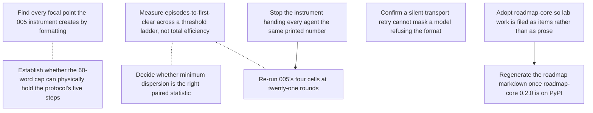

# ROADMAP.md — open work items

<!-- GENERATED FILE — DO NOT EDIT BY HAND. Regenerate with `roadmap sync`. -->

This is the agent-readable projection of the roadmap graph; the store is the `roadmap_items` table (see `roadmap/README.md`). For when it was last regenerated ask git — `git log -1 --format=%cI -- roadmap/ROADMAP.md` — because nothing in this file is derived from the clock or from a graph-wide total, so that two branches editing different items merge cleanly. Do not add one back.

`ARCS.md` is the narrative layer — *why* an arc is open. This file is the work-item layer — *what* is claimable right now, and who holds it.

## ▶ Ready — startable now

Claim before starting: `roadmap claim <key>`

**In priority order, most important first.** An item with no marker carries no stated priority — take it as unjudged, not as low. The order within a band is alphabetical and means nothing.

- `now` **`005-render-precision-fix`** — Stop the instrument handing every agent the same printed number
- `next` **`005-episodes-to-threshold`** — Measure episodes-to-first-clear across a threshold ladder, not total efficiency
  - ↔ related: **`005-paired-statistic-choice`** — Both decide what the next pre-registration freezes as its metric, and both must be settled before it is written. Decide them together — a speed-to-quality curve and a paired statistic on the same record are one analysis pass, and freezing one without the other means amending.
  - ↔ related: **`005-rerun-at-twenty-one-rounds`** — This is the metric that re-run would be read with. CLAUDE.md requires metrics and thresholds pre-registered before a run, so the ladder has to be chosen and its estimator settled before that pre-registration is written — not after the numbers are in.
- `later` **`005-paired-statistic-choice`** — Decide whether minimum dispersion is the right paired statistic
  - ↔ related: **`005-episodes-to-threshold`** — Both decide what the next pre-registration freezes as its metric, and both must be settled before it is written. Decide them together — a speed-to-quality curve and a paired statistic on the same record are one analysis pass, and freezing one without the other means amending.

## ⏸ Deferred — startable, deliberately not now

_Nothing deferred._

## 🔒 Claimed — someone is on these

_Nothing claimed._

## ⛔ Blocked

- **`005-rerun-at-twenty-one-rounds`** — Re-run 005's four cells at twenty-one rounds  
  waiting on `005-render-precision-fix`
- **`lab-roadmap-core-0-2-0`** — Regenerate the roadmap markdown once roadmap-core 0.2.0 is on PyPI  
  waiting on `lab-roadmap-adoption`

## Dependency graph

## Items

### `005-display-precision-artifact`

- **title:** Find every focal point the 005 instrument creates by formatting
- **status:** done
- **arc:** deliberation-protocol
- **priority:** now
- **related to** (not a dependency — both are startable):
  - `005-word-cap-fits-the-protocol` — Both are instrument reviews of the same run, and both bear on whether the null measured the manipulation or the format. Read the message stream once for both rather than twice.
- **refs:**
  - `reports/2026-08-21-005-deliberation-protocol.md`
  - `experiments/005-deliberation-protocol/experiment`

evidence

> The run report's claim 3: `content-only` and `both` reach dispersion exactly
> 0.000 at round 0, before anyone has spoken, and 0 of 96 round-0 submissions
> equal the hint — they equal the hint *as the prompt printed it*, because
> `prompt._vector` formats with `f"{p:.3f}"`. That artifact alone may account
> for 24 of the 48 episodes.
>
> Done when every place the instrument renders a number or a choice back to an
> agent has been read for the same failure, and each is either shown not to
> create a focal point or recorded as one that does. The output is a note in
> the experiment directory naming what was checked; a re-run before that note
> exists would buy the same artifact again.
>
> ---
>
> **Closed 2026-08-22 — confirmed, and larger than the report claimed.**
> `INSTRUMENT-REVIEW.md` §1. All three places the instrument renders a number
> back to an agent go through `prompt._vector` and its `f"{p:.3f}"`: the hint,
> the agent's own signal, and the prices it hears.
>
> 99.2% of submitted numbers (5,714/5,760) already sit exactly on the
> 3-decimal grid. Round-0 dispersion — before anyone has spoken — is exactly
> 0.000 in 11/12 `content-only` and 6/12 `both` worlds, and 0/12 in both
> unhinted cells; the hinted cells carry `median_rounds_to_coordinate = 0` and
> a rate of 1.000 against 3/12 and 4/12 unhinted.
>
> So the artifact accounts for the entire hint effect, not the "24 of 48
> episodes" first estimated. Any v1 comparison involving `content-only` or
> `both` measures the renderer. The unhinted cells remain readable.

### `005-episodes-to-threshold`

- **title:** Measure episodes-to-first-clear across a threshold ladder, not total efficiency
- **status:** ready
- **arc:** deliberation-protocol
- **priority:** next
- **related to** (not a dependency — both are startable):
  - `005-paired-statistic-choice` — Both decide what the next pre-registration freezes as its metric, and both must be settled before it is written. Decide them together — a speed-to-quality curve and a paired statistic on the same record are one analysis pass, and freezing one without the other means amending.
  - `005-rerun-at-twenty-one-rounds` — This is the metric that re-run would be read with. CLAUDE.md requires metrics and thresholds pre-registered before a run, so the ladder has to be chosen and its estimator settled before that pre-registration is written — not after the numbers are in.
- **refs:**
  - `experiments/005-deliberation-protocol/island/score.py`
  - `experiments/005-deliberation-protocol/results/v3/v3.json`
  - `experiments/002-barter-conventions/experiment/barter/economy.py`
  - `CLAUDE.md`

evidence

> `eff_round` is a level: how good the accumulated bundle got. It cannot say
> how *fast* quality arrived, and speed is the thing a round with k episodes
> exists to show — that is why context persists across a round's episodes.
> Two rounds ending at the same `eff_round` can differ entirely in whether the
> agents got there in episode two or episode seven, and nothing currently
> reported separates them.
>
> So: fix a ladder of thresholds, and for each, the episode index at which a
> round's per-episode efficiency first reaches it. Averaged over rounds that is
> a speed-for-quality curve — episodes to reach this good — with `eff_round`
> still reported beside it as the level.
>
> The machinery is already there. `island/score.py` records `eff_episode` as a
> per-episode list and already carries `first_above_floor`: the first episode
> index above the autarky floor. That is this metric at one threshold, chosen
> for a reason that has nothing to do with quality. Generalising it is a
> ladder, not a new instrument, and `exchange_ceiling()` and `capture()` in
> `002-barter-conventions/experiment/barter/economy.py` supply the other rung
> and the scale.
>
> **The ladder is autarky and exchange, not round numbers.** Both are already
> computed. `autarky()` gives the floor — what each agent gets making
> everything itself — and `score.py` already records it as `autarky_floor` and
> uses it for `first_above_floor`. `exchange_ceiling()` is the best reachable
> by swapping only, never changing what is produced. Those are two rungs that
> mean something — cleared autarky, finished swapping — where 0.25 and 0.75
> mean nothing.
>
> Separating them is the point of the ladder rather than a refinement.
> Everything below the exchange ceiling is a failure to swap; everything above
> it requires having produced differently, so time-to-clear on each answers a
> different question about the same round. On the settled island they are close
> — 0.823 and 0.856 — which says nearly all the gain there needs different
> production, not better haggling.
>
> **The frontier itself is the top of the ladder and needs no rung of its
> own.** Efficiency is measured *against* the frontier, so 1.0 already is
> "reached it", and `walras()` is one particular frontier point the solver
> happens to land on rather than an independent standard. Scoring
> time-to-clear on it would be timing the solver, not the agents.
>
> **The anchors are island-relative, and that is what makes rounds comparable.**
> The autarky floor is a property of the draw, so a fixed absolute threshold
> measures the island as much as the agents. `capture()` already rescales
> realised efficiency so autarky is 0.0 and the frontier is 1.0, and the ladder
> should be read on that scale for anything pooled across seeds.
>
> **Censoring is the common case here, not an edge case.** On the single
> settled round in `results/v3/v3.json` (seed 1, 2 agents, 4 goods, 8 episodes,
> eff_episode = [0.0, 0.0, 0.580, 0.580, ...]):
>
>     autarky   0.8232  ->  never cleared (censored at 8)
>     exchange  0.8561  ->  never cleared (censored at 8)
>
> The round never reaches even the autarky floor — those agents did worse than
> not trading. So both rungs are censored, and a mean over only the rounds that
> cleared would report a *faster* time the higher the rung, because the slow
> rounds leave the denominator: a metric that improves as performance worsens.
> CLAUDE.md's rule applies exactly — print denominators, never drop failed runs
> from one.
>
> Done when the rungs are fixed and written down before the run they score;
> the estimator handles never-cleared rounds explicitly, reporting clear-rate
> per rung beside the time so the two cannot be read apart; and the curve is
> computed over the existing record so its shape is known on real data before
> any pre-registration freezes it.

### `005-paired-statistic-choice`

- **title:** Decide whether minimum dispersion is the right paired statistic
- **status:** ready
- **arc:** deliberation-protocol
- **priority:** later
- **related to** (not a dependency — both are startable):
  - `005-episodes-to-threshold` — Both decide what the next pre-registration freezes as its metric, and both must be settled before it is written. Decide them together — a speed-to-quality curve and a paired statistic on the same record are one analysis pass, and freezing one without the other means amending.
- **refs:**
  - `reports/2026-08-21-005-deliberation-protocol.md`
  - `experiments/005-deliberation-protocol/analysis`

evidence

> Review target 5: a world can dip below threshold once and diverge again, and
> `min_r D(r)` scores that as a success. The statistic was pre-specified in
> DEVIATIONS.md D2 before the run, so it stands for the run that used it —
> this item is about what the *next* pre-registration should freeze.
>
> Done when the alternative (terminal dispersion, or dispersion held below
> threshold for k rounds) is computed over the existing record and the choice
> is written down with the numbers that motivated it, before the re-run freezes
> its own metrics.

### `005-render-precision-fix`

- **title:** Stop the instrument handing every agent the same printed number
- **status:** ready
- **arc:** deliberation-protocol
- **priority:** now
- **blocks:** `005-rerun-at-twenty-one-rounds`
- **refs:**
  - `experiments/005-deliberation-protocol/INSTRUMENT-REVIEW.md`
  - `experiments/005-deliberation-protocol/experiment/agents/prompt.py`

evidence

> Opened 2026-08-22 by the instrument review that closed
> `005-display-precision-artifact`. That item asked whether the renderer
> creates a focal point; it does, and this is the work the answer implies.
>
> Every number an agent sees goes through `prompt._vector`, which formats with
> `f"{p:.3f}"`. So each agent given the hint is handed the same string, and
> 99.2% of submitted numbers already sit exactly on that 3-decimal grid.
> Round-0 dispersion is exactly 0.000 in 11/12 `content-only` and 6/12 `both`
> worlds — before anyone has spoken — while both unhinted cells are 0/12. The
> hinted cells' coordination rate of 1.000 is the renderer, not deliberation.
>
> This blocks the twenty-one-round re-run, which was already blocked on the two
> reviews for exactly this reason: buying a second copy of a known display
> artifact is not a go. Re-running as specified would reproduce it in 24 of 48
> worlds.
>
> Done when the hint (and the private signal, which snaps submissions to the
> same grid) is either rendered at a precision that does not hand every agent
> an identical string, or the hinted cells are dropped from the design — and
> whichever is chosen is written into the next pre-registration before the run,
> with the round-0 dispersion check named as an acceptance criterion so the
> artifact cannot return unnoticed.

### `005-rerun-at-twenty-one-rounds`

- **title:** Re-run 005's four cells at twenty-one rounds
- **status:** blocked
- **arc:** deliberation-protocol
- **priority:** now
- **blocked on:** `005-render-precision-fix`
- **related to** (not a dependency — both are startable):
  - `005-episodes-to-threshold` — This is the metric that re-run would be read with. CLAUDE.md requires metrics and thresholds pre-registered before a run, so the ladder has to be chosen and its estimator settled before that pre-registration is written — not after the numbers are in.
- **refs:**
  - `reports/2026-08-21-005-deliberation-protocol.md`
  - `experiments/005-deliberation-protocol/PREREGISTRATION.md`
  - `experiments/005-deliberation-protocol/DEVIATIONS.md`

evidence

> "What would change the answer", verbatim: run the same four cells at
> twenty-one rounds, which is what the pilot accepted and what the protocol is
> a procedure over. Threat 1 says five rounds is the most likely reason for the
> null, and three `method-only` worlds were still converging at the bell.
>
> Blocked on the two instrument reviews on purpose. This is a paid run — the
> first one cost 1,920 calls and ~3h50m — and CLAUDE.md forbids spending on one
> without an explicit go; buying a second copy of a known display artifact is
> not a go.
>
> Done when the amendment is written before the run, the run is recorded, and
> the paired sign test on minimum dispersion is reported at twenty-one rounds.
> Either result is publishable: survival makes the null a result about
> deliberation protocols, and reversal makes it a result about five rounds.
>
> ---
>
> **Re-blocked 2026-08-22.** The two instrument reviews it waited on are done,
> and they did not clear it — one of them found the artifact rather than ruling
> it out. It now waits on `005-render-precision-fix` instead. Unblocking on the
> reviews alone would run the same four cells into the same round-0 focal point
> and buy a second copy of it, which is the thing the original block existed to
> prevent.

### `005-transport-retry-audit`

- **title:** Confirm a silent transport retry cannot mask a model refusing the format
- **status:** done
- **arc:** deliberation-protocol
- **priority:** next
- **refs:**
  - `reports/2026-08-21-005-deliberation-protocol.md`
  - `experiments/005-deliberation-protocol/experiment`

evidence

> Review target 3: `agents/runner.py` has two retry paths. Content retries are
> counted; transport retries (non-zero exit, timeout) are silent and uncounted.
> The run reports zero harness failures in 48 episodes, and claim 5 — that no
> rate stands on a moving denominator — rests on that count being complete.
>
> Done when the two paths are separated in the record, or a case is exhibited
> where a refusal reaches the transport path. Either outcome changes what claim
> 5 is allowed to say.
>
> ---
>
> **Closed 2026-08-22 — separated by construction, with a named residual.**
> `INSTRUMENT-REVIEW.md` §3. A format refusal returns exit 0 with prose, so it
> cannot reach `_invoke`'s uncounted transport retry; it fails later in
> `_read(_extract(raw))` and is counted as a content retry. The recorded counts
> are therefore counts of the right thing.
>
> Residual the record cannot rule out: a refusal producing empty stdout or a
> non-zero exit is indistinguishable from transport failure and would be
> retried up to three times silently.
>
> What claim 5 may say: that no content-retry rate stands on a moving
> denominator. Not that the harness-failure count of zero is complete.

### `005-word-cap-fits-the-protocol`

- **title:** Establish whether the 60-word cap can physically hold the protocol's five steps
- **status:** done
- **arc:** deliberation-protocol
- **priority:** now
- **related to** (not a dependency — both are startable):
  - `005-display-precision-artifact` — Both are instrument reviews of the same run, and both bear on whether the null measured the manipulation or the format. Read the message stream once for both rather than twice.
- **refs:**
  - `reports/2026-08-21-005-deliberation-protocol.md`
  - `experiments/005-deliberation-protocol/stimuli/protocol.md`

evidence

> Threat to validity 4: the protocol asks for a proposal, a falsifier, an
> accept-or-object and a convergence check, and the harness caps a message at
> sixty words. If the steps do not fit, the manipulation was partly suppressed
> by the format rather than absent.
>
> Done when the recorded messages answer it: the distribution of steps actually
> present per message, and whether any message that attempted all of them was
> truncated. A null on a manipulation the format cannot express is a result
> about the format.
>
> ---
>
> **Closed 2026-08-22 — ruled out.** `INSTRUMENT-REVIEW.md` §2, offline over
> `results/agents.json`. The cap never bound: 1,920 messages ran min 5, median
> 22, max 52 words, and 0 reached the 60-word cap. The format could express the
> manipulation.
>
> The steps were nonetheless barely performed — mean steps per message 0.77
> (`method-only`) and 0.92 (`both`) against 0.70 for `baseline`, and four or
> five steps never co-occur in any message in any cell. That strengthens the
> null rather than undermining it: the manipulation was expressible and was not
> performed.

### `lab-roadmap-adoption`

- **title:** Adopt roadmap-core so lab work is filed as items rather than as prose
- **status:** verifying
- **arc:** lab-practice
- **priority:** now
- **blocks:** `lab-roadmap-core-0-2-0`
- **refs:**
  - `roadmap/README.md`
  - `https://github.com/gald33/roadmap-core`
  - `https://pypi.org/project/roadmap-core/`

evidence

> Reports already end in "what to attack first" and experiment READMEs already
> end in what is unrun. Those are a backlog written six times in six places,
> where nothing can say which of them is startable now.
>
> `roadmap-core` is stdlib-only with a SQLite store inside the checkout, so
> adopting it adds no service, no credential and no framework an experiment
> could accidentally be shaped by — it stays outside experiments/, which is
> what tools/README.md protects.
>
> Done when the arcs and items here are the lab's actual queue: a session that
> finishes a run files what it left open as an item, and `roadmap ready` is
> what the next session reads. Verifying rather than done because that is a
> claim about how sessions behave, and one commit cannot settle it.

### `lab-roadmap-core-0-2-0`

- **title:** Regenerate the roadmap markdown once roadmap-core 0.2.0 is on PyPI
- **status:** blocked
- **arc:** lab-practice
- **priority:** next
- **blocked on:** `lab-roadmap-adoption`
- **refs:**
  - `https://pypi.org/project/roadmap-core/`
  - `https://github.com/gald33/roadmap-core`

evidence

> PyPI serves roadmap-core 0.1.0; the repository is at 0.2.0. The generated
> headers this lab committed therefore carry two things from the repository the
> package was extracted from and not from here: they name
> `python scripts/roadmap.py sync` as the command to regenerate, which is a
> file this checkout does not have, and ARCS.md opens with a paragraph about a
> flag ledger, a substrate-quality trace and a hygiene backlog under
> `docs/architecture/`, none of which exist here. 0.2.0 fixes both — `CLI =
> "roadmap"` and the paragraph is gone.
>
> It lands in the one artifact written for a reader with nothing installed, so
> the wrong command is the worst place for it to be.
>
> Done when the workflow installs a version that has the fix, `roadmap sync`
> regenerates, and the committed markdown names a command this repo actually
> has.

