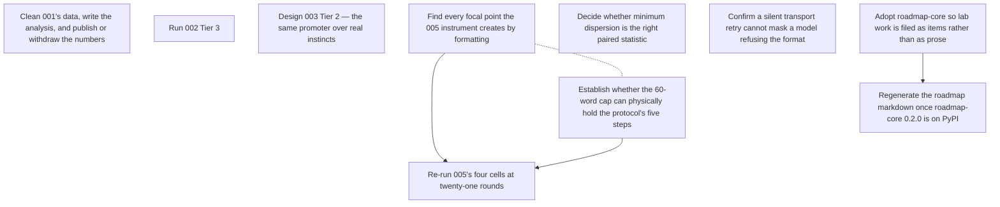

# ROADMAP.md — open work items

<!-- GENERATED FILE — DO NOT EDIT BY HAND. Regenerate with `python scripts/roadmap.py sync`. -->

This is the agent-readable projection of the roadmap graph; the store is the `roadmap_items` table (see `roadmap/README.md`). For when it was last regenerated ask git — `git log -1 --format=%cI -- roadmap/ROADMAP.md` — because nothing in this file is derived from the clock or from a graph-wide total, so that two branches editing different items merge cleanly. Do not add one back.

`ARCS.md` is the narrative layer — *why* an arc is open. This file is the work-item layer — *what* is claimable right now, and who holds it.

## ▶ Ready — startable now

Claim before starting: `python scripts/roadmap.py claim <key>`

**In priority order, most important first.** An item with no marker carries no stated priority — take it as unjudged, not as low. The order within a band is alphabetical and means nothing.

- `now` **`005-display-precision-artifact`** — Find every focal point the 005 instrument creates by formatting
  - ↔ related: **`005-word-cap-fits-the-protocol`** — Both are instrument reviews of the same run, and both bear on whether the null measured the manipulation or the format. Read the message stream once for both rather than twice.
- `now` **`005-word-cap-fits-the-protocol`** — Establish whether the 60-word cap can physically hold the protocol's five steps
  - ↔ related: **`005-display-precision-artifact`** — Both are instrument reviews of the same run, and both bear on whether the null measured the manipulation or the format. Read the message stream once for both rather than twice.
- `next` **`001-publish-results`** — Clean 001's data, write the analysis, and publish or withdraw the numbers
- `next` **`002-tier3-run`** — Run 002 Tier 3
- `next` **`005-transport-retry-audit`** — Confirm a silent transport retry cannot mask a model refusing the format
- `later` **`003-tier2-design`** — Design 003 Tier 2 — the same promoter over real instincts
- `later` **`005-paired-statistic-choice`** — Decide whether minimum dispersion is the right paired statistic

## ⏸ Deferred — startable, deliberately not now

_Nothing deferred._

## 🔒 Claimed — someone is on these

_Nothing claimed._

## ⛔ Blocked

- **`005-rerun-at-twenty-one-rounds`** — Re-run 005's four cells at twenty-one rounds  
  waiting on `005-display-precision-artifact`, `005-word-cap-fits-the-protocol`
- **`lab-roadmap-core-0-2-0`** — Regenerate the roadmap markdown once roadmap-core 0.2.0 is on PyPI  
  waiting on `lab-roadmap-adoption`

## Dependency graph

## Items

### `001-publish-results`

- **title:** Clean 001's data, write the analysis, and publish or withdraw the numbers
- **status:** ready
- **arc:** switchboard-coordination
- **priority:** next
- **refs:**
  - `experiments/001-switchboard-coordination/README.md`

evidence

> The experiment README says it plainly: run, not published; the data is not
> cleaned and the analysis is not written, and the repo README's experiment
> table carries "results not yet published". The design and one preserved
> negative result are already written, so what is missing is the analysis, not
> the reasoning.
>
> Done when the experiment directory states an outcome for the question it
> asked — including "the data does not support an answer", which is an outcome
> — and the README table stops saying results are pending.

### `002-tier3-run`

- **title:** Run 002 Tier 3
- **status:** ready
- **arc:** barter-conventions
- **priority:** next
- **refs:**
  - `experiments/002-barter-conventions/tier3-design.md`
  - `reports/2026-08-20-002-tier3-calibration.md`

evidence

> Tier 3 is designed and calibrated and unrun — the design document exists and
> the calibration has its own report. Tier 2 is separately mid-flight with the
> harness moving under it, which is why its numbers are recorded as measuring
> the harness.
>
> Done when the tier is pre-registered, run against seeded rounds paired across
> conditions, and reported with denominators — including the runs that failed
> and which failures were harness rather than behaviour.

### `003-tier2-design`

- **title:** Design 003 Tier 2 — the same promoter over real instincts
- **status:** ready
- **arc:** promotion-rules
- **priority:** later
- **refs:**
  - `experiments/003-promotion-rules/README.md`
  - `reports/2026-08-20-003-promotion-rules.md`

evidence

> Tier 1, the scripted tier, is complete and reported; the README says Tier 2
> is not designed and not run. Tier 1 answers the rule question over scripted
> candidates, which leaves open the thing the experiment is actually about: a
> promoter choosing among solutions a model wrote.
>
> Done when there is a design document naming the question, what is held fixed,
> and which result would change what gets built — not an implementation.

### `005-display-precision-artifact`

- **title:** Find every focal point the 005 instrument creates by formatting
- **status:** ready
- **arc:** deliberation-protocol
- **priority:** now
- **blocks:** `005-rerun-at-twenty-one-rounds`
- **related to** (not a dependency — both are startable):
  - `005-word-cap-fits-the-protocol` — Both are instrument reviews of the same run, and both bear on whether the null measured the manipulation or the format. Read the message stream once for both rather than twice.
- **refs:**
  - `reports/2026-08-21-005-deliberation-protocol.md`
  - `experiments/005-deliberation-protocol/experiment`

evidence

> The run report's claim 3: `content-only` and `both` reach dispersion exactly
> 0.000 at round 0, before anyone has spoken, and 0 of 96 round-0 submissions
> equal the hint — they equal the hint *as the prompt printed it*, because
> `prompt._vector` formats with `f"{p:.3f}"`. That artifact alone may account
> for 24 of the 48 episodes.
>
> Done when every place the instrument renders a number or a choice back to an
> agent has been read for the same failure, and each is either shown not to
> create a focal point or recorded as one that does. The output is a note in
> the experiment directory naming what was checked; a re-run before that note
> exists would buy the same artifact again.

### `005-paired-statistic-choice`

- **title:** Decide whether minimum dispersion is the right paired statistic
- **status:** ready
- **arc:** deliberation-protocol
- **priority:** later
- **refs:**
  - `reports/2026-08-21-005-deliberation-protocol.md`
  - `experiments/005-deliberation-protocol/analysis`

evidence

> Review target 5: a world can dip below threshold once and diverge again, and
> `min_r D(r)` scores that as a success. The statistic was pre-specified in
> DEVIATIONS.md D2 before the run, so it stands for the run that used it —
> this item is about what the *next* pre-registration should freeze.
>
> Done when the alternative (terminal dispersion, or dispersion held below
> threshold for k rounds) is computed over the existing record and the choice
> is written down with the numbers that motivated it, before the re-run freezes
> its own metrics.

### `005-rerun-at-twenty-one-rounds`

- **title:** Re-run 005's four cells at twenty-one rounds
- **status:** blocked
- **arc:** deliberation-protocol
- **priority:** now
- **blocked on:** `005-display-precision-artifact`, `005-word-cap-fits-the-protocol`
- **refs:**
  - `reports/2026-08-21-005-deliberation-protocol.md`
  - `experiments/005-deliberation-protocol/PREREGISTRATION.md`
  - `experiments/005-deliberation-protocol/DEVIATIONS.md`

evidence

> "What would change the answer", verbatim: run the same four cells at
> twenty-one rounds, which is what the pilot accepted and what the protocol is
> a procedure over. Threat 1 says five rounds is the most likely reason for the
> null, and three `method-only` worlds were still converging at the bell.
>
> Blocked on the two instrument reviews on purpose. This is a paid run — the
> first one cost 1,920 calls and ~3h50m — and CLAUDE.md forbids spending on one
> without an explicit go; buying a second copy of a known display artifact is
> not a go.
>
> Done when the amendment is written before the run, the run is recorded, and
> the paired sign test on minimum dispersion is reported at twenty-one rounds.
> Either result is publishable: survival makes the null a result about
> deliberation protocols, and reversal makes it a result about five rounds.

### `005-transport-retry-audit`

- **title:** Confirm a silent transport retry cannot mask a model refusing the format
- **status:** ready
- **arc:** deliberation-protocol
- **priority:** next
- **refs:**
  - `reports/2026-08-21-005-deliberation-protocol.md`
  - `experiments/005-deliberation-protocol/experiment`

evidence

> Review target 3: `agents/runner.py` has two retry paths. Content retries are
> counted; transport retries (non-zero exit, timeout) are silent and uncounted.
> The run reports zero harness failures in 48 episodes, and claim 5 — that no
> rate stands on a moving denominator — rests on that count being complete.
>
> Done when the two paths are separated in the record, or a case is exhibited
> where a refusal reaches the transport path. Either outcome changes what claim
> 5 is allowed to say.

### `005-word-cap-fits-the-protocol`

- **title:** Establish whether the 60-word cap can physically hold the protocol's five steps
- **status:** ready
- **arc:** deliberation-protocol
- **priority:** now
- **blocks:** `005-rerun-at-twenty-one-rounds`
- **related to** (not a dependency — both are startable):
  - `005-display-precision-artifact` — Both are instrument reviews of the same run, and both bear on whether the null measured the manipulation or the format. Read the message stream once for both rather than twice.
- **refs:**
  - `reports/2026-08-21-005-deliberation-protocol.md`
  - `experiments/005-deliberation-protocol/stimuli/protocol.md`

evidence

> Threat to validity 4: the protocol asks for a proposal, a falsifier, an
> accept-or-object and a convergence check, and the harness caps a message at
> sixty words. If the steps do not fit, the manipulation was partly suppressed
> by the format rather than absent.
>
> Done when the recorded messages answer it: the distribution of steps actually
> present per message, and whether any message that attempted all of them was
> truncated. A null on a manipulation the format cannot express is a result
> about the format.

### `lab-roadmap-adoption`

- **title:** Adopt roadmap-core so lab work is filed as items rather than as prose
- **status:** verifying
- **arc:** lab-practice
- **priority:** now
- **blocks:** `lab-roadmap-core-0-2-0`
- **refs:**
  - `roadmap/README.md`
  - `https://github.com/gald33/roadmap-core`
  - `https://pypi.org/project/roadmap-core/`

evidence

> Reports already end in "what to attack first" and experiment READMEs already
> end in what is unrun. Those are a backlog written six times in six places,
> where nothing can say which of them is startable now.
>
> `roadmap-core` is stdlib-only with a SQLite store inside the checkout, so
> adopting it adds no service, no credential and no framework an experiment
> could accidentally be shaped by — it stays outside experiments/, which is
> what tools/README.md protects.
>
> Done when the arcs and items here are the lab's actual queue: a session that
> finishes a run files what it left open as an item, and `roadmap ready` is
> what the next session reads. Verifying rather than done because that is a
> claim about how sessions behave, and one commit cannot settle it.

### `lab-roadmap-core-0-2-0`

- **title:** Regenerate the roadmap markdown once roadmap-core 0.2.0 is on PyPI
- **status:** blocked
- **arc:** lab-practice
- **priority:** next
- **blocked on:** `lab-roadmap-adoption`
- **refs:**
  - `https://pypi.org/project/roadmap-core/`
  - `https://github.com/gald33/roadmap-core`

evidence

> PyPI serves roadmap-core 0.1.0; the repository is at 0.2.0. The generated
> headers this lab committed therefore carry two things from the repository the
> package was extracted from and not from here: they name
> `python scripts/roadmap.py sync` as the command to regenerate, which is a
> file this checkout does not have, and ARCS.md opens with a paragraph about a
> flag ledger, a substrate-quality trace and a hygiene backlog under
> `docs/architecture/`, none of which exist here. 0.2.0 fixes both — `CLI =
> "roadmap"` and the paragraph is gone.
>
> It lands in the one artifact written for a reader with nothing installed, so
> the wrong command is the worst place for it to be.
>
> Done when the workflow installs a version that has the fix, `roadmap sync`
> regenerates, and the committed markdown names a command this repo actually
> has.

