# ROADMAP.md — open work items

<!-- GENERATED FILE — DO NOT EDIT BY HAND. Regenerate with `roadmap sync`. -->

This is the agent-readable projection of the roadmap graph; the store is the `roadmap_items` table (see `roadmap/README.md`). For when it was last regenerated ask git — `git log -1 --format=%cI -- roadmap/ROADMAP.md` — because nothing in this file is derived from the clock or from a graph-wide total, so that two branches editing different items merge cleanly. Do not add one back.

`ARCS.md` is the narrative layer — *why* an arc is open. This file is the work-item layer — *what* is claimable right now, and who holds it.

## ▶ Ready — startable now

Claim before starting: `roadmap claim <key>`

**In priority order, most important first.** An item with no marker carries no stated priority — take it as unjudged, not as low. The order within a band is alphabetical and means nothing.

- `now` **`005-render-precision-fix`** — Stop the instrument handing every agent the same printed number
- `now` **`005-viewer-first-view-has-no-hierarchy`** — Give the viewer a first-view hierarchy — nothing currently says where to look first
- `now` **`008-carry-forward-what-survives`** — Write down which coordination lessons survive the island, as the design input to 008
- `now` **`008-coding-task-with-an-answer-key`** — Build a shared coding task whose outcome is read off settled state and has a reference point
- `next` **`005-episodes-to-threshold`** — Measure episodes-to-first-clear across a threshold ladder, not total efficiency
  - ↔ related: **`005-paired-statistic-choice`** — Both decide what the next pre-registration freezes as its metric, and both must be settled before it is written. Decide them together — a speed-to-quality curve and a paired statistic on the same record are one analysis pass, and freezing one without the other means amending.
  - ↔ related: **`005-rerun-at-twenty-one-rounds`** — This is the metric that re-run would be read with. CLAUDE.md requires metrics and thresholds pre-registered before a run, so the ladder has to be chosen and its estimator settled before that pre-registration is written — not after the numbers are in.
- `next` **`005-viewer-flickering-shadow-rectangle`** — Find and fix the flickering shadow-like rectangle reported mid-island
- `next` **`006-standby-alarm-has-never-rung`** — Find a substrate where a self-scheduled wake actually fires, or conclude an agent cannot hold its own clock
- `next` **`007-replicate-the-control`** — Replicate the bare control so the lab's best difference rests on more than one draw
- `next` **`007-third-pass-on-ruin`** — A third ladder pass, to separate the ruin reduction from the control's own movement
- `later` **`005-paired-statistic-choice`** — Decide whether minimum dispersion is the right paired statistic
  - ↔ related: **`005-episodes-to-threshold`** — Both decide what the next pre-registration freezes as its metric, and both must be settled before it is written. Decide them together — a speed-to-quality curve and a paired statistic on the same record are one analysis pass, and freezing one without the other means amending.
- `later` **`island-viewer-density-scaled-spacing`** — Scale element size to element count on the island viewer, so huts and production sites are never crowded together

## ⏸ Deferred — startable, deliberately not now

_Nothing deferred._

## 🔒 Claimed — someone is on these

_Nothing claimed._

## ⛔ Blocked

- **`005-rerun-at-twenty-one-rounds`** — Re-run 005's four cells at twenty-one rounds  
  waiting on `005-render-precision-fix`
- **`008-noise-before-thresholds`** — Measure the coding instrument's own run-to-run movement before any treatment is compared on it  
  waiting on `008-coding-task-with-an-answer-key`
- **`008-asymmetry-is-the-design-factor`** — Make permissions, knowledge and context the manipulated factor, one at a time  
  waiting on `008-coding-task-with-an-answer-key`
- **`008-convention-ladder-start-at-the-end`** — Run the convention arm as a ladder from a handed-over plan downwards, not from a hint upwards  
  waiting on `008-carry-forward-what-survives`, `008-noise-before-thresholds`
- **`008-timing-tool-mechanism-and-outcome`** — Measure Switchboard's timing convergence as a mechanism and as an outcome, separately  
  waiting on `008-coding-task-with-an-answer-key`
- **`lab-roadmap-core-0-2-0`** — Regenerate the roadmap markdown once roadmap-core 0.2.0 is on PyPI  
  waiting on `lab-roadmap-adoption`
- **`008-helper-tools-after-conventions`** — Open a second treatment family — helper tools that do part of the reasoning  
  waiting on `008-convention-ladder-start-at-the-end`

## Dependency graph

```mermaid
graph TD
  005_display_precision_artifact["Find every focal point the 005 instrument creates by formatting"]
  005_episodes_to_threshold["Measure episodes-to-first-clear across a threshold ladder, not total efficiency"]
  005_paired_statistic_choice["Decide whether minimum dispersion is the right paired statistic"]
  005_render_precision_fix["Stop the instrument handing every agent the same printed number"]
  005_rerun_at_twenty_one_rounds["Re-run 005's four cells at twenty-one rounds"]
  005_transport_retry_audit["Confirm a silent transport retry cannot mask a model refusing the format"]
  005_viewer_first_view_has_no_hierarchy["Give the viewer a first-view hierarchy — nothing currently says where to look first"]
  005_viewer_flickering_shadow_rectangle["Find and fix the flickering shadow-like rectangle reported mid-island"]
  005_word_cap_fits_the_protocol["Establish whether the 60-word cap can physically hold the protocol's five steps"]
  006_standby_alarm_has_never_rung["Find a substrate where a self-scheduled wake actually fires, or conclude an agent cannot hold its own clock"]
  007_replicate_the_control["Replicate the bare control so the lab's best difference rests on more than one draw"]
  007_third_pass_on_ruin["A third ladder pass, to separate the ruin reduction from the control's own movement"]
  008_asymmetry_is_the_design_factor["Make permissions, knowledge and context the manipulated factor, one at a time"]
  008_carry_forward_what_survives["Write down which coordination lessons survive the island, as the design input to 008"]
  008_coding_task_with_an_answer_key["Build a shared coding task whose outcome is read off settled state and has a reference point"]
  008_convention_ladder_start_at_the_end["Run the convention arm as a ladder from a handed-over plan downwards, not from a hint upwards"]
  008_helper_tools_after_conventions["Open a second treatment family — helper tools that do part of the reasoning"]
  008_noise_before_thresholds["Measure the coding instrument's own run-to-run movement before any treatment is compared on it"]
  008_timing_tool_mechanism_and_outcome["Measure Switchboard's timing convergence as a mechanism and as an outcome, separately"]
  island_viewer_density_scaled_spacing["Scale element size to element count on the island viewer, so huts and production sites are never crowded together"]
  lab_roadmap_adoption["Adopt roadmap-core so lab work is filed as items rather than as prose"]
  lab_roadmap_core_0_2_0["Regenerate the roadmap markdown once roadmap-core 0.2.0 is on PyPI"]
  005_render_precision_fix --> 005_rerun_at_twenty_one_rounds
  008_coding_task_with_an_answer_key --> 008_asymmetry_is_the_design_factor
  008_carry_forward_what_survives --> 008_convention_ladder_start_at_the_end
  008_noise_before_thresholds --> 008_convention_ladder_start_at_the_end
  008_convention_ladder_start_at_the_end --> 008_helper_tools_after_conventions
  008_coding_task_with_an_answer_key --> 008_noise_before_thresholds
  008_coding_task_with_an_answer_key --> 008_timing_tool_mechanism_and_outcome
  lab_roadmap_adoption --> lab_roadmap_core_0_2_0
  005_display_precision_artifact -.- 005_word_cap_fits_the_protocol
  005_episodes_to_threshold -.- 005_paired_statistic_choice
  005_episodes_to_threshold -.- 005_rerun_at_twenty_one_rounds
```

## Items

### `005-display-precision-artifact`

- **title:** Find every focal point the 005 instrument creates by formatting
- **status:** done
- **arc:** deliberation-protocol
- **priority:** now
- **related to** (not a dependency — both are startable):
  - `005-word-cap-fits-the-protocol` — Both are instrument reviews of the same run, and both bear on whether the null measured the manipulation or the format. Read the message stream once for both rather than twice.
- **refs:**
  - `reports/2026-08-21-005-deliberation-protocol.md`
  - `experiments/005-deliberation-protocol/experiment`

evidence

> The run report's claim 3: `content-only` and `both` reach dispersion exactly
> 0.000 at round 0, before anyone has spoken, and 0 of 96 round-0 submissions
> equal the hint — they equal the hint *as the prompt printed it*, because
> `prompt._vector` formats with `f"{p:.3f}"`. That artifact alone may account
> for 24 of the 48 episodes.
>
> Done when every place the instrument renders a number or a choice back to an
> agent has been read for the same failure, and each is either shown not to
> create a focal point or recorded as one that does. The output is a note in
> the experiment directory naming what was checked; a re-run before that note
> exists would buy the same artifact again.
>
> ---
>
> **Closed 2026-08-22 — confirmed, and larger than the report claimed.**
> `INSTRUMENT-REVIEW.md` §1. All three places the instrument renders a number
> back to an agent go through `prompt._vector` and its `f"{p:.3f}"`: the hint,
> the agent's own signal, and the prices it hears.
>
> 99.2% of submitted numbers (5,714/5,760) already sit exactly on the
> 3-decimal grid. Round-0 dispersion — before anyone has spoken — is exactly
> 0.000 in 11/12 `content-only` and 6/12 `both` worlds, and 0/12 in both
> unhinted cells; the hinted cells carry `median_rounds_to_coordinate = 0` and
> a rate of 1.000 against 3/12 and 4/12 unhinted.
>
> So the artifact accounts for the entire hint effect, not the "24 of 48
> episodes" first estimated. Any v1 comparison involving `content-only` or
> `both` measures the renderer. The unhinted cells remain readable.

### `005-episodes-to-threshold`

- **title:** Measure episodes-to-first-clear across a threshold ladder, not total efficiency
- **status:** ready
- **arc:** deliberation-protocol
- **priority:** next
- **related to** (not a dependency — both are startable):
  - `005-paired-statistic-choice` — Both decide what the next pre-registration freezes as its metric, and both must be settled before it is written. Decide them together — a speed-to-quality curve and a paired statistic on the same record are one analysis pass, and freezing one without the other means amending.
  - `005-rerun-at-twenty-one-rounds` — This is the metric that re-run would be read with. CLAUDE.md requires metrics and thresholds pre-registered before a run, so the ladder has to be chosen and its estimator settled before that pre-registration is written — not after the numbers are in.
- **refs:**
  - `experiments/005-deliberation-protocol/island/score.py`
  - `experiments/005-deliberation-protocol/results/v3/v3.json`
  - `experiments/002-barter-conventions/experiment/barter/economy.py`
  - `CLAUDE.md`

evidence

> `eff_round` is a level: how good the accumulated bundle got. It cannot say
> how *fast* quality arrived, and speed is the thing a round with k episodes
> exists to show — that is why context persists across a round's episodes.
> Two rounds ending at the same `eff_round` can differ entirely in whether the
> agents got there in episode two or episode seven, and nothing currently
> reported separates them.
>
> So: fix a ladder of thresholds, and for each, the episode index at which a
> round's per-episode efficiency first reaches it. Averaged over rounds that is
> a speed-for-quality curve — episodes to reach this good — with `eff_round`
> still reported beside it as the level.
>
> The machinery is already there. `island/score.py` records `eff_episode` as a
> per-episode list and already carries `first_above_floor`: the first episode
> index above the autarky floor. That is this metric at one threshold, chosen
> for a reason that has nothing to do with quality. Generalising it is a
> ladder, not a new instrument, and `exchange_ceiling()` and `capture()` in
> `002-barter-conventions/experiment/barter/economy.py` supply the other rung
> and the scale.
>
> **The ladder is autarky and exchange, not round numbers.** Both are already
> computed. `autarky()` gives the floor — what each agent gets making
> everything itself — and `score.py` already records it as `autarky_floor` and
> uses it for `first_above_floor`. `exchange_ceiling()` is the best reachable
> by swapping only, never changing what is produced. Those are two rungs that
> mean something — cleared autarky, finished swapping — where 0.25 and 0.75
> mean nothing.
>
> Separating them is the point of the ladder rather than a refinement.
> Everything below the exchange ceiling is a failure to swap; everything above
> it requires having produced differently, so time-to-clear on each answers a
> different question about the same round. On the settled island they are close
> — 0.823 and 0.856 — which says nearly all the gain there needs different
> production, not better haggling.
>
> **The frontier itself is the top of the ladder and needs no rung of its
> own.** Efficiency is measured *against* the frontier, so 1.0 already is
> "reached it", and `walras()` is one particular frontier point the solver
> happens to land on rather than an independent standard. Scoring
> time-to-clear on it would be timing the solver, not the agents.
>
> **The anchors are island-relative, and that is what makes rounds comparable.**
> The autarky floor is a property of the draw, so a fixed absolute threshold
> measures the island as much as the agents. `capture()` already rescales
> realised efficiency so autarky is 0.0 and the frontier is 1.0, and the ladder
> should be read on that scale for anything pooled across seeds.
>
> **Censoring is the common case here, not an edge case.** On the single
> settled round in `results/v3/v3.json` (seed 1, 2 agents, 4 goods, 8 episodes,
> eff_episode = [0.0, 0.0, 0.580, 0.580, ...]):
>
>     autarky   0.8232  ->  never cleared (censored at 8)
>     exchange  0.8561  ->  never cleared (censored at 8)
>
> The round never reaches even the autarky floor — those agents did worse than
> not trading. So both rungs are censored, and a mean over only the rounds that
> cleared would report a *faster* time the higher the rung, because the slow
> rounds leave the denominator: a metric that improves as performance worsens.
> CLAUDE.md's rule applies exactly — print denominators, never drop failed runs
> from one.
>
> Done when the rungs are fixed and written down before the run they score;
> the estimator handles never-cleared rounds explicitly, reporting clear-rate
> per rung beside the time so the two cannot be read apart; and the curve is
> computed over the existing record so its shape is known on real data before
> any pre-registration freezes it.
>
> ---
>
> **Partly settled 2026-08-22** by `analysis/ladder.py`, computed over the
> 50-round screen record. Two of the three done-conditions are met; the third
> belongs to the next pre-registration.
>
> *The estimator is settled.* Per round, time-to-first-clear is non-decreasing
> in the threshold — anything clearing x clears every y < x — and
> `check_monotone` asserts it (0 violations over 50 rounds). The mean is a
> different matter: taken over only the rounds that cleared, the denominator
> falls from 38 to 3 across the ladder, and the curve then falls at 9 of 40
> steps. That is the slowest rounds leaving the average, read as speed.
> Counting a never-cleared round at k+1 keeps all 50 in every denominator and
> restores monotonicity: 2.18 to 3.86 across the same ladder. Clear-rate is
> reported beside the time on every rung, so the two cannot be read apart.
>
> *The curve's shape is known on real data.* It rises slowly to the exchange
> band and steeply after it, and no round in the screen clears 0.65.
>
> *Still open, and the reason this item stays ready:* the rungs have to be
> fixed and written into the pre-registration before the run they score.
>
> One finding for whoever writes that. The exchange rung is **per seed** —
> +0.186, +0.242, -0.023, +0.333, +0.290 on seeds 1-5 — so it is a band, not a
> line, and a single pooled value sits where no island has it. Seed 3's is
> negative because the autarky and exchange sandwiches overlap there
> (0.666-0.676 against 0.658-0.665): on that island the two rungs are not
> separable at the solver's precision. A ladder that assumes exchange is above
> autarky on every draw is wrong.

### `005-paired-statistic-choice`

- **title:** Decide whether minimum dispersion is the right paired statistic
- **status:** ready
- **arc:** deliberation-protocol
- **priority:** later
- **related to** (not a dependency — both are startable):
  - `005-episodes-to-threshold` — Both decide what the next pre-registration freezes as its metric, and both must be settled before it is written. Decide them together — a speed-to-quality curve and a paired statistic on the same record are one analysis pass, and freezing one without the other means amending.
- **refs:**
  - `reports/2026-08-21-005-deliberation-protocol.md`
  - `experiments/005-deliberation-protocol/analysis`

evidence

> Review target 5: a world can dip below threshold once and diverge again, and
> `min_r D(r)` scores that as a success. The statistic was pre-specified in
> DEVIATIONS.md D2 before the run, so it stands for the run that used it —
> this item is about what the *next* pre-registration should freeze.
>
> Done when the alternative (terminal dispersion, or dispersion held below
> threshold for k rounds) is computed over the existing record and the choice
> is written down with the numbers that motivated it, before the re-run freezes
> its own metrics.

### `005-render-precision-fix`

- **title:** Stop the instrument handing every agent the same printed number
- **status:** ready
- **arc:** deliberation-protocol
- **priority:** now
- **blocks:** `005-rerun-at-twenty-one-rounds`
- **refs:**
  - `experiments/005-deliberation-protocol/INSTRUMENT-REVIEW.md`
  - `experiments/005-deliberation-protocol/experiment/agents/prompt.py`

evidence

> Opened 2026-08-22 by the instrument review that closed
> `005-display-precision-artifact`. That item asked whether the renderer
> creates a focal point; it does, and this is the work the answer implies.
>
> Every number an agent sees goes through `prompt._vector`, which formats with
> `f"{p:.3f}"`. So each agent given the hint is handed the same string, and
> 99.2% of submitted numbers already sit exactly on that 3-decimal grid.
> Round-0 dispersion is exactly 0.000 in 11/12 `content-only` and 6/12 `both`
> worlds — before anyone has spoken — while both unhinted cells are 0/12. The
> hinted cells' coordination rate of 1.000 is the renderer, not deliberation.
>
> This blocks the twenty-one-round re-run, which was already blocked on the two
> reviews for exactly this reason: buying a second copy of a known display
> artifact is not a go. Re-running as specified would reproduce it in 24 of 48
> worlds.
>
> Done when the hint (and the private signal, which snaps submissions to the
> same grid) is either rendered at a precision that does not hand every agent
> an identical string, or the hinted cells are dropped from the design — and
> whichever is chosen is written into the next pre-registration before the run,
> with the round-0 dispersion check named as an acceptance criterion so the
> artifact cannot return unnoticed.

### `005-rerun-at-twenty-one-rounds`

- **title:** Re-run 005's four cells at twenty-one rounds
- **status:** blocked
- **arc:** deliberation-protocol
- **priority:** now
- **blocked on:** `005-render-precision-fix`
- **related to** (not a dependency — both are startable):
  - `005-episodes-to-threshold` — This is the metric that re-run would be read with. CLAUDE.md requires metrics and thresholds pre-registered before a run, so the ladder has to be chosen and its estimator settled before that pre-registration is written — not after the numbers are in.
- **refs:**
  - `reports/2026-08-21-005-deliberation-protocol.md`
  - `experiments/005-deliberation-protocol/PREREGISTRATION.md`
  - `experiments/005-deliberation-protocol/DEVIATIONS.md`

evidence

> "What would change the answer", verbatim: run the same four cells at
> twenty-one rounds, which is what the pilot accepted and what the protocol is
> a procedure over. Threat 1 says five rounds is the most likely reason for the
> null, and three `method-only` worlds were still converging at the bell.
>
> Blocked on the two instrument reviews on purpose. This is a paid run — the
> first one cost 1,920 calls and ~3h50m — and CLAUDE.md forbids spending on one
> without an explicit go; buying a second copy of a known display artifact is
> not a go.
>
> Done when the amendment is written before the run, the run is recorded, and
> the paired sign test on minimum dispersion is reported at twenty-one rounds.
> Either result is publishable: survival makes the null a result about
> deliberation protocols, and reversal makes it a result about five rounds.
>
> ---
>
> **Re-blocked 2026-08-22.** The two instrument reviews it waited on are done,
> and they did not clear it — one of them found the artifact rather than ruling
> it out. It now waits on `005-render-precision-fix` instead. Unblocking on the
> reviews alone would run the same four cells into the same round-0 focal point
> and buy a second copy of it, which is the thing the original block existed to
> prevent.

### `005-transport-retry-audit`

- **title:** Confirm a silent transport retry cannot mask a model refusing the format
- **status:** done
- **arc:** deliberation-protocol
- **priority:** next
- **refs:**
  - `reports/2026-08-21-005-deliberation-protocol.md`
  - `experiments/005-deliberation-protocol/experiment`

evidence

> Review target 3: `agents/runner.py` has two retry paths. Content retries are
> counted; transport retries (non-zero exit, timeout) are silent and uncounted.
> The run reports zero harness failures in 48 episodes, and claim 5 — that no
> rate stands on a moving denominator — rests on that count being complete.
>
> Done when the two paths are separated in the record, or a case is exhibited
> where a refusal reaches the transport path. Either outcome changes what claim
> 5 is allowed to say.
>
> ---
>
> **Closed 2026-08-22 — separated by construction, with a named residual.**
> `INSTRUMENT-REVIEW.md` §3. A format refusal returns exit 0 with prose, so it
> cannot reach `_invoke`'s uncounted transport retry; it fails later in
> `_read(_extract(raw))` and is counted as a content retry. The recorded counts
> are therefore counts of the right thing.
>
> Residual the record cannot rule out: a refusal producing empty stdout or a
> non-zero exit is indistinguishable from transport failure and would be
> retried up to three times silently.
>
> What claim 5 may say: that no content-retry rate stands on a moving
> denominator. Not that the harness-failure count of zero is complete.

### `005-viewer-first-view-has-no-hierarchy`

- **title:** Give the viewer a first-view hierarchy — nothing currently says where to look first
- **status:** ready
- **arc:** deliberation-protocol
- **priority:** now
- **refs:**
  - `experiments/005-deliberation-protocol/viewer/README.md`
  - `experiments/005-deliberation-protocol/viewer/web/index.html`
  - `experiments/005-deliberation-protocol/viewer/web/scene.js`

evidence

> Reported 2026-08-26, watching the viewer cold: "there's currently a lot of
> information competing for attention. On first viewing I don't know whether I
> should watch the island, inspect the four trader cards, understand the
> floating trades, watch utility, or look at settled/refused/lapsed."
>
> That is five surfaces, all live at once, all drawn at roughly equal weight:
> the 3D island in the middle; a trader card per seat in the margins (shelves,
> labour, utility, the ALONE bar); the offer chip floating over the island with
> its rope; the metric panel; and the settled/refused/lapsed counters in the
> chrome band. Each was designed and defended on its own -- the README's
> "Notes on the drawing" has a paragraph justifying nearly every one -- and no
> document anywhere states which of them a first-time viewer is supposed to
> read first, or what the others are for once they have.
>
> WHY THIS IS THE INTERESTING ONE. Every visual decision recorded in
> `viewer/README.md` so far is *subtractive and local*: a mark that carried no
> information came off (ground marks, shockwave rings, the hut's flag, the
> tether's ring, the hut's lantern). Each was right on its own and none of them
> addresses this, because the problem is not that any single element is
> unearned -- it is that five earned elements at equal weight have no order.
> Removing a sixth thing will not fix it. This needs a stated hierarchy, which
> is a *decision*, not a cleanup: what is the one thing a viewer watches, what
> is glanceable, and what is only there when asked for.
>
> NOT A LICENCE TO DELETE THE RECEIPTS. Everything named above is drawn from
> manager receipts and the three rules in `games/island.md` "Watching" still
> bind: only what the manager said, the hidden half stays hidden while it
> matters, a replay publishes its island. Demoting a surface means changing
> its weight or putting it behind a disclosure, never inventing a summary the
> manager did not settle.
>
> Also worth resolving in the same pass, since it is the same question: the
> viewer already knows whether it is live or a replay, and a first-time viewer
> of a *replay* can be told where to look in a way a live watcher cannot.
>
> HOW YOU WOULD KNOW IT WORKED. State the intended reading order in
> `viewer/README.md` alongside the other drawing decisions, then check it the
> way the null result was checked rather than by assertion: show the viewer
> cold to someone who has not seen it, ask what they looked at first and what
> they thought it meant, and record the answer. One person is not a finding,
> but "the first thing they watched was the thing the document says is first"
> is at least falsifiable, and nothing of the kind has been recorded for this
> page.

### `005-viewer-flickering-shadow-rectangle`

- **title:** Find and fix the flickering shadow-like rectangle reported mid-island
- **status:** ready
- **arc:** deliberation-protocol
- **priority:** next
- **refs:**
  - `experiments/005-deliberation-protocol/viewer/web/stage.js`
  - `experiments/005-deliberation-protocol/viewer/web/island-life.js`

evidence

> Reported 2026-08-26, from a screenshot of the 3D island: a dark, soft-edged
> rectangular patch sitting in the middle of the scene, distinct from any
> drawn prop, and seen flickering rather than sitting still.
>
> Not yet root-caused, but the likely mechanism is already on record in the
> code the rectangle's shape points at. `stage.js`'s key light casts a real
> shadow from an **orthographic** camera sized to a fixed box (`left: -6,
> right: 6, top: 6, bottom: -6`, `stage.js` around `Object.assign(this.key.shadow.camera, ...)`)
> -- an orthographic shadow frustum is exactly a rectangle, and its bias is
> tuned deliberately small ("small, because a large one detaches a shadow
> from its own tree"). `island-life.js:534` moves that light's position every
> frame as the sun swings across the day (`key.position.set(Math.sin(swing) *
> 7.5, high, Math.cos(swing) * 7.5)`), which moves the shadow camera's box
> with it -- a light re-aimed every frame is a shadow map redrawn every frame,
> which is exactly where a small bias produces visible shadow acne or a
> detached edge that would read as flicker rather than as a still artifact.
>
> That reasoning is offered as the first thing to check, not a diagnosis: it
> has not been reproduced against the actual screenshot, and the shape could
> equally be something else layered in the same area (a clip's ground patch,
> e.g. the "patch of light lying on the ground" `viewer/README.md`'s
> "Notes on the drawing" describes replacing the old shockwave rings with, or
> a z-fighting plane). Rule those out before touching the shadow camera.
>
> Done when the rectangle is identified against a running board (which node,
> drawn by which code) and either fixed or, if it turns out to be an
> intentional mark misread as an artifact, written up as such in
> `viewer/README.md`'s "Notes on the drawing" the way this experiment's other
> visual decisions already are.

### `005-word-cap-fits-the-protocol`

- **title:** Establish whether the 60-word cap can physically hold the protocol's five steps
- **status:** done
- **arc:** deliberation-protocol
- **priority:** now
- **related to** (not a dependency — both are startable):
  - `005-display-precision-artifact` — Both are instrument reviews of the same run, and both bear on whether the null measured the manipulation or the format. Read the message stream once for both rather than twice.
- **refs:**
  - `reports/2026-08-21-005-deliberation-protocol.md`
  - `experiments/005-deliberation-protocol/stimuli/protocol.md`

evidence

> Threat to validity 4: the protocol asks for a proposal, a falsifier, an
> accept-or-object and a convergence check, and the harness caps a message at
> sixty words. If the steps do not fit, the manipulation was partly suppressed
> by the format rather than absent.
>
> Done when the recorded messages answer it: the distribution of steps actually
> present per message, and whether any message that attempted all of them was
> truncated. A null on a manipulation the format cannot express is a result
> about the format.
>
> ---
>
> **Closed 2026-08-22 — ruled out.** `INSTRUMENT-REVIEW.md` §2, offline over
> `results/agents.json`. The cap never bound: 1,920 messages ran min 5, median
> 22, max 52 words, and 0 reached the 60-word cap. The format could express the
> manipulation.
>
> The steps were nonetheless barely performed — mean steps per message 0.77
> (`method-only`) and 0.92 (`both`) against 0.70 for `baseline`, and four or
> five steps never co-occur in any message in any cell. That strengthens the
> null rather than undermining it: the manipulation was expressible and was not
> performed.

### `006-standby-alarm-has-never-rung`

- **title:** Find a substrate where a self-scheduled wake actually fires, or conclude an agent cannot hold its own clock
- **status:** ready
- **arc:** agent-standby
- **priority:** next
- **refs:**
  - `https://github.com/gald33/Lucille/blob/main/docs/architecture/agent-standby.md`
  - `https://github.com/gald33/Lucille/blob/main/scripts/standby.py`
  - `https://code.claude.com/docs/en/scheduled-tasks`
  - `https://github.com/gald33/Lucille/pull/1338`

evidence

> MOVED FROM Lucille's roadmap (`agent-standby-duty-cycle`), where it was built
> and where the code still lives. It is here because what is left is a question
> about agents, not a feature Lucille is waiting on: Lucille has the mechanism,
> merged across #1335/#1337/#1338, and can use the half that works.
>
> WHAT IS BUILT AND VERIFIED. An agent declares a cadence and an expertise,
> writes a duty record to a coordination hub carrying `next_wake_at`, and is
> supposed to re-stamp that record and re-create its own alarm on every wake, so
> both clocks are wound by the same event. Measured end-to-end against the live
> hub 2026-08-18: arm, a request filed by a second identity, a wake that reads
> it, take, a clean wake, stand down.
>
> WHAT HAS NEVER HAPPENED: a wake firing on its own. Two attempts, both from a
> Claude Code cloud session:
>
>   6h cadence, armed 2026-08-18 15:13Z, due 21:13Z. Checked 08-19 05:32Z:
>     no scheduled jobs, wake count still 1, 8.3h late -> OVERDUE.
>   5m cadence, armed 2026-08-20 13:58Z, due 14:03Z. Checked 08-21 07:29Z:
>     no scheduled jobs, wake count still 1, 17.4h late -> GONE.
>
> The second run is the informative one. Shortening the cadence to the minimum
> the tool allows, with the alarm due about ninety seconds after the turn ended,
> did not help — which rules out "the gap was too long" and leaves the harness
> itself.
>
> WHAT THE DOCS SAY, checked 2026-08-21 after asserting a mechanism I had not
> verified. In-session scheduling is documented as requiring a live process:
> `/loop`'s row in the comparison table reads "Runs on: your machine",
> "Requires open session: **Yes**", and its limitations say "Tasks only fire
> while Claude Code is running and idle." Separately, cloud sessions "stop after
> a period of inactivity and the session's VM is reclaimed" — no duration given.
>
> SO THE OBSERVATION IS SOLID AND MY EXPLANATION WAS NOT. I had written that the
> container suspends the moment a turn ends. The docs do not say that, and my
> two runs cannot distinguish it from the alternative — that the VM was still up
> and there was simply no running-and-idle process to fire anything. Both
> predict exactly what I saw. Lucille's doc still states the unverified version
> and should be corrected to cite the documented requirement instead; that edit
> is part of this item.
>
> WHY IT IS WORTH DOING. "The agent keeps its own clock" is the whole claim, and
> it is not a property of the agent. It is a property of the runtime, and moving
> the same agent between harnesses changes whether it is true with nothing about
> the agent having changed. That is the kind of hidden substrate dependency this
> lab exists to find — a design that reads as self-contained, is adopted because
> the reasoning is clean, and turns out to have been leaning on something nobody
> wrote down.
>
> It also has a control built in already. The detector half is verified twice on
> real absences, so a run that produces no wake is still legible rather than
> ambiguous: the promise-with-a-timestamp says which of "quiet" and "dead"
> happened. Few experiments arrive with their null case pre-instrumented.
>
> HOW YOU WOULD KNOW IT WORKED. One of two outcomes, both publishable:
>
>   1. A wake fires on its own, on some substrate, and the agent does the work
>      waiting for it. State the substrate, the cadence, how many wakes were
>      quiet, and what the quiet wakes cost — a daily expert is ~30 turns a
>      month doing nothing, and if that is not worth what it buys, the honest
>      outcome is to say so and delete the mechanism rather than keep it because
>      it runs. The obvious first candidate is a session whose process genuinely
>      persists (a terminal or desktop session), which is the cheapest available
>      test and has not been run.
>
>   2. No substrate reachable from an agent provides this, and "an agent keeps
>      its own clock" is written up as false — availability is lent by a runtime,
>      not held by an agent. That is a result, and it retires the design rather
>      than leaving it as something that looks shippable and is not.
>
> NOT AN ACCEPTABLE OUTCOME: adopting a server-side trigger and calling the
> question answered. A trigger that fires into a fresh session survives the
> agent that asked for it, which is a different mechanism with a different
> failure mode — an availability outliving the agent asserting it — and it was
> ruled out deliberately at the start rather than overlooked.
>
> MEASURED 2026-08-26, one substrate, n = 1
> (`experiments/006-agent-standby/`). A Claude Code remote session, left quiet
> for 5h59m with nothing running in it, and read by a server trigger: the
> container was GONE. boot_id changed, uptime 25s, and pid 1 started four
> seconds after the trigger fired — the wake did not resume a machine, it
> caused one to be built. Nothing inside the old container survived to fire
> anything, which is the shape of both failures already on record: found dead,
> not late.
>
> That is outcome 2 above, on this substrate: availability is lent by the
> runtime, not held by the agent. Two earlier probes whose in-container timers
> DID fire (5 min, 20 min) are explained rather than contradicted — the session
> was in use, so the container was still there. The ladder was measuring
> session activity.
>
> What this does NOT close: the terminal/desktop session named above as the
> cheapest untried candidate is still untried, and the Lucille doc correction
> is still unwritten. One substrate is not "no substrate reachable from an
> agent".
>
> One finding worth carrying: the SCRATCHPAD SURVIVED the reclamation. Storage
> is durable across it and processes are not — an agent here can leave a note
> for its successor but not a process, which is precisely the split the standby
> design already draws between its detector (works) and its alarm (never has).

### `007-replicate-the-control`

- **title:** Replicate the bare control so the lab's best difference rests on more than one draw
- **status:** ready
- **arc:** execution-ceiling
- **priority:** next
- **refs:**
  - `reports/2026-08-24-hypothesis-ledger.md`
  - `experiments/007-execution-ceiling/runs/003-how-much-does-the-instrument-move.md`

evidence

> Row 14 of the hypothesis ledger is the strongest difference this lab has:
> handed the full plan, four independent replicates of the plan cell all beat
> the control — rounds above their own floor 5, 4, 7 and 5 against 1, mean
> `eff_round` 0.390–0.737 against 0.192, median captured gain +0.68 to +1.00
> against −0.11. Not one replicate overlaps.
>
> It rests on **one** control draw. Run 003 measured a control-type cell moving
> by 1.03 sd on captured gain and 0.073–0.114 on the bounded shares, so a single
> draw of `e-bare` carries exactly the uncertainty that retired every other
> difference in the ledger. Four-against-one is not a comparison; it is four
> measurements against a number of unknown position.
>
> Two more `e-bare` replicates on seeds 1–12, 5 episodes, 45/30 timing — the
> same command run 001 used — would make it four against three, and would be
> the first fully replicated difference in this repo.
>
> Done when both replicates are recorded, the control's own between-run spread
> is reported beside the plan cell's, and the ledger's row 14 is regraded from
> "probably yes" to a strength the evidence actually supports — in either
> direction.
>
> Cost: 96 agent sessions, about 65 minutes.

### `007-third-pass-on-ruin`

- **title:** A third ladder pass, to separate the ruin reduction from the control's own movement
- **status:** ready
- **arc:** execution-ceiling
- **priority:** next
- **refs:**
  - `reports/2026-08-24-hypothesis-ledger.md`
  - `experiments/007-execution-ceiling/runs/005-the-ladder-pass-b.md`
  - `experiments/007-execution-ceiling/PREREGISTRATION-v3.md`

evidence

> With the cheat removed, the protocol and hint blocks did not move the primary:
> no cell met "≥ +0.15 on 8 of 12 seeds" in either pass, and `l-protocol`
> reversed sign between them (+0.044 then −0.126).
>
> The co-primary did move, and in the same direction both times. Share of
> trader-episodes ending in zero utility, pooled over 24 seeds against the
> control: `l-protocol` −0.108, `l-hint` −0.118, `l-both` **−0.161**. All three
> lower in both passes.
>
> The reason this is graded `weak` and not `supported`: the **control's own**
> ruin rate moved 0.298 → 0.184 between the same two passes, a swing of 0.114.
> Only `l-both` sits clearly outside that. A third pass on the same seeds would
> say whether −0.161 is a treatment or whether the control is simply wandering
> under it.
>
> This is the only signal the legitimate blocks produced, so it is worth one
> pass and not more. If pass C leaves `l-both` inside the control's spread, the
> decomposed blocks have nothing, and `PREREGISTRATION-v3.md`'s stopping rule
> ends the experiment rather than proposing a fifth block.
>
> Done when pass C is recorded, the three passes' control spread is reported as
> a number, and `l-both` is called resolved or unresolved against it.
>
> Cost: 192 agent sessions, about 80 minutes.

### `008-asymmetry-is-the-design-factor`

- **title:** Make permissions, knowledge and context the manipulated factor, one at a time
- **status:** blocked
- **arc:** shared-coding-tasks
- **priority:** next
- **blocked on:** `008-coding-task-with-an-answer-key`
- **refs:**
  - `experiments/001-switchboard-coordination/README.md`
  - `reports/2026-08-24-hypothesis-ledger.md`
  - `games/switchboard-what-an-entrant-already-holds.md`

evidence

> A group of identical agents on a shared codebase has little to coordinate
> about: everyone can do everything and everyone knows the same things, so a
> convention has nothing to carry. What makes coordination necessary is
> asymmetry, and three kinds are separable and were never separated on the
> island, where every trader held the same tools and differed only in private
> numbers:
>
> - **permissions** — who may write which paths, who may merge, who may only
>   read. Switchboard already makes this expressible without a permission model
>   inside the game: a room key belongs to whoever holds it, sealed messages
>   reach one peer, and interference is made visible rather than prevented
>   (CLAUDE.md, "The weaker thing is allowed").
> - **knowledge** — who was told what about the task, the interfaces, or the
>   other agents. This is the island's private-α analogue and the one the lab
>   has most experience measuring.
> - **context** — what an agent carries from earlier work. A round's memory is
>   already the island's learning channel; here it becomes a manipulated
>   difference between agents in the same round, not a constant across them.
>
> Vary one at a time. 007's ladder is the model: rungs are only worth running
> when the rung above them worked, and a design that moves three things at once
> cannot say which one the convention was compensating for. The prediction
> worth pre-registering is that a convention's value **rises with the
> asymmetry it addresses** and is near zero without it — which, if true, also
> explains the island's nulls, since a symmetric island gives a coordination
> convention nothing to do.
>
> Done when each asymmetry is an explicit cell with a stated mechanism (what
> differs, how it is enforced, how the record shows it), a symmetric cell is
> kept as the reference, and the manipulation check for each is a count of an
> event that either happened or did not — the kind of endpoint the ledger says
> survives this lab's noise.

### `008-carry-forward-what-survives`

- **title:** Write down which coordination lessons survive the island, as the design input to 008
- **status:** ready
- **arc:** lab-practice
- **priority:** now
- **blocks:** `008-convention-ladder-start-at-the-end`
- **refs:**
  - `reports/2026-08-24-hypothesis-ledger.md`
  - `reports/2026-08-24-lessons-for-a-paper.md`
  - `experiments/001-switchboard-coordination/README.md`
  - `CLAUDE.md`

evidence

> The lab is about to move from the island to shared coding tasks, and the
> thing that carries across is not a harness — it is a short list of what has
> actually been established about instruction and conventions. That list exists
> today only as two long reports and a 16-row ledger, which is the exact
> condition CLAUDE.md's first standing decision was written against: a decision
> that lives in a document nobody reads at design time gets made again from
> scratch.
>
> What the ledger supports, and what 008 must therefore assume rather than
> re-test:
>
> - **Instruction changes behaviour, immediately and exactly** (rows 2–5).
>   214/214 settled productions matched a handed plan against 0/215 in control;
>   told *where* and *when* to disclose, 20/20 wrote the key, and two cells
>   holding the identical tool wrote 0/20. A granted capability nobody mentions
>   is not used. So a convention's *manipulation* will succeed; that is not a
>   result and must not be reported as one.
> - **Telling agents only *what* is worth saying does not work** (row 4): 7 free
>   messages across 200 trader-episodes. Conventions have to name the slot, not
>   the topic.
> - **The loss is in production, not exchange** (row 7): alone, an agent hits
>   0.972 of its closed-form optimum; in company that falls to 0.49–0.78 and
>   trade recovers only +0.09 to +0.13. The company is what costs, and a coding
>   analogue of this — how much worse an agent's own work gets when others are
>   on the repo — is the effect 008 is looking for.
> - **The only replicated win was the one that cheated** (row 14). Every
>   treatment that stayed inside what an agent could legitimately know landed
>   inside the noise (rows 15, 16).
> - **Nine "did they do it at all" answers are clean; seven "how much did it
>   help" are not** (the ledger's own summary). That split is a property of
>   counts against means-of-heavy-tailed-ratios, and it should decide what 008
>   measures before its instrument is written.
>
> And one from 001, which is the negative result that experiment preserved
> ahead of its numbers: **a timing predictor became well calibrated without
> improving completion time at all.** Calibration and performance are separate
> claims needing separate metrics; reported as one number a working mechanism
> and a flat outcome are indistinguishable.
>
> Done when this list is a document under `experiments/008-*/` (or a report
> linked from it) that 008's design cites by row, each entry carrying its
> evidence and its strength grade, and each marked *assumed* or *under test* in
> 008. Not done by pointing at the ledger: the ledger grades the island's
> hypotheses, and the carry-forward is the subset that constrains a different
> task.

### `008-coding-task-with-an-answer-key`

- **title:** Build a shared coding task whose outcome is read off settled state and has a reference point
- **status:** ready
- **arc:** shared-coding-tasks
- **priority:** now
- **blocks:** `008-asymmetry-is-the-design-factor`, `008-noise-before-thresholds`, `008-timing-tool-mechanism-and-outcome`
- **refs:**
  - `experiments/001-switchboard-coordination/README.md`
  - `experiments/002-barter-conventions/README.md`
  - `reports/2026-08-24-lessons-for-a-paper.md`
  - `CLAUDE.md`

evidence

> 002 exists because of a sentence in 001: an economy has an answer key, and
> "better coordination" on a shared codebase is hard to define independently of
> the task. Returning to the codebase means paying that bill rather than
> re-discovering it. The island's reference points — autarky, the exchange
> ceiling, the Walras frontier — are what let every later result be a fraction
> of something rather than a raw score, and no coding task has them for free.
>
> What the task must supply, all three:
>
> 1. **An outcome read from state, never from self-report.** CLAUDE.md's rule
>    is not negotiable and on a codebase it means the repo: tests that pass,
>    files that changed, commits that landed. What an agent says it did is not
>    data.
> 2. **A solo reference per agent** — the island's autarky. 006 turned on being
>    able to say an agent alone reaches 0.972 of its own optimum, which is what
>    made a peopled shortfall attributable to the interaction rather than to
>    the task being hard. The coding analogue is the same agent, same slice,
>    working alone under the same clock and budget. Without it, a group score
>    means nothing.
> 3. **A group ceiling** — what the task is worth if the work is partitioned
>    perfectly and nothing is done twice. It need not be closed-form; it needs
>    to be computable the same way every time and fixed before the run.
>
> Two design constraints inherited rather than chosen. **One surface**: the
> board is where agents talk, and nothing about the task may become a second
> channel or a tool API. **No scheduler**: each agent is its own long-lived
> session and the clock closes the episode whether or not anyone acted.
>
> One trap the island supplies for free. Cobb-Douglas made a single agent at
> zero move a whole round by units, and that zero is where the instrument's
> variance lived. A coding score that is dominated by "did the build break"
> reproduces that failure exactly. Prefer a bounded, decomposable score —
> per-slice completion shares, in the spirit of the bounded shares that cut the
> island's noise threefold — with the all-or-nothing gate reported beside it,
> not as it.
>
> Done when the task, the solo reference and the group ceiling are written
> down, the scorer computes all three from repo state on a recorded run, and a
> worked example shows the three numbers for one seed.

### `008-convention-ladder-start-at-the-end`

- **title:** Run the convention arm as a ladder from a handed-over plan downwards, not from a hint upwards
- **status:** blocked
- **arc:** shared-coding-tasks
- **priority:** next
- **blocked on:** `008-carry-forward-what-survives`, `008-noise-before-thresholds`
- **blocks:** `008-helper-tools-after-conventions`
- **refs:**
  - `experiments/007-execution-ceiling/README.md`
  - `reports/2026-08-24-hypothesis-ledger.md`
  - `experiments/001-switchboard-coordination/README.md`

evidence

> The hypothesis is that conventions — strategies and protocols agreed in
> advance — help coordination. The island tested subtle versions of that first
> and spent five experiments learning it could not resolve them; 007 then
> inverted the order and got answers immediately by starting at the most
> informative instruction possible and dismantling it. That inversion is the
> method to import, and it is cheap: a rung is only run if the rung above it
> worked, so a dead arm is discovered on the first rung rather than the fifth.
>
> The ladder for a shared coding task, top down, with 001's five stages as the
> bottom half of it:
>
> | rung | what the group is handed |
> |---|---|
> | 1 | the full partition — who does which slice, in what order, with what interfaces |
> | 2 | the partition without assignments — the slices, find your own owner |
> | 3 | a protocol only — how to claim, how to yield, how to announce done; no slices |
> | 4 | a disposition — "coordinate before you edit"; no slots named |
> | 5 | nothing — the control |
>
> Rung 1 is the feasibility question and answers something the island cannot:
> whether a group of asymmetric agents executes a partition at all, and where
> execution breaks when it does not. 007's answer on the island was that
> partners and goods were nearly always right and **quantities** were wrong
> 53% of the time — the failure was in the magnitudes, not the plan. The coding
> analogue of that question is what rung 1 buys.
>
> Rung 4 is where the ledger says to expect nothing: told only what is worth
> saying, agents said almost nothing (7 messages in 200 trader-episodes). If a
> convention works at rung 3 and not rung 4, the finding is that conventions
> must name the slot rather than the topic — which is a publishable statement
> about what a convention *is*, and is the shape of answer this lab can
> actually resolve.
>
> Done when the rungs are written and frozen by hash before the first run, each
> carries its own manipulation check, and each is run only on the evidence that
> the rung above it produced an effect.

### `008-helper-tools-after-conventions`

- **title:** Open a second treatment family — helper tools that do part of the reasoning
- **status:** blocked
- **arc:** shared-coding-tasks
- **priority:** later
- **blocked on:** `008-convention-ladder-start-at-the-end`
- **refs:**
  - `experiments/001-switchboard-coordination/README.md`
  - `reports/2026-08-24-hypothesis-ledger.md`
  - `CLAUDE.md`

evidence

> A convention is one way to make coordination cheaper; it works by changing
> what agents say to each other. A helper tool is a different way: a
> calculator, a partition solver, a consistency checker, anything that does a
> piece of the reasoning the agents would otherwise do badly. 001's founding
> question is exactly the comparison between them — does coordination improve
> because agents reason harder about each other, or because good primitives
> leave them **less to reason about**? Conventions are the first answer; tools
> are the second, and running both on one instrument is what makes the question
> answerable rather than rhetorical.
>
> Two constraints from the standing decisions, and they are the reason this is
> `later` rather than parallel work:
>
> - **A tool is not a second surface.** Anything an agent wants to do on the
>   board, it does by writing a message. A helper an agent consults is fine; a
>   helper the runner calls on an agent's behalf, or an action schema
>   dispatched from what an agent wrote, is the thing this repo refuses.
> - **A granted capability nobody mentions is not used** — ledger row 5,
>   established twice on different capabilities, 20 against 0 and 68% against
>   0%. So a tool arm is always at least two cells, granted-and-unmentioned
>   against granted-and-instructed, or the experiment measures the instruction
>   and calls it the tool.
>
> The comparison worth pre-registering is whether a tool that removes a
> computation beats a convention that coordinates the same computation, at
> matched instruction. The island's row 14 hints at the answer — the only
> treatment that repeatedly won was the one that handed over a computed
> result — but it won by cheating with private data, and a calculator that
> computes from what an agent legitimately holds is precisely the honest
> version of that treatment. That is the sharpest available test of whether the
> cheat was the *information* or the *computation*.
>
> Done when a tool arm is designed against the same task, ceiling and noise
> estimate the convention ladder used, so the two families are comparable
> without a new instrument.

### `008-noise-before-thresholds`

- **title:** Measure the coding instrument's own run-to-run movement before any treatment is compared on it
- **status:** blocked
- **arc:** shared-coding-tasks
- **priority:** now
- **blocked on:** `008-coding-task-with-an-answer-key`
- **blocks:** `008-convention-ladder-start-at-the-end`
- **refs:**
  - `reports/2026-08-24-hypothesis-ledger.md`
  - `experiments/007-execution-ceiling/runs/003-how-much-does-the-instrument-move.md`
  - `experiments/006-ratio-disclosure/FINDING-run-level-variance.md`
  - `CLAUDE.md`

evidence

> This is the single most expensive lesson the lab has bought. 005 and 006 ran
> four treatments against pre-registered thresholds of 0.10–0.15; 007's run 003
> then replicated one cell four times with nothing varied and found a between-run
> sd of **1.03** on captured gain, 0.229 on the ratio, 0.073–0.114 on the
> bounded shares. Every paired difference the lab had reported was inside its
> own noise, and rows 10–13, 15 and 16 of the ledger are the wreckage. The
> measurement that would have prevented all of it cost one afternoon and was
> run last.
>
> So on the coding instrument it is run **first**, before any convention is
> written and before any threshold is named: the same cell, the same seeds, the
> same everything, replicated enough times to state a between-run sd per
> endpoint. That number then sets what 008 is allowed to pre-register — the
> ledger's own arithmetic is that resolving 0.15 at the island's spread needs
> roughly 370 paired seeds on captured gain, or n≈25 on the bounded shares, and
> a threshold chosen without that arithmetic is a threshold chosen to be met.
>
> Report the endpoints separately rather than picking one: the island's lesson
> was that bounded shares moved a third as much as the ratio built on the same
> runs, so which endpoint is used is itself a resolution decision.
>
> Done when the replicated control is recorded, each candidate endpoint carries
> a stated between-run sd with its denominator, and 008's pre-registration
> quotes those numbers as the basis for its threshold and its seed count. A
> treatment run before this exists is a run this lab already knows how to
> waste.

### `008-timing-tool-mechanism-and-outcome`

- **title:** Measure Switchboard's timing convergence as a mechanism and as an outcome, separately
- **status:** blocked
- **arc:** shared-coding-tasks
- **priority:** next
- **blocked on:** `008-coding-task-with-an-answer-key`
- **refs:**
  - `experiments/001-switchboard-coordination/README.md`
  - `games/switchboard-what-an-entrant-already-holds.md`
  - `CLAUDE.md`

evidence

> Switchboard grew a timing facility — agents converging on a time to talk —
> and it is the first lab-built coordination primitive that a coding group
> would plausibly use. It arrives with a warning already written: 001's
> preserved negative result is that its timing predictor became **well
> calibrated without improving completion time at all**. Not a broken
> predictor — one that solved a problem the task did not have. Reported as a
> single number, that is indistinguishable from a working mechanism whose
> outcome got lost in noise, and 001 recorded it first precisely because it is
> the result most likely to be dropped.
>
> So the timing tool is measured on two ledgers that are never added together:
>
> - **mechanism** — did the group converge on a time, how fast, how often, and
>   did anyone act outside it. Counts and rates: the endpoint class the
>   hypothesis ledger says survives this lab's noise.
> - **outcome** — did the shared task go better. Read from settled repo state,
>   against the solo reference and the group ceiling, with the instrument's own
>   between-run movement stated beside it.
>
> The interesting cell is the one where they disagree. A tool that converges
> perfectly and buys nothing says the task was not timing-bound, which is a
> finding about the task and a constraint on every later primitive; a tool that
> converges poorly and still helps says the coordination benefit is in the
> asking, not the answer.
>
> This also pins down where the timing facility sits relative to CLAUDE.md's
> standing decisions. It is a Switchboard primitive agents hold, like `whisper`
> or `board_*` — not a scheduler, not a turn, and not a second surface. If
> measuring it starts to require the runner to drive agents to a rendezvous,
> that is the forbidden thing arriving in new clothes; the tool may hold a
> time, and the bell still rings on the clock.
>
> Done when both ledgers are pre-registered as separate metrics with separate
> thresholds, and the run reports them side by side even when they point in
> opposite directions.

### `island-viewer-density-scaled-spacing`

- **title:** Scale element size to element count on the island viewer, so huts and production sites are never crowded together
- **status:** ready
- **arc:** lab-practice
- **priority:** later
- **refs:**
  - `games/island.md`

evidence

> games/island.md, "Watching": "The spectator surface is built: an island
> drawn from the board, replays with transport and chapters, and a
> scoreboard." That drawing has no stated layout rule yet for how many
> elements (huts, production sites) can occupy the island at once, and a
> fixed element size at a growing table size is how a board reads as
> crowded and how a hut ends up rendered adjacent to a production site —
> a layout accident, not a fact the manager settled.
>
> The fix decided here: an element's drawn size on the island varies
> inversely with the number of elements the current table has, so a
> denser island still reads as legible and spaced rather than as a
> fixed-size grid overflowing its board. Concretely, this should keep
> huts and production sites from rendering adjacent to each other
> regardless of table size, and should keep the island from reading as
> crowded at whatever table size the game is run with.
>
> Done when the viewer computes drawn element size from the live table's
> element count (not a constant), and a rendered island at a larger table
> size can be shown to keep huts non-adjacent to production sites and
> free of visual crowding, at whatever table sizes the lab actually runs.

### `lab-roadmap-adoption`

- **title:** Adopt roadmap-core so lab work is filed as items rather than as prose
- **status:** verifying
- **arc:** lab-practice
- **priority:** now
- **blocks:** `lab-roadmap-core-0-2-0`
- **refs:**
  - `roadmap/README.md`
  - `https://github.com/gald33/roadmap-core`
  - `https://pypi.org/project/roadmap-core/`

evidence

> Reports already end in "what to attack first" and experiment READMEs already
> end in what is unrun. Those are a backlog written six times in six places,
> where nothing can say which of them is startable now.
>
> `roadmap-core` is stdlib-only with a SQLite store inside the checkout, so
> adopting it adds no service, no credential and no framework an experiment
> could accidentally be shaped by — it stays outside experiments/, which is
> what tools/README.md protects.
>
> Done when the arcs and items here are the lab's actual queue: a session that
> finishes a run files what it left open as an item, and `roadmap ready` is
> what the next session reads. Verifying rather than done because that is a
> claim about how sessions behave, and one commit cannot settle it.

### `lab-roadmap-core-0-2-0`

- **title:** Regenerate the roadmap markdown once roadmap-core 0.2.0 is on PyPI
- **status:** blocked
- **arc:** lab-practice
- **priority:** next
- **blocked on:** `lab-roadmap-adoption`
- **refs:**
  - `https://pypi.org/project/roadmap-core/`
  - `https://github.com/gald33/roadmap-core`

evidence

> PyPI served roadmap-core 0.1.0 when this was filed, and the generated headers
> this lab committed therefore carried two things from the repository the
> package was extracted from and not from here: they named
> `python scripts/roadmap.py sync` as the command to regenerate, which is a
> file this checkout does not have, and ARCS.md opened with a paragraph about a
> flag ledger, a substrate-quality trace and a hygiene backlog under
> `docs/architecture/`, none of which exist here. 0.2.0 fixed both — `CLI =
> "roadmap"` and the paragraph is gone.
>
> It lands in the one artifact written for a reader with nothing installed, so
> the wrong command is the worst place for it to be.
>
> The regeneration half is settled: PyPI now serves 0.2.3, `roadmap sync` under
> it reproduces the committed `roadmap/ROADMAP.md` and `ARCS.md` byte for byte,
> and the workflow's install is pinned `>=0.2.0` so the fix is a requirement of
> the job rather than whatever pip happens to resolve — 0.1.0 is still on PyPI
> and would still render the wrong command.
>
> What is left is not a regeneration. This stays open behind
> `lab-roadmap-adoption` because that item is `verifying` on purpose: whether
> sessions actually file their open tail as items is a claim about behaviour
> that no commit settles, and retiring this one first would report the adoption
> as finished on the strength of a version bump.

